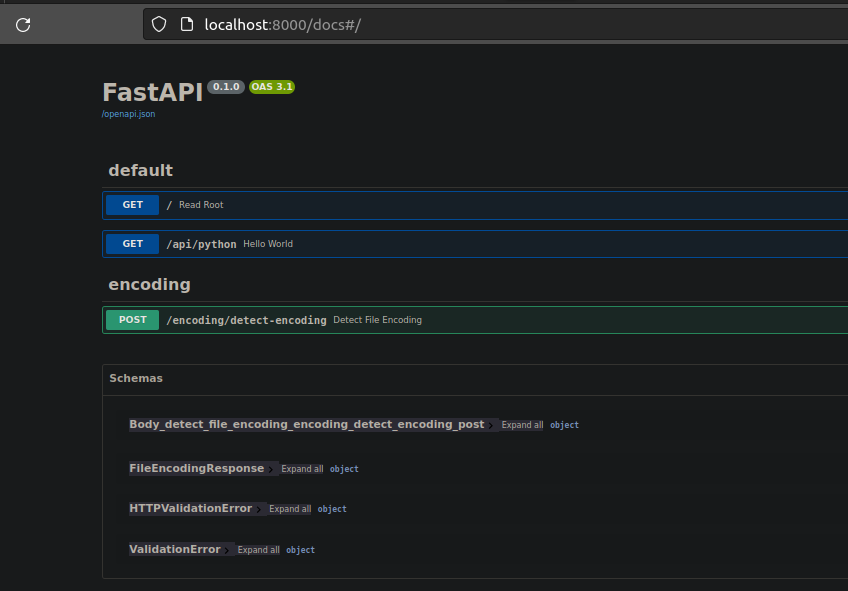

# Evolution of a Project: From Python Apps to a Web Interface

__How a solo coder turned a repo full of data scripts into a full-stack web app with beautiful interface in one day ?__

In the world of development, projects tend to evolve, morphing and reshaping themselves to meet ever-changing needs and preferences. What starts as a collection of Python applications can transform into something entirely different—a cohesive web interface with a backend to match.

This evolution was made possible by harnessing a comprehensive tech stack, blending various cutting-edge technologies:

- __Python:__ Served as the foundational language for backend logic and functionality.
- __FastAPI:__ Empowered the backend with rapid server capabilities and smooth API integration.
- __Next.js:__ Spearheaded the frontend development, providing dynamic and responsive user interfaces.
- __Prisma:__ Efficiently managed databases, optimizing data operations and queries.
- __Clerk:__ Handled authentication and user management, ensuring secure and streamlined user experiences.
- __Docker:__ Ensured modern development practices and facilitated seamless execution across various environments.
<!-- more -->
This amalgamation of technologies enabled the evolution from fragmented Python apps to a unified, feature-rich web interface, promising an immersive user experience while optimizing efficiency and elegance in development.

## Motivation

At the end of 2023, in the very last 2 days, I felt a sense of completion. It was time to bring life to a project that had been waiting for attention.

Looking back at the same time one year ago —from 2022 to 2023— I remembered working on statistical tools, learning through coding all methods i've encountered in a dedicated coursera certification. The work is open source on github at [Hermann-web/some-common-statistical-methods](https://github.com/Hermann-web/some-common-statistical-methods)

In the last months of 2023, i've started this [blog](https://hermann-web.github.io/), as a mean to put on the web what tech tools i learn and how to use them. I rewrite my notes as tutorials i find interesting enough to share, in a way i would want to read them right before having tested them.

Before that, i've created an application that has an api, a frontend view then on top of it, a python module that gave birth to a cli tool. I've written a [tutorial about it showing how i build it brick by brick](https://hermann-web.github.io/web/blog/2023/11/14/flask-based-file-hosting-web-app-api-python-module-cli-app/?h=flask) and it also open source on github at [Hermann-web/simple-file-hosting-with-flask](https://github.com/Hermann-web/simple-file-hosting-with-flask)

But, as the year ended, a project lingered, a collection of scattered Python apps. This project had evolved into a vision—a web interface combined with a backend, a unified creation born from various ideas.

## Consolidating Python Apps

Initially, my computer housed several Python applications, each serving a specific purpose. As these apps expanded in functionality, I recognized the potential for a more streamlined experience. That's when I transitioned them into command-line interfaces (CLI apps), offering users a smoother interaction.

## Structuring for Scalability

However, as the collection grew further, the need for organization became apparent. Inspired by the structured approach of ETL (Extract, Transform, Load) in data engineering, I restructured the repository, employing a folder hierarchy to enhance manageability.

## The Resurrection of Dev Notes: Markdown, MkDocs, and Docker

This restructuring revelation extended beyond just applications.
I figured i've gone through a similar for my development notes. These notes—ranging from syntax references to frequently used functions and tutorials—were upgraded significantly.
Migrating from plain text to Markdown format, these notes underwent a transformation. Leveraging the prowess of MkDocs and Docker, these notes metamorphosed into a [dynamic web application, offering a seamless browsing experience](https://hermann-web.github.io/web/blog/2023/12/25/using-mkdocs-with-docker-streamlining-documentation-workflow).
This gave me an idea for my small python projects too.

## The Expansion: Taking Projects Online

Embracing this analogy of transformation, it became evident that bringing these smaller python projects to the web was the next logical step. This expansion wasn't merely about accessibility; it was about a richer, more interactive experience. While I could have chosen familiar tools like Flask and HTML, my inclination toward exploring new frameworks led me elsewhere: Fast and modern tools for both the server (FastAPI/Tornado) and the ui (ReactJS/NextJS)

### Framework Selection

Seeking equilibrium between rapid backend operations and a responsive frontend, this quest led me to opt for FastAPI for the server and Next.js for the frontend. These choices aligned with my desire for speed and versatility, given FastAPI's rapid server capabilities and Next.js's dynamic UI.

## Starting with the backend

With prior experience in FastAPI, integrating one of my Python projects as starter was a swift process.  

I opted for poetry for dependency management, though encountered a hiccup when it failed to create a virtual environment. Resorting to traditional methods to create one, I used poetry to manage packages.

Then, i've added my packages with poetry: fastapi and uvicorn. then, black and isort, as dev dependencies. In comparison to pip, poetry or pipenv let you separate dev dependencies and you can ever group dependencies or add command to be run with poetry.

!!! note "See more on [python package managers practical comparison here](https://hermann-web.github.io/web/blog/2023/10/28/managing-python-dependencies-navigating-pip-pipenv-poetry-and-conda/)"

Despite encountering issues, tweaking the `pyproject.toml` scripts addressed the obstacles.

```toml
# [tool.poetry.scripts]
# format = "isort . && black ."

# [tool.poetry.scripts]
# start = "uvicorn app.main:app --host 0.0.0.0 --port 8000 --reload"
```

I've just made progress on the Swagger docs!

Check out the snapshot of the Swagger documentation below:



The existing endpoints are operational, and to ensure smooth integration before introducing new ones, I've taken a step to containerize the application and connect the backend with the frontend.

## Embracing Docker for Modernization

Docker-compose emerged as my choice for modern development practices and to ensure seamless project execution across different environments. After locally testing the API with uvicorn, I streamlined the setup, crafting a `docker-compose.yml` file.

Before creating the `docker-compose.yml`, i've exported my requirements into a file so i could use pip instead of poetry inside the container

```bash
poetry export -f requirements.txt --output requirements.txt --without-hashes
```

Then, i've refactorised `docker-compose.yml`, into a `Dockerfile` use by `docker-compose.yml`. Having a separate Dockerfile allowed me use it in the root folder of the project so i can run the `Dockerfile`s from client and server in a simple `docker-compose.yml`

So, i had an architecture like this

```yaml
project-root/
│
├── client/                 # Next.js client folder
│
├── server/                 # FastAPI server folder
│   ├── app/                # FastAPI application logic
│   ├── requirements.txt    # Server dependencies
│   ├── Dockerfile          # Dockerfile for FastAPI server
│   ├── docker-compose.yml  # Docker Compose configuration
│   ├── .gitignore          # Server-specific .gitignore
│   ├── pyproject.toml      # poetry dependency file
│   ├── poetry.lock         # poetry lock file
│   └── ...                
│
├── docker-compose.yml      # Docker Compose configuration
└── readme.md               # Project README or documentation
```

I've added a module in my fastapi app and tested on swagger on the browser. It was working fine. So my version 0 will be ready righr after the setup of the nextjs app.

## The Frontend Odyssey

Choosing to build a bespoke tool, I commenced with a command to create a Next.js project. The CLI app provided an interactive interface, offering language options (js vs ts), formatting tool choices and more.

## Navigating the UI Dilemma

In my quest to fashion a unique frontend, fate introduced me to [DevToolboxWeb](https://github.com/YourAverageTechBro/DevToolboxWeb), a project resonating with my aspirations.

Despite deliberations on building from scratch, leveraging their UI became my choice for multiple reasons:

- An opportunity to contribute to an interesting open source project
- If i were to build from scratch, I would have done it like them
- I was on a clock ! And i prefer build-from-template over build-from-scratch when it comes to frontend

## Merging Frontend and Backend

While DevToolboxWeb's UI aligned with my vision, it lacked a backend—a void I intended to fill. Forking their repository, I ventured into integrating my FastAPI backend with their feature-rich UI, striving for a synergy of functionality and aesthetics.
That's why i've created [a fork of their code](https://github.com/Hermann-web/DevToolboxWeb) and add a server into it.

### Integrating FastAPI and Next.js

To bridge the gap between FastAPI and Next.js, I explored [digitros/nextjs-fastapi](https://github.com/digitros/nextjs-fastapi) from the [Next.js and FastAPI starter templates on Vercel](https://vercel.com/templates?framework=next.js&type=ai&type=starter&search=fastapi). This resource offered insights into integrating the next js based frontend and fastapi backend seamlessly.

## Culmination: A Glimpse of the Horizon

Projects in development constantly change and borrow from each other. My journey from scattered Python apps to a unified web interface has been an ongoing quest for efficiency and elegance.

As I combine backend strength with frontend finesse, the vision of a user-friendly toolbox gets closer. And in this pursuit, the journey itself is as rewarding as the destination.
