# Guide Perplexity AI : Tutoriels pour Tous

Bienvenue dans ce guide pas à pas pour utiliser Perplexity AI, pensé pour tous : jeunes, moins jeunes, débutants ou curieux. Chaque section propose des instructions simples, des icônes pour repérer les actions, et des indications pour insérer vos propres captures d’écran (pensez à ajouter des balises `alt` pour l’accessibilité).

---

## 1. Se connecter à son compte Perplexity

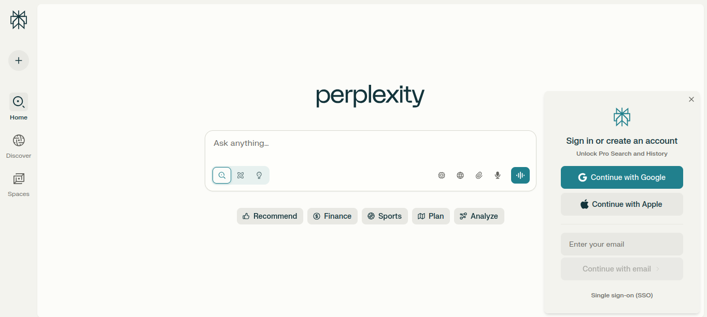

<!-- more -->

### Étapes simples

- Rendez-vous sur [www.perplexity.ai](https://www.perplexity.ai/) depuis votre navigateur[^31].
- Entrez votre adresse e-mail et votre mot de passe, ou choisissez la connexion via Google[^31].
- Si vous avez oublié votre mot de passe, cliquez sur « Mot de passe oublié ? » et suivez les instructions reçues par e-mail[^31].
- Après connexion, vous accédez à l’interface principale.

---

## 2. Discuter avec l’IA et comprendre les sources

### Comment discuter avec l’IA

- Tapez votre question dans la barre centrale, puis appuyez sur **Entrée** ou cliquez sur l’icône flèche[^32][^33].
- L’IA répond en quelques secondes, avec une réponse claire et facile à lire[^32][^33].
- **Astuce :** Posez vos questions comme à une personne réelle, et soyez précis si possible[^33].

![[resp.png]]

### Comprendre les sources

- Sous chaque réponse, vous verrez des **numéros** (ex : [^32], [^33], [^34]) : ce sont les sources utilisées par l’IA[^33].
- Cliquez sur un numéro pour afficher la source complète dans une nouvelle fenêtre[^33].

---

## 3. Retrouver ses anciennes discussions

### Où retrouver vos conversations passées

- Sur la page principale, cherchez l'icone Accueil sur la gauche 🔍.
- Cherchez le menu **Bibliothèque** ou **Historique** sur la gauche[^32][^35].
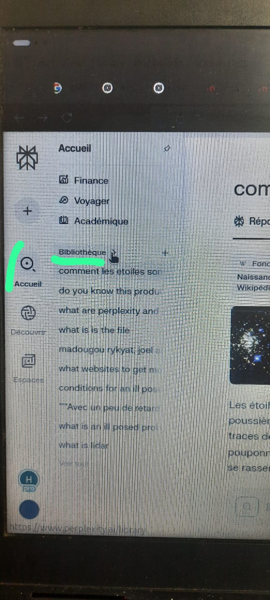
- Cliquez dessus pour voir la liste de toutes vos discussions précédentes. Vous pouvez en rouvrir une en un clic[^32][^35].
- **Attention :** Si vous supprimez une discussion, elle ne pourra pas être récupérée[^36][^35].

---

## 4. Faire une recherche sur le web

### Comment procéder

- Tapez votre question dans la barre de recherche[^32][^33].
- Perplexity va chercher sur Internet et vous affiche une réponse avec des sources à jour[^32][^33].
- Pour approfondir, cliquez sur les numéros de sources en bas de la réponse[^33].

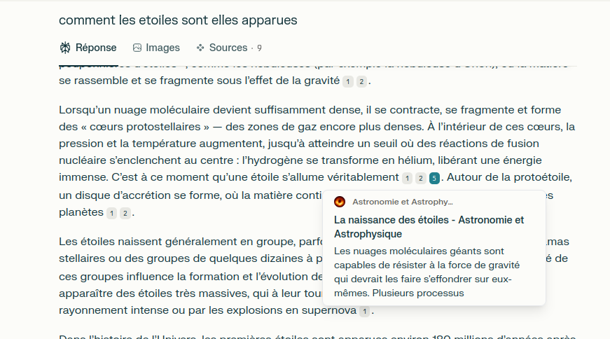

---

## 5. Faire une recherche académique

### Étapes à suivre

- Creer une nouvelle discussion en cliquant sur l'icone à gauche ➕. Puis, vous serez sur une nouvelle page
- Dans la barre de recherche, cliquez sur le menu déroulant (souvent nommé « Mode » ou « Focus »)[^33][^37].
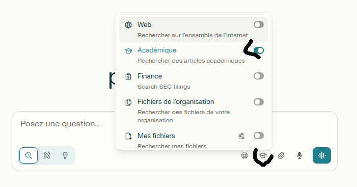
- Sélectionnez **Academique** pour cibler les articles scientifiques, thèses, etc.[^33][^37].
- Posez votre question : l’IA vous donnera des réponses issues de publications reconnues, avec des références claires[^37][^38][^39].

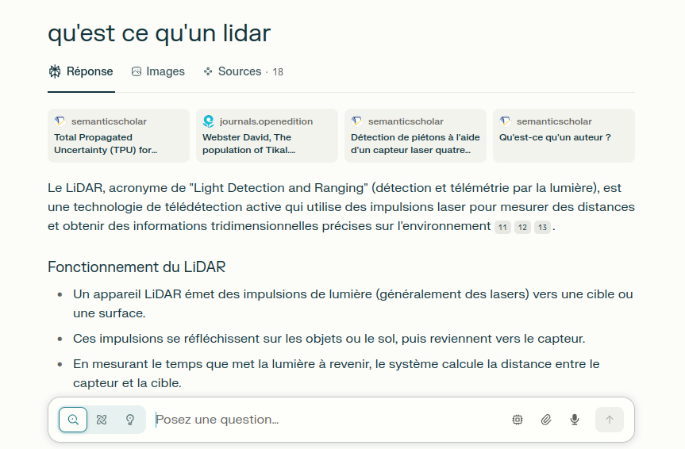

---

## 6. Ajouter un fichier à une discussion

**Icône à utiliser :**
**Capture d’écran suggérée :** Bouton « + Attacher » (alt="Bouton pour ajouter un fichier à la discussion")

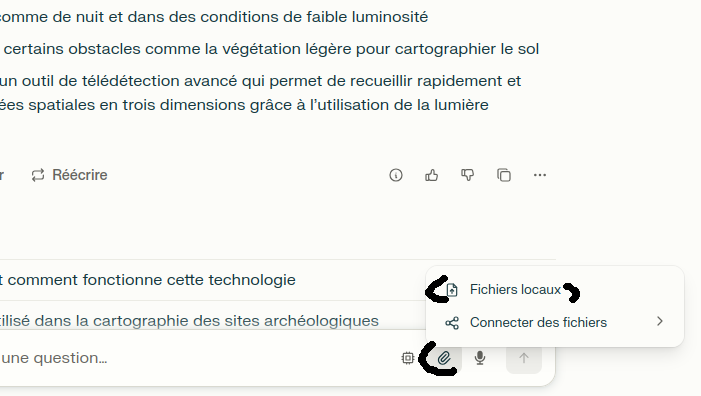

### Comment faire

- Lors d’une nouvelle question, cliquez sur le bouton **+ Attacher** (📎) à droite de la barre de recherche[^32][^310][^311].
- Sélectionnez votre fichier (PDF, image, texte, etc.)[^310][^311][^312].
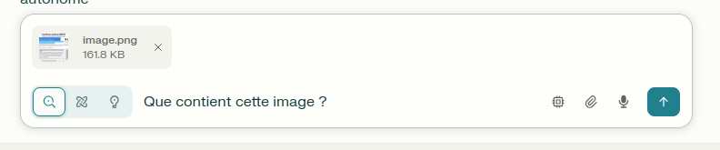
- L’IA analysera le contenu du fichier pour répondre à vos questions spécifiques[^311][^312].
- Limite : 25 Mo par fichier, jusqu’à 4 fichiers à la fois pour les utilisateurs standards[^311].
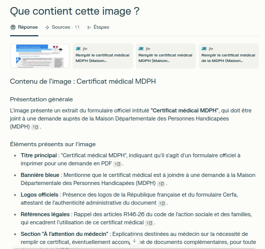

---

## 7. Exporter une discussion ou un fichier

**Icône à utiliser :**
**Capture d’écran suggérée :** Menu d’export (alt="Menu pour exporter ou enregistrer une discussion")

### Exporter une discussion

- Dans une discussion, cherchez en haut à droite, l'icone `⋯` l’option **Exporter** ou utilisez une extension comme « Save my Chatbot » pour sauvegarder la conversation au format Markdown ou PDF[^313][^314][^315].
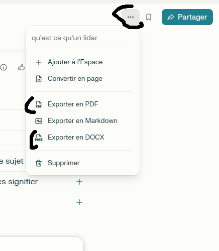
- Pratique pour garder une trace ou partager vos échanges avec d’autres personnes[^316][^314].
- Vous pouvez également générer un lien et partager avec d'autres personnes

---

## 8. Générer les fichiers avec l'A

Dans une question, vous pouvez demander à l'AI de générer un fichier

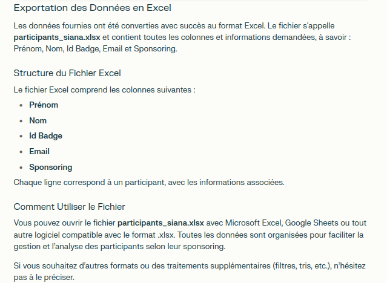

Pour trouver les fichier, cliquer sur l'onglet "Etapes"
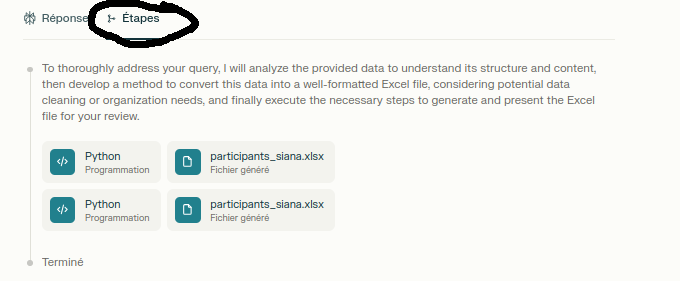

# Tutoriels Avancés Perplexity : Rapports approfondis, Personnalisation, Collaboration

## 8. Créer des rapports de recherche approfondis (Deep Research)

### À quoi ça sert ?

Le mode « Recherche approfondie » (Deep Research) permet d’obtenir des rapports détaillés et structurés sur des sujets complexes, en quelques minutes seulement. L’IA analyse des dizaines de sources, synthétise l’information et vous livre un document clair, idéal pour des études, des dossiers ou des analyses poussées[^331][^332][^333].

### Étapes simples

- **Accédez à Perplexity** et connectez-vous à votre compte.
- **Saisissez votre question** dans la barre de recherche, puis sélectionnez le mode « Recherche approfondie » ou « Deep Research ».
- **Lancez la recherche** : l’IA va effectuer plusieurs recherches liées, analyser les sources et rédiger un rapport complet.
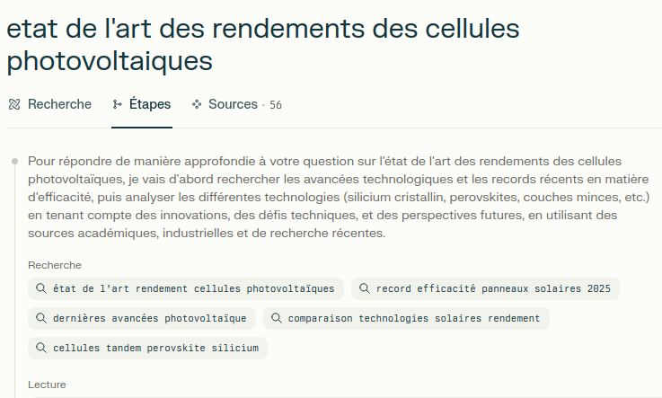
- **Consultez le rapport** : vous pouvez voir le raisonnement étape par étape, les sources utilisées et la synthèse finale.
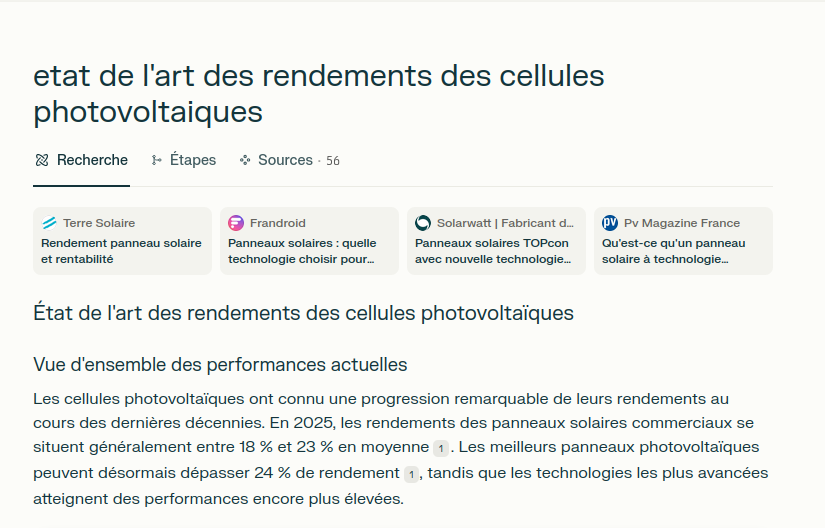
- **Exportez ou partagez** le rapport : cliquez sur l’option d’export (PDF, Word, page partagée) pour sauvegarder ou envoyer votre analyse à d’autres personnes[^331][^332][^333].

**Astuce :** Ce mode est idéal pour les études de marché, les analyses techniques ou la rédaction de mémoires universitaires.
Par exemple, vous pouvez exporter les résultats sous la forme d'un blog
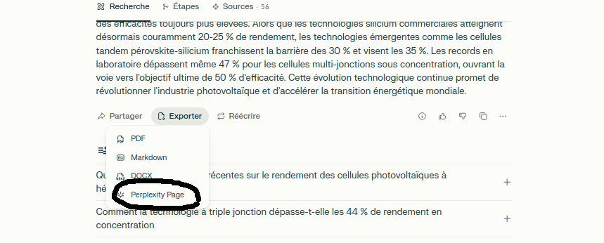

---

## 9. Personnaliser les résultats de l’IA

### Pourquoi personnaliser ?

Adapter Perplexity à vos besoins permet d’obtenir des réponses plus pertinentes et adaptées à votre profil, vos centres d’intérêt ou votre style de communication[^331][^334][^335].

### Comment faire ?

- **Accédez aux paramètres** : cliquez sur votre photo de profil (généralement en bas à droite de l’interface).
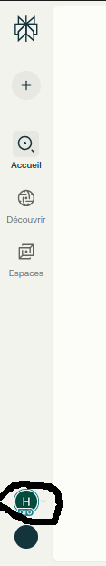
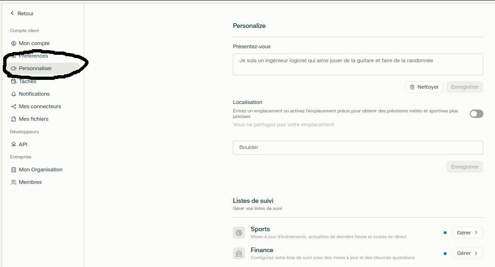
- **Remplissez votre profil** :
  - **Centres d’intérêt** : indiquez vos sujets favoris (sciences, cuisine, voyages…).
  - **Style de réponse** : choisissez entre un ton formel ou décontracté, des réponses courtes ou détaillées.
  - **Langue et localisation** : sélectionnez la langue de préférence et, si besoin, votre région.
  - **Objectifs** : précisez ce que vous attendez de Perplexity (aide aux devoirs, veille professionnelle, etc.).
- **Enregistrez vos préférences** : ces réglages s’appliqueront à toutes vos futures recherches, rendant l’IA plus efficace et personnalisée[^331][^334][^335].

**Astuce :** Les abonnés Pro peuvent aussi choisir le modèle d’IA utilisé pour chaque recherche (ex : GPT-4o, Claude 3), pour encore plus de personnalisation[^335].

---

## 10. Collaborer dans les espaces de travail (Spaces)

### Qu’est-ce qu’un espace de travail ?

Un « Space » est un espace collaboratif où vous pouvez organiser vos recherches, partager des fichiers et travailler à plusieurs sur des projets communs (études, travaux de groupe, veille d’équipe…)[^336].

### Étapes pour collaborer

- Dans le menu à gauche, clickez sur le bouton espace
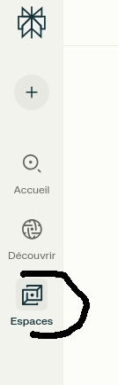
- **Créez un espace** : cliquez sur « Créer un espace » dans la barre latérale, donnez-lui un nom et une description.
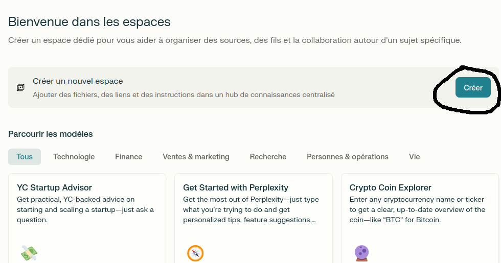
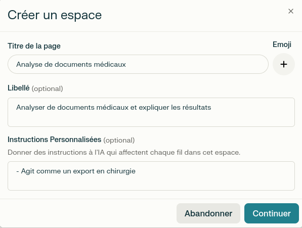
- **Ajoutez des membres** : invitez d’autres utilisateurs par e-mail ou lien de partage.
- **Centralisez vos documents** : importez notes, fichiers, liens et ressources dans l’espace.
- **Posez des questions à l’IA** : chaque membre peut interroger l’IA sur les documents partagés, générer des synthèses, ou demander des plans de projet.
- **Organisez la collaboration** : créez des guides d’étude, des calendriers partagés, divisez les tâches et suivez l’avancement du groupe[^336].

**Exemples d’usages :**

- Préparer un exposé ou un rapport à plusieurs.
- Centraliser les ressources d’une équipe projet.
- Générer des outils d’étude personnalisés pour une classe ou un groupe d’apprentissage[^336].

- Cliquez sur **Créer un espace** dans la barre latérale[^317][^319].

- Donnez un nom à l’espace, ajoutez une description et, si besoin, des instructions personnalisées pour l’IA[^317][^319].

- Ajoutez vos fichiers et commencez à poser des questions ou à collaborer avec d’autres utilisateurs[^318][^319].

⁂

[^31]: <https://infopreneur.blog/perplexity-login/>

[^32]: <https://reglo.ai/comment-utiliser-perplexity-ai/>

[^33]: <https://gitmind.com/fr/perplexity-ai-guide-utilisation.html>

[^34]: <https://www.blogdumoderateur.com/perplexity-guide-bien-utiliser-moteur-recherche-assiste-ia/>

[^35]: <https://www.perplexity.ai/help-center/fr/articles/10354769-qu-est-ce-qu-un-fil-de-discussion>

[^36]: <https://www.reddit.com/r/perplexity_ai/comments/1dyx9uy/need_help_with_managing_threads/?tl=fr>

[^37]: <https://www.perplexity.ai/fr/hub/getting-started>

[^38]: <https://www.perplexity.ai/help-center/fr/articles/10354975-commencer-a-utiliser-perplexity>

[^39]: <https://www.elephorm.com/formation/code-data/no-code/maitriser-perplexity-ai-optimisez-vos-recherches-avec-lia>

[^310]: <https://www.elephorm.com/formation/code-data/perplexity/maitriser-perplexity-ai-optimisez-vos-recherches-avec-lia/integration-dimages-et-de-fichiers-dans-vos-recherches>

[^311]: <https://app.studyraid.com/fr/read/18469/680245/importer-des-fichiers-pdf>

[^312]: <https://www.perplexity.ai/hub/faq/how-does-file-upload-work>

[^313]: <https://www.reddit.com/r/perplexity_ai/comments/16n2g3d/i_made_an_extension_to_export_perplexity_threads/?tl=fr>

[^314]: <https://chromewebstore.google.com/detail/save-my-chatbot-ai-conver/agklnagmfeooogcppjccdnoallkhgkod>

[^315]: <https://github.com/Hugo-COLLIN/SaveMyPhind-conversation-exporter>

[^316]: <https://www.perplexity.ai/hub/blog/introducing-perplexity-deep-research>

[^317]: <https://www.elephorm.com/formation/code-data/perplexity/maitriser-perplexity-ai-optimisez-vos-recherches-avec-lia/explorez-la-fonctionnalite-space-de-perplexity>

[^318]: <https://anthemcreation.com/intelligence-artificielle/perplexity-spaces-recherche-en-ligne-et-locale-premium/>

[^319]: <https://action-commerciale.com/espace-perplexity-hub-projets/>

[^331]: <https://reglo.ai/comment-utiliser-perplexity-ai/>

[^332]: <https://www.elephorm.com/formation/code-data/perplexity/maitriser-perplexity-ai-optimisez-vos-recherches-avec-lia/exploration-de-la-recherche-approfondie-avec-perplexity>

[^333]: <https://cedric.fm/guide-perplexity-redaction/>

[^334]: <https://www.perplexity.ai/help-center/fr/articles/10354948-comment-dois-je-remplir-la-section-profil-de-mes-parametres>

[^335]: <https://www.blogdumoderateur.com/perplexity-guide-bien-utiliser-moteur-recherche-assiste-ia/>

[^336]: <https://www.perplexity.ai/fr/hub/blog/a-student-s-guide-to-using-perplexity-spaces>

# Guide pour utiliser NotebookLM

Guide pour utiliser NotebookLM : Simplifiez vos tâches et organisez vos informations

Bienvenue dans ce guide détaillé pour utiliser NotebookLM \! Que vous soyez un jeune étudiant, un professionnel expérimenté ou simplement curieux, ce guide vous aidera à maîtriser NotebookLM pour alléger vos tâches administratives, stocker et classer vos recherches, et bien plus encore. Chaque section propose des instructions simples, des icônes pour repérer les actions, et des indications pour insérer vos propres captures d'écran (pensez à ajouter des balises `alt` pour l'accessibilité).

-----

## 1\. Créer un nouveau carnet de notes (Notebook)

### Icône à utiliser

### Étapes simples

- Rendez-vous sur [notebooklm.google](https://notebooklm.google/) depuis votre navigateur.
- Cliquez sur le bouton "+ Nouveau carnet de notes" (ou "New notebook")[^341].
- Donnez un nom à votre carnet de notes (ex: "Projet Alpha", "Recettes de cuisine", "Recherches historiques").
- Cliquez sur "Créer" pour ouvrir votre nouveau carnet[^341].

-----

## 2\. Ajouter des sources à votre carnet de notes

NotebookLM est puissant grâce aux sources que vous lui fournissez. Il peut analyser différents types de documents.

### Icône à utiliser

### Comment ajouter des sources

- Dans votre carnet de notes, cherchez le bouton "Ajouter des sources" (généralement "+ Add sources" ou une icône similaire).

- Vous avez plusieurs options pour ajouter des sources[^342]:

  - **Depuis votre ordinateur** : Cliquez sur "Télécharger un fichier" et sélectionnez des documents PDF, Google Docs, ou d'autres fichiers texte[^342].
  - **Depuis Google Drive** : Connectez votre compte Google Drive pour importer des documents directement[^342].
  - **Copier-coller du texte** : Collez du texte directement dans la zone prévue à cet effet (par exemple, un article de blog, une transcription)[^342].
  - **Coller une URL de site web** : Ajoutez l'URL d'une page web pour que NotebookLM en tire des informations[^342].

- Une fois les sources ajoutées, NotebookLM les analyse. Cela peut prendre quelques instants selon la taille et le nombre de fichiers[^342].

-----

## 3\. Discuter avec l'IA et obtenir des résumés

Une fois vos sources ajoutées, vous pouvez interroger NotebookLM pour obtenir des informations, des résumés ou des idées.

### Icône à utiliser

### Comment discuter avec l'IA

- Après avoir ajouté vos sources, vous verrez une barre de discussion ou une zone de texte en bas ou sur le côté de l'interface[^343].
- Tapez votre question ou votre demande dans cette barre. Par exemple : "Résumez les points clés du document sur le projet X", "Quels sont les avantages de la solution Y mentionnés dans ce fichier ?", ou "Générez un plan d'action basé sur ces notes"[^343].
- Appuyez sur **Entrée** ou cliquez sur l'icône d'envoi.
- L'IA générera une réponse basée **uniquement** sur les sources que vous avez fournies, ce qui garantit la pertinence et la fiabilité des informations[^343].

### Comprendre les citations (Sources)

- Les réponses de NotebookLM incluent des citations (par exemple, `[1]`, `[2]`) qui renvoient aux sources spécifiques que vous avez ajoutées[^344].
- Cliquez sur ces citations pour voir quelle partie de votre document a été utilisée pour générer la réponse. Cela vous aide à vérifier l'information et à trouver rapidement la section originale[^344].

-----

## 4\. Organiser vos notes et informations

NotebookLM vous aide à structurer vos pensées et vos recherches.

### Icône à utiliser

### Comment organiser vos informations

- **Ajouter des notes** : Vous pouvez prendre des notes directement dans votre carnet, à côté de vos sources ou des discussions avec l'IA[^345].
- **Créer des résumés automatiques** : Demandez à l'IA de générer des résumés pour des sections spécifiques de vos documents ou pour l'ensemble de votre carnet[^345].
- **Générer des plans et des idées** : Utilisez l'IA pour structurer des plans d'exposé, des ébauches d'articles, ou pour brainstormer des idées en fonction de vos sources[^345].
- **Mettre en évidence les passages importants** : Sélectionnez du texte dans vos sources et demandez à NotebookLM de vous en extraire des points clés ou de les résumer[^346].

-----

## 5\. Utiliser les guides générés par l'IA

NotebookLM peut créer des "Guides" basés sur vos sources pour vous aider à explorer des sujets en profondeur.

### Icône à utiliser

### Comment utiliser les guides

- Dans certains cas, NotebookLM peut suggérer de créer un guide basé sur le contenu de votre carnet[^347].
- Cliquez sur "Créer un guide" ou une option similaire.
- L'IA organisera les informations de vos sources en sections thématiques, facilitant la navigation et la compréhension des sujets complexes[^347].
- Les guides sont particulièrement utiles pour étudier, préparer des présentations ou explorer de nouvelles thématiques.

-----

## 6\. Partager vos carnets de notes

Vous pouvez partager vos carnets de notes avec d'autres personnes pour collaborer ou simplement diffuser vos recherches.

### Icône à utiliser

### Comment partager un carnet

- Dans votre carnet de notes, cherchez l'icône de partage (souvent un symbole de flèche ou de trois points connectés) ou le bouton "Partager"[^348].
- Vous pourrez alors générer un lien partageable.
- Attention : Assurez-vous de bien comprendre les options de partage (lecture seule, modification) avant d'envoyer le lien[^348].

-----

## 7\. Gérer et retrouver vos carnets

### Où retrouver vos carnets passés

- Sur la page principale de NotebookLM, vous verrez la liste de tous vos carnets de notes.
- Cliquez sur un carnet pour l'ouvrir et reprendre votre travail là où vous l'avez laissé.
- Vous pouvez rechercher des carnets par nom si vous en avez beaucoup.

### Attention

- Si vous supprimez un carnet de notes, toutes les sources et discussions qu'il contient seront définitivement effacées[^349].

-----

En utilisant NotebookLM, vous transformez vos documents en une base de connaissances interactive et personnalisée, prête à répondre à toutes vos questions et à vous aider à organiser vos idées.

\
⁂\</div\>

[^341]:
    [Google Workspace Updates: Build your own AI assistant with NotebookLM](https://www.google.com/search?q=https://workspaceupdates.googleblog.com/2023/07/build-your-own-ai-assistant-with-notebooklm.html)

[^342]:
    [Google Chrome : Utiliser NotebookLM](https://support.google.com/chrome/answer/14352127?hl=fr)

[^343]:
    [Google Workspace Updates: Get to know NotebookLM, a Google AI experiment](https://www.google.com/search?q=https://workspaceupdates.googleblog.com/2024/06/get-to-know-notebooklm-a-google-ai-experiment.html)

[^344]:
    [NotebookLM - Your AI-powered research assistant](https://www.google.com/search?q=https://blog.google/technology/ai/notebooklm-google-ai-research-assistant/)

[^345]:
    [Google Workspace Updates: NotebookLM makes your research easier with AI-generated notes, outlines, and summaries](https://www.google.com/search?q=https://workspaceupdates.googleblog.com/2024/03/notebooklm-ai-generated-notes-outlines-summaries.html)

[^346]:
    [How to use NotebookLM - YouTube](https://www.google.com/search?q=https://www.youtube.com/watch%3Fv%3DFqS0o7M4j2E)

[^347]:
    [Google Blog: How NotebookLM helps you learn anything](https://www.google.com/search?q=https://blog.google/technology/ai/how-notebooklm-helps-you-learn-anything/)

[^348]:
    [How to Share NotebookLM Projects - YouTube](https://www.google.com/search?q=https://m.youtube.com/watch%3Fv%3D4F9o_c2d0fE)

[^349]:
    [NotebookLM support page](https://support.google.com/notebooklm/answer/14352127)
