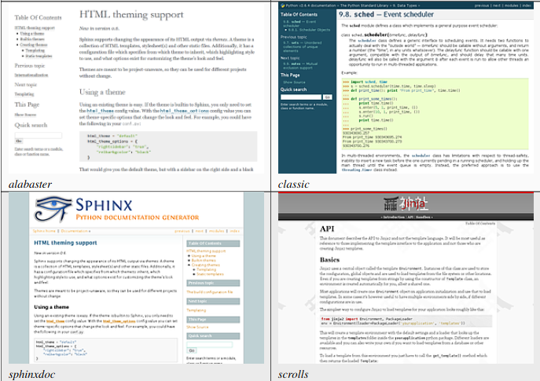
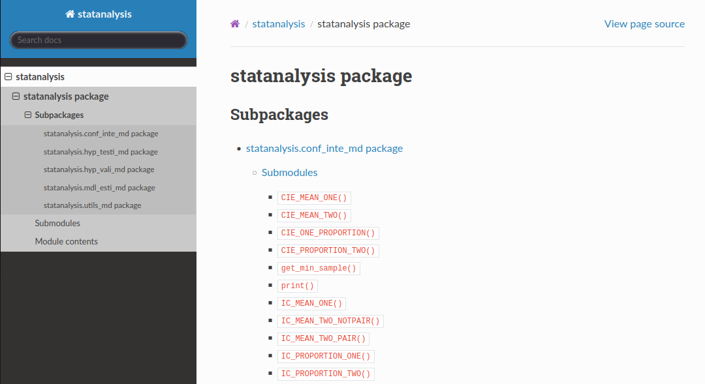
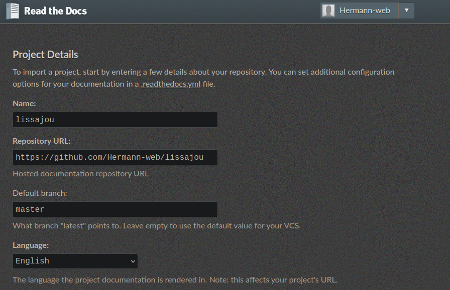
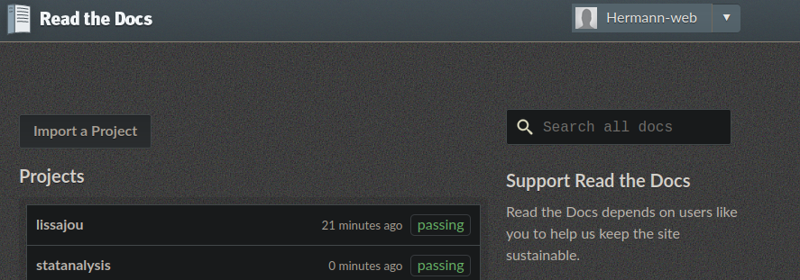

# Generating API Documentation for Your Python Package with Sphinx-apidoc

## Introduction

In this guide, we will explore how to generate API documentation for your Python package using Sphinx-apidoc. Effective documentation is crucial for understanding, maintaining, and collaborating on software projects. Sphinx-apidoc is a tool that automates the process of creating documentation from docstrings within your Python codebase. Let's dive into the steps required to set up and utilize this tool effectively.

<!-- more -->

## Motivation

In my quest to streamline the documentation process for my python projects as packages, I embarked on a journey to explore methods of leveraging docstrings to automatically generate documentation compatible with [ReadTheDocs](https://readthedocs.org/) or [MkDocs](https://www.mkdocs.org/), platforms I'm familiar with and prefer due to their formatting styles. Despite my inclination towards MkDocs, I encountered a dilemma as it lacks built-in support for API documentation.

Amidst my research, I stumbled upon a pivotal discovery. A question posed by a fellow developer seeking to automatically generate [Sphinx documentation](https://www.sphinx-doc.org/en/master/) from their docstrings led me to a solution. Users had proposed a [script](https://stackoverflow.com/a/2703173), which eventually found its way into the Sphinx ecosystem as [sphinx-apidoc](https://www.sphinx-doc.org/en/master/man/sphinx-apidoc.html), aligning perfectly with my requirements.

Despite the prevalence of Sphinx in platforms like ReadTheDocs, I encountered [discussions](https://github.com/encode/httpx/discussions/1220) debating the merits of [MkDocs](../../software-and-tools/dev/mkdocs/mkdocs-get-started.md) versus Sphinx, particularly concerning module documentation. While MkDocs appealed to me for its simplicity, the absence of built-in support for API documentation posed a significant hurdle. This realization prompted me to explore alternatives and delve later on into lesser-known solutions like [mkdocstrings](https://github.com/mkdocstrings/mkdocstrings) or [react based ones](https://dev.to/jacksonkasi/how-to-make-a-documentation-website-in-react-js-56mk) or whatever solution is used in [pydandic api documentation](https://docs.pydantic.dev/latest/api/base_model/), built using mkdocs with [some automation](https://github.com/pydantic/pydantic/tree/main/docs/api).

??? examples "Example of documentations with these tools:"

    - [MkDocs Documentation](https://www.python-httpx.org/environment_variables/): Showcases simplicity in general documentation.
    - [Requests Documentation](https://requests.readthedocs.io/en/stable/api/#authentication): An example of documentation built with Sphinx, although some may find the theme less appealing.
    - [Open3D v0.17 Documentation](https://www.open3d.org/docs/0.17.0/introduction.html): Known for its visually appealing documentation despite using Sphinx.
    - [Open3D v0.18 Documentation](https://www.open3d.org/docs/0.17.0/introduction.html): Built with Sphinx using another theme.

With my decision made, I opted to utilize `sphinx-apidoc` for its efficiency and compatibility with Sphinx. My journey involved generating a foundational [Sphinx documentation](https://www.sphinx-doc.org/en/master/tutorial/getting-started.html), employing `sphinx-apidoc` to automate the creation of documentation directives, integrating them into my project's index file, and finally, compiling the documentation. Alongside these steps, I undertook additional refinements, such as adopting the widely-used [sphinx-rtd-theme](https://sphinx-rtd-theme.readthedocs.io/) for an enhanced visual experience and leveraging [napoleon](https://sphinx-contrib-napoleon.readthedocs.io/en/latest/) for greater flexibility in docstring formatting, eliminating the need for reStructuredText within the docstrings themselves.

## Installing Sphinx

Before we can generate documentation with Sphinx-apidoc, we need to install Sphinx. Sphinx is a documentation generation tool widely used in the Python community.

=== ":octicons-file-code-16: `using pip`"

    You can install Sphinx using pip:

    ```bash
    pip install -U sphinx
    ```

=== ":octicons-file-code-16: `using apt`"

    Alternatively, you can install it globally with:

    ```bash
    sudo apt update
    sudo apt install python3-sphinx
    ```

??? note "to uninstall"

    === ":octicons-file-code-16: `using pip`"

       ```bash
       pip uninstall sphinx
       ``` 
    === ":octicons-file-code-16: `using apt`" 

       ```bash
       sudo apt remove python3-sphinx
       sudo apt autoremove
       ```

## Generating Documentation Base Files for a Basic Setup

To start generating documentation with Sphinx-apidoc, we first need to create the base files for our documentation project. This can be achieved using the `sphinx-quickstart` command:

```bash
cd my/project/path
sphinx-quickstart docs
```

Follow the prompts to set up your project. Once completed, you can generate the HTML documentation by running:

```bash
cd docs
make html
```

Your documentation will be located at `build/html/index.html`.

## Utilizing Docstrings

### Incorporating Directives

Now that we have our basic documentation structure set up, let's incorporate our Python docstrings into the documentation. We can achieve this with Sphinx-apidoc. For example, if our module is located at `./statanalysis`, we can generate documentation files for it using the following command:

```bash
sphinx-apidoc ./statanalysis/ -o ./docs/source/statanalysis/ -f -E
```

Make sure to update your index file like below to include the newly generated files.

```rts
...

.. toctree::
   :maxdepth: 2

   statanalysis/statanalysis

...
```

Here, i use `statanalysis/statanalysis` that will access the file `docs/source/statanalysis/statanalysis.rts`. This file list the other module files.

Then run the command `make html` in the `docs` directory to update the build.

??? "Troubleshooting Import Errors in Sphinx"

    If you encounter import errors while generating documentation with Sphinx, it's essential to diagnose and resolve the issue promptly. Here are some steps to troubleshoot and address import errors effectively:
    
    1. **Check Module Installation**: Ensure that all required Python modules are installed in the environment where Sphinx is running. Use `pip list` or `pip show <module_name>` to verify module installation.
    
    2. **Activate Virtual Environment**: If you're using a virtual environment, activate it before running Sphinx. Use the appropriate activation command (`source <venv>/bin/activate` for Unix-like systems or `<venv>\Scripts\activate` for Windows).
    
    3. **Inspect Sphinx Configuration**: Review your Sphinx configuration file (`conf.py`) to ensure that it specifies the correct Python interpreter and environment. Uncomment and update the `sys.path` variable to include the path to your project. For example:
    
        ```python
        import sys
        from pathlib import Path
        sys.path.insert(0, str(Path(__file__).parent.parent.parent.absolute()))
        ```
    
        This step ensures that Sphinx can locate and import your project modules correctly.
    
    4. **Resolve Dependency Conflicts**: Check for any conflicting dependencies between modules or packages in your project. Resolve conflicts by updating package versions or installing compatible versions of conflicting packages.
    
    5. **Validate Module Paths**: Double-check the import paths specified in your Python source files. Ensure that module paths are correctly defined and that all necessary `__init__.py` files are present in directories.
    
    6. **Check `__init__.py`**: Make sure that `__init__.py` files are present in all module folders within your project. These files are necessary for Python to recognize directories as packages.
    
    7. **Update Sphinx Extensions**: If you're using Sphinx extensions, ensure that they are up to date. Outdated extensions may cause compatibility issues or import errors. Use `pip install --upgrade <extension_name>` to update extensions.
    
    8. **Rebuild Documentation**: After making any changes or resolving issues, rebuild your Sphinx documentation to verify that the import errors have been resolved. Use the `make html` command to rebuild the documentation.

### Enhancing Docstring Readability

We can improve the readability of our docstrings by using the `napoleon` extension.  `napoleon` allows us to write docstrings in a more concise and readable format, such as Google or Numpy style. To enable  `napoleon`, update your `conf.py` with the following:

```python
...
# Add any Sphinx extension module names here, as strings. They can be
# extensions coming with Sphinx (named 'sphinx.ext.*') or your custom
# ones.
extensions = [
    "sphinx.ext.napoleon",
]

#  `napoleon` settings
# from https://github.com/cimarieta/sphinx-autodoc-example
napoleon_google_docstring = True
napoleon_numpy_docstring = True
napoleon_include_init_with_doc = True
napoleon_include_private_with_doc = True
napoleon_include_special_with_doc = True
napoleon_use_admonition_for_examples = False
napoleon_use_admonition_for_notes = False
napoleon_use_admonition_for_references = False
napoleon_use_ivar = False
napoleon_use_param = True
napoleon_use_rtype = True
...
```

Rerun the `make html`. Great! They may still be some warnings, but in general, the build will be successful.

## Additional Extensions for Enhanced Functionality

Sphinx offers a variety of extensions to enhance the functionality of your documentation. Some useful extensions include:

- `sphinx.ext.autodoc`: Automatically generates documentation from docstrings.
- `sphinx.ext.autosummary`: Generates summaries of modules, classes, and functions based on documentation.
- `sphinx.ext.mathjax`: Renders mathematical equations in your documentation.
- `sphinx.ext.todo`: Includes "todo" items in your documentation.
- and more.

You can activate these extensions by adding them to the `extensions` list in your `conf.py` like below:

```python
extensions = [
    "sphinx.ext.autodoc", 
    "sphinx.ext.autosummary",
    "sphinx.ext.napoleon",
    "sphinx.ext.mathjax",
    "sphinx.ext.todo",
]
```

??? tip "more extensions"
    Here is an example of a list of extensions. You can activate those you find useful:

    ```python
    extensions = [
       # like open3d:0.17
       "sphinx.ext.autodoc", # generate documentation for Python modules, classes, and functions, from docstring
       "sphinx.ext.autosummary", # generates summaries of modules, classes, and functions based on the documentation generated by sphinx.ext.autodoc
       "sphinx.ext.napoleon", # the  `napoleon` style of docstrings for Python modules, classes, and functions, is easy to read and write
       "sphinx.ext.mathjax", # display mathematical equations
       "sphinx.ext.todo", # include "todo" items in your documentation
       # "nbsphinx", #include Jupyter Notebooks in your documentation
       # 'm2r2', #convert Markdown files to reStructuredText (RST) format,
       # more from https://github.com/cimarieta/sphinx-autodoc-example
       # "nbsphinx", #include Jupyter Notebooks in your documentation
       # 'm2r2', #convert Markdown files to reStructuredText (RST) format,
       # more from https://github.com/cimarieta/sphinx-autodoc-example
       # 'sphinx.ext.doctest', # test code snippets in the documentation
       # 'sphinx.ext.intersphinx', # link to external documentation
       # 'sphinx.ext.coverage', # measure the coverage of the documentation
       # 'sphinx.ext.ifconfig', # include content based on configuration options
       # 'sphinx.ext.viewcode', # show the source code of modules and functions
       # 'sphinx.ext.githubpages', # publish documentation on GitHub Pages
    ]
    ```

## Handy Tips for Integration

??? tip "Link Integration"

    When adding hyperlinks to your documentation, use reStructuredText syntax to ensure proper rendering. For example:

    - We may do this in markdown
    ```md
    Author: Susan Li source:[LogisticRegressionImplementation.ipynb](https://github.com/aihubprojects/Logistic-Regression-From-Scratch-Python/blob/master/LogisticRegressionImplementation.ipynb)
    ```

    - But in rst, we use

    ```rst
    Author: Susan Li source: `LogisticRegressionImplementation.ipynb <https://github.com/aihubprojects/Logistic-Regression-From-Scratch-Python/blob/master/LogisticRegressionImplementation.ipynb>`_
    ```

    So, use the backtick (`) and angle brackets (<>) around the text you want to display as a hyperlink, along with the correct reStructuredText syntax (`link text <URL>`_), you can ensure that the text is rendered as a clickable link in the documentation.

??? tip "Utilizing Todo Extension"

    To mark sections as "todo" items within your Python docstrings, use the `.. todo::` directive. For example:
 
    ```python
    def my_function():
     """
     This is a function that does something.
 
     .. todo:: Implement error handling.
     """
    ```
 
    Make sure to enable the `sphinx.ext.todo` extension in your `conf.py` and optionaly, set the `todo_include_todos` configuration value to `True` in your `conf.py` file. This configuration ensures that the `todo` directives in your docstrings will be included in the output.
 
    **Generate a List of Todos:**
    To generate a list of all `todo` directives in your documentation, you can use the `.. todolist::` directive in your documentation. This will create a list of all `todo` items throughout your documentation.

??? tip "Adding Sphinx to Development Dependencies"

    Ensure Sphinx is included in your development dependencies. You can achieve this by adding it to your project using Poetry or pip:

    ```bash
    poetry add sphinx --group buildthedocs
    ```

    or

    ```bash
    pip install sphinx
    ```

## Customizing the Theme

The default theme or even the built in themes (`alabaster`, `classic`, `sphinxdoc`, `scrools`, ...) provided by Sphinx may not suit your preferences.



You can customize the theme to better fit your project's style. Some popular themes include:

- [solar-theme](https://github.com/c-bata/solar-theme)
- [sphinx-rtd-theme](https://sphinx-rtd-theme.readthedocs.io/)
- [furo](https://pradyunsg.me/furo/)

!!! example "Example of online project using these themes"

    - `sphinx-rtd-theme` used for [open3d v0.17 documentation](https://www.open3d.org/docs/0.17.0/introduction.html)
    - `furo` in [open3d v0.18](https://www.open3d.org/docs/0.18.0/introduction.html)"

Install your chosen theme using pip and update the `html_theme` in your `conf.py`.

??? example "use sphinx-rtd-theme"

    Install in the environment with the method you use (I use Poetry):

    ```bash
    poetry add sphinx-rtd-theme --group buildthedocs
    ```

    Update the `html_theme` in the `conf.py` file:

    ```python
    ...
    html_theme = 'sphinx_rtd_theme'
    ...
    ```

    Generate the build like mentioned before.

    You may have some warnings related to the syntax; you can fix them.

Here was my output of my python package [statanalysis](https://pypi.org/project/statanalysis/) with `sphinx-docapi` + `sphinx-rtd-theme`



## Integrating README.md into Sphinx Documentation

To include your `README.md` file as an introduction to your Sphinx documentation, you can use the [`m2r2` extension](https://github.com/CrossNox/m2r2) as implicitely mentioned [in this stackoverflow answer](https://stackoverflow.com/a/46286751). Follow these steps to seamlessly integrate your `README.md` file into your Sphinx documentation:

1. **Install m2r2 Extension**: First, install the `m2r2` extension in your development environment using Poetry or pip:

    === ":octicons-file-code-16: `using poetry`"

        ```bash
        poetry add m2r2 --group buildthedocs
        ```

    === ":octicons-file-code-16: `using pip`"

        ```bash
        pip install m2r2
        ```

2. **Create `readme.rst` File**: Create a `readme.rst` file in your Sphinx documentation source directory (`./docs/source/readme.rst`).

    === ":octicons-file-code-16: `readme.rst`"

         In your `readme.rst` file, use the `mdinclude` directive to include the content of your `README.md` file:
     
         ```rst
         -----------
         Introduction
         -----------
     
         .. mdinclude:: ../../README.md
         ```

    === ":octicons-file-code-16: `using poetry`"

         Update your `index.rst` file to include the `readme.rst` file in the table of contents (`toctree` directive):
 
         ```rst
         ...
 
         .. toctree::
             :maxdepth: 2
             :caption: Contents:
 
             readme  # Include readme.rst here
             reference
 
         ...
         ```

By following these steps, you can seamlessly integrate your `README.md` file into your Sphinx documentation, providing an informative introduction to your project.

## Deploying Documentation to ReadTheDocs

Once you've generated your Sphinx documentation, deploying it to [ReadTheDocs](https://readthedocs.org) allows you to host and share your documentation with ease.

!!! example "For example I've deployed the [statanalysis api reference](https://statanalysis.readthedocs.io/en/latest/) or the [lissajou api reference](https://lissajou.readthedocs.io/en/latest)"

To deploy your documentation to ReadTheDocs, you need to prepare your documentation and configuration files, then you can import your project to ReadTheDocs and initiate the build process. Follow this step-by-step guide:

1. **Export Dependencies**:

    Before deploying your documentation, you need to export your project dependencies to ensure that ReadTheDocs builds your documentation with the correct dependencies.

    Depending on your package manager (e.g., Poetry, pip), export your dependencies to a `requirements.txt` file.

    !!! tip "Depending on your package manager, to get the right syntax, refer to this [cheat on package managers](./package-managers-in-python.md)"

    ??? example "Example Using Poetry"

         ```bash
         poetry export -f requirements.txt --output ./docs/requirements.txt --without-hashes --with buildthedocs
         ```
         This command exports the dependencies specified in your Poetry project, excluding development dependencies, and includes the dependencies grouped under `buildthedocs`.

1. **Create Configuration File**: Next, you need to create a `.readthedocs.yaml` file in the root directory of your project. This file specifies the build configuration for ReadTheDocs.

    ??? example "Example of `.readthedocs.yaml`"

         ```yaml
         # Required
         version: 2
 
         # Set the OS, Python version, and other tools you might need
         build:
           os: ubuntu-22.04
           tools:
             python: "3.8"
 
         # Build documentation in the "docs/" directory with Sphinx
         sphinx:
           configuration: docs/source/conf.py
 
         # Optionally build your docs in additional formats such as PDF and ePub
         formats:
           - pdf
           - epub
 
         python:
           install:
             - requirements: docs/requirements.txt
         ```

    This configuration file specifies the Python version, operating system, and build tools required for building your documentation. Additionally, it defines the location of your Sphinx configuration file and specifies the dependencies needed for the build.

1. **Create ReadTheDocs Account**: If you haven't already, create an account on the [ReadTheDocs website](https://readthedocs.org).

1. **Import Project**: Import your project to ReadTheDocs, linking it to your GitHub repository or other version control system. You can either use the GitHub integration or import your project manually.

    !!! example "Manual Import Example"

        - Navigate to the [manual import page](https://readthedocs.org/dashboard/import/manual/?).
    
            {width=50%}
    
        - Enter the URL of your repository (e.g., `https://github.com/hermann-web/lissajou`) 
        
        - Specify the desired project name. 
        
            !!! note "That name will appear in `https://<name>.readthedocs.io/en/latest`"
    
        - Follow the prompts to complete the import process.

1. **Build Documentation**: Once your project is imported, initiate the build process on ReadTheDocs. The platform will automatically detect changes in your repository and trigger builds accordingly.

1. **Monitor Builds on ReadTheDocs Dashboard**: After initiating the build process, you can monitor the progress and status of your documentation builds on the [ReadTheDocs dashboard](https://readthedocs.org/dashboard/). This allows you to track build successes, view logs, and troubleshoot any errors that may occur during the build process.

    {width=80%}

By following these steps, you can successfully deploy your Sphinx documentation to ReadTheDocs and make it accessible to your audience.

??? example "recap example"

 This was the steps for one python package i've built

 ```bash
 # 1. add deps
 poetry add sphinx==^7.0.0 --group buildthedocs
 poetry add sphinx-rtd-theme --group buildthedocs
 poetry add m2r2 --group buildthedocs
 # 2. create the docu template
 sphinx-quickstart docs
 # 2. generate buildthedocs requirements, generate api doc and build docu
 source scripts/run-build-docu.sh
 # 3. add readme.rst
 # 4. update index.rst to integrate readme.rst and openconv/modules.rst in 
 # 5. update conf.py to specify main path, add extensions, modify the html_theme
 # 6. rebuild docu to check
 source scripts/run-build-docu.sh
 # 7. add a .readthedocs file
 # 8. push to readthedocs.org
 ```

## Additional Resources

For more information on Sphinx and its capabilities, refer to the official Sphinx documentation. Additionally, you can explore the available themes and extensions to further enhance your documentation.

- [Sphinx Documentation - PDF](https://www.sphinx-doc.org/_/downloads/en/master/pdf/)
- [sphinx-autodoc-example - github](https://github.com/cimarieta/sphinx-autodoc-example)
- [Sphinx Quickstart](https://sphinx-rtd-tutorial.readthedocs.io/en/latest/sphinx-quickstart.html)
- [`lissajou` Module Documentation](https://lissajou.readthedocs.io/en/latest)
- [`statanalysis` Module Documentation](https://statanalysis.readthedocs.io/en/latest)
- [Readthedocs Configuration File Reference](https://docs.readthedocs.io/en/stable/config-file/v2.html)
