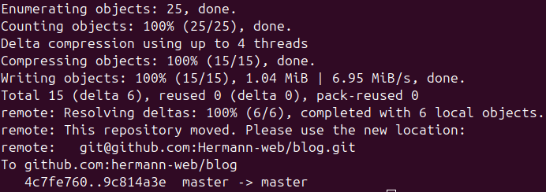

When I install a fresh Linux distribution like Ubuntu 24, I'm not just setting up a computer; I'm building a personal workspace. My goal is a clean, reliable, and portable development environment that can be replicated anywhere, from my local machine to a remote VPS.

<div class="float-img-container float-img-left">
  
  <figcaption style="font-size: 0.5em; color: #666; text-align: center; margin-top: 2px;">
    Image generated using Google Gemini
  </figcaption>
</div>

This isn't just about [a list of commands](../../../../../posts/software-and-tools/dev/OSX/linux/commands-for-file-and-directory-browsing.md), it's a philosophy of intentionality. Every tool I choose, and every tool I leave behind, is a step toward a more efficient and less cluttered workflow.

This is my journey to a perfect setup, and it all starts with version control.

<!-- more -->

## The First Steps: Git and SSH, The Key to Everything

First things first: [**Git**](../../../../../posts/software-and-tools/dev/version-control/git/git-pull-vs-git-merge-equivalence.md). It's the cornerstone of my development life. I don't just use Git for code; I use it to version control documents, configurations, and even this very blog post. The ability to track changes and collaborate is a non-negotiable.



So, the very first command I run after updating my packages is to install Git:

```bash
sudo apt install git
```

Next, I need a secure, password-free way to connect to my Git hosting service. I used to rely on tools like GitHub Desktop, but I've found that nothing beats the raw power and security of **SSH**. It's the standard for server access, and it's the most practical way to interact with my repositories when I'm working on a remote machine.

I follow the [official guideline](https://docs.github.com/en/authentication/connecting-to-github-with-ssh/generating-a-new-ssh-key-and-adding-it-to-the-ssh-agent) to generate a new key pair:

```bash
ssh-keygen -t ed25519 -C "my-email@example.com"
```

When prompted, I provide a clear, descriptive filename, like `~/.ssh/id_ed25519_github`. This is a small habit, but it's a lifesaver when you end up managing keys for multiple services like GitHub, GitLab, AWS ElasticBeanStalk cli, Azure Dev or a company's internal servers. The public key is then copied and added to my GitHub account. A quick test confirms everything is working:

```bash
ssh -T git@github.com
```

Now, my machine is securely and permanently linked to my Git repositories, and I'm ready for the next, most crucial step.

-----

## The Docker Revolution: Ditching Local Installs for a Clean Slate

This is where my philosophy truly diverges from the norm. Many developers install tools directly on their system using `apt`, `snap`, or `flatpak`. But even with these tools, you're still accumulating dependencies, caches, and configuration files that can lead to a bloated, messy system over time.

I choose a different path. I use **Docker** as my primary application manager.

Imagine a pristine, empty desktop. Now, imagine a magical box that contains all your applications and their messy dependencies, neatly sealed away. When you need a tool, you open the box. When you're done, you close it, and all the mess vanishes without a trace. That's Docker for me.


<figcaption style="font-size: 0.5em; color: #666; text-align: center; margin-top: 2px;">
    A stylized Docker whale with containers, courtesy of Google Gemini Image generator
</figcaption>

My applications are completely isolated, running in lightweight containers. This means I can run Node.js, Python, MongoDB, or any other tool without ever touching my host system's libraries. It eliminates version conflicts and ensures that my environment is always reproducible.

The installation is straightforward, following the official [Docker documentation](https://docs.docker.com/engine/install/ubuntu/#install-using-the-repository).

After a quick test with `sudo docker run hello-world`, I perform the single most important post-installation step: managing Docker as a non-root user.

```bash
sudo groupadd docker          # Create the docker group
sudo usermod -aG docker $USER # Add my user to the group
reboot                        # A restart is necessary to apply the changes
```

After the reboot, I can run `docker run hello-world` without `sudo`, and my user has full control over Docker. The real power of this approach comes from the next step: aliases.

!!! note "Read [here](../../../../../posts/software-and-tools/dev/OSX/docker/mastering-docker-comprehensive-guide-efficient-container-management.md) for a deep dive into docker in practice"

-----

## The Power of Aliases: Docker Apps at My Fingertips

My `~/.bashrc` file is my command center. It contains a collection of aliases that let me use Dockerized applications as if they were natively installed. This is where the magic happens.

### General & Utility Aliases

First, some quality-of-life aliases for day-to-day work:

```sh
# Copy the current directory to clipboard (useful for pasting into file dialogs or a browser)
alias cppwd="pwd | xclip -selection clipboard"

# Change directory to the path copied to clipboard
alias cdpwd='cd "$(xclip -selection clipboard -o)"'

# An alias for the graphical text editor
alias gedit2='gnome-text-editor'

# --- Navigation and Listing ---

# Navigate up two directories
alias ..='cd ..'
alias ...='cd ../..'

# Human-readable disk usage and free space
alias du='du -h'
alias df='df -h'

# A more readable 'ls' command: long format, human-readable sizes, and shows all files
alias ll='ls -lah'

# --- Git Shortcuts ---

# Git status: a command I run a dozen times a day
alias gs='git status'

# Git add all
alias ga='git add .'

# Git commit with a quick message
alias gc='git commit -m'

# Git push
alias gp='git push'

# Git pull
alias gpl='git pull'

# --- System and Updates ---

# Full system update and upgrade in one command
alias sup='sudo apt update && sudo apt upgrade -y'

# My version of 'clear', which clears the terminal and then shows my home directory
alias cl='clear && ls'
```

### Dockerized Aliases: From Mongo to Markdown

Here's a look at how I manage specific tools. I don't install the MongoDB shell locally. Instead, I pull a lightweight Alpine image and run it via an alias:

```bash
alias mongosh="sudo docker run -ti --rm alpine/mongosh mongosh"
```

This ensures I'm always using the latest version of `mongosh` without any local installation. I do the same for `mongoexport` and `mongoimport`, even creating a persistent volume to handle files:

```bash
alias mongoexport="mkdir -p ./out && sudo docker run -v ./out:/run -ti --rm alpine/mongosh mongoexport"
alias mongoimport='[ -d ./out ] || { echo "./out directory not found" >&2; exit 1; } && sudo docker run -v ./out:/run -ti --rm alpine/mongosh mongoimport'
```

### Node.js Development Without the Pain

I used to be a heavy user of `nvm` to manage multiple Node.js versions. But even `nvm` adds complexity and can sometimes break. My solution? One simple `docker run` command for my entire development workflow.

```bash
sudo docker run --rm -p 3005:3001 -v $PWD:/app -w /app node:18 sh -c "npm install && npm run dev"
```

This single command mounts my project folder, installs dependencies, and runs the dev server in a clean, isolated environment. I apply the same logic to linters and formatters like **Prettier** and **markdownlint-cli2**:

```bash
alias prettier-npx='sudo docker run --rm -v "$PWD":/work -w /work node:22 npx prettier'
alias markdownlint-cli2='sudo docker run --rm -v "$PWD":/work -w /work node:22 npx markdownlint-cli2'
```

### Embracing Markdown and LaTeX with Docker

I've fallen in love with **Markdown** and its rich ecosystem. Unlike proprietary word processors, Markdown files are plain text, making them perfect for Git. I've even created aliases for tools like [**Pandoc**](../../../../../posts/software-and-tools/dev/convertion-tools/pandoc-convert-most-files-without-online-services.md) or [**Grip**](../../../../../posts/software-and-tools/dev/convertion-tools/github-like-viewer-of-markdown-on-your-computer.md), a GitHub-like markdown viewer, which I run from a Docker container:

```bash
alias grip='sudo docker run --rm -it -v "$PWD":/home -p 6419:6419 -w /home python:3.11-slim bash -c '\''pip install grip && file=$1 && shift && grip "$file" 0.0.0.0 "$@"'\'' --'
```

For professional or academic documents, nothing beats **LaTeX**. I remember being blown away when I first discovered it—the idea of coding a document. But a full TeX Live installation can be enormous\!

My solution, of course, is a Docker container. I created minimal images with just the tools I need, like `latexindent` and `pdflatex`, to keep the size down.

**Dockerfile for `latexindent`:**

```dockerfile
FROM debian:bookworm-slim
LABEL maintainer="Hermann Agossou <agossouhermann7@gmail.com>"
LABEL description="A lightweight Docker image for running latexindent"

RUN apt-get update && \
    apt-get install -y texlive-extra-utils perl && \
    apt-get clean && \
    rm -rf /var/lib/apt/lists/*

WORKDIR /data
ENTRYPOINT ["latexindent"]
```

I build this once, then use it as needed:

```bash
alias latexindent='sudo docker run --rm -v "$(pwd)":/data -w /data ahlk/latexindent'
```

**Dockerfile for `pdflatex`:**

```dockerfile
# Use a lightweight base image with TeX Live
FROM debian:bookworm-slim


# Set metadata for the image
LABEL maintainer="Hermann Agossou <agossouhermann7@gmail.com>"
LABEL description="A lightweight Docker image for running pdflatex"

# Install pdflatex and clean up to minimize image size
RUN apt-get update && \
    apt-get install -y --no-install-recommends \
    texlive-latex-base \
    texlive-fonts-recommended \
    texlive-fonts-extra \
    texlive-latex-extra && \
    apt-get clean && \
    rm -rf /var/lib/apt/lists/*

# Set the working directory inside the container
WORKDIR /data

# Default command to run pdflatex
ENTRYPOINT ["pdflatex"]
```

I build this once, then use it as needed:

For example,

```bash
alias pdflatex = 'docker run --rm --volume "$PWD:/data" pdflatex main.tex'
```

This approach extends to my most powerful document workflow: converting complex Markdown files to beautiful PDFs using [**Pandoc**](../../../../../posts/software-and-tools/dev/convertion-tools/pandoc-convert-most-files-without-online-services.md). For simple conversions, the default `pandoc/latex` image is fine, but for academic writing, I need more advanced features like glossaries, mini-tables of contents (`minitoc`), and elegant drop caps (`lettrine`). The `pandoc/extra` image is a great starting point, but it's still missing some key packages.

So, I wrote my own custom Dockerfile to build on top of it:

```dockerfile
FROM pandoc/extra

RUN tlmgr update --self && \
    tlmgr install glossaries minitoc lettrine

ENTRYPOINT ["pandoc"]
```

I build this image once, and it becomes my ultimate document conversion tool. By using a customized [Eisvogel](https://github.com/enhuiz/eisvogel) template and custom Lua filters, I can transform a simple Markdown file or a complex file structure into a professional PDF that rivals anything created with a proprietary word processor. I access this powerful tool with a simple alias:

```bash
alias pandock-more-extras='sudo docker run --rm -v "$(pwd):/data" -w /data -u $(id -u):$(id -g) pandoc/more-extras'
```

### The Clean Slate Philosophy: Keeping Docker Tidy

One of the greatest benefits of the Docker-first approach is how easy it is to maintain a clean system. With traditional installations, applications leave behind caches, configuration files, and dependencies that clutter your storage over time. Docker simplifies this dramatically.

When I'm done with a container or a project, I can instantly reclaim disk space by removing all unused resources. The `docker system prune` command is a powerful ally in this.

```bash
docker system prune -a
```

This single command sweeps away all stopped containers, unused networks, dangling images, and build cache layers. It's the ultimate cleanup tool, ensuring that your system remains lean and performant. And if I need that tool again? No problem. The next time I run my alias, Docker will automatically pull the required image, and I'll be back to work in seconds. This cycle of use, prune, and reuse is the essence of the clean, intentional workflow I've built.

---

My Ubuntu setup isn't just about a list of commands; it’s a commitment to a clean, modular, and portable development environment. By embracing Git for version control and Docker as my application manager, I’ve built a workspace that is both powerful and blissfully simple. I invite you to try this approach—it just might change the way you think about your system.
