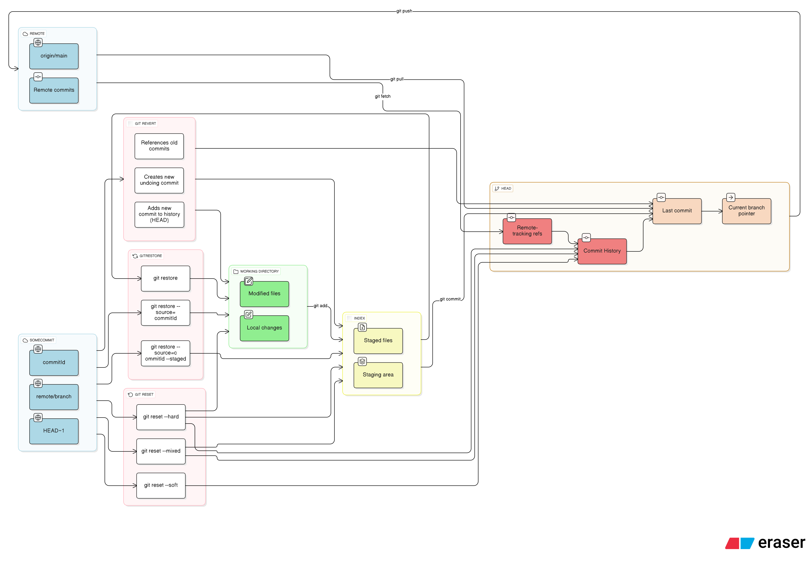

## Introduction

**Ever stared at your repo, wondering why a “small” change just won’t commit or push?**

GUI tools like GitHub Desktop or VSCode extensions are convenient—but they hide the magic. When things go sideways, or when you need to carefully craft commits, stage parts of files, or undo a “tiny mistake” that isn’t obvious, the GUI often leaves you helpless.

Full CLI Git is where you gain *real control*. It’s the difference between:

* Clicking buttons blindly and hoping everything works
* **Understanding exactly where each change lives (Working Directory, Index, HEAD, Remote)** and moving it precisely

Even minor mistakes—like accidentally staging a debug log or overwriting a feature—can snowball into hours of frustration. By mastering the CLI, you can fix problems **before they become disasters**, cherry-pick changes, or sculpt your commit history like a pro.

Think of this guide as your toolkit: practical commands, clear flows between Git states, and actionable tips to tame your repo—even when the “small” fixes aren’t so small after all.

<!-- more -->

## Git File and Commit Operations Between States

Git can be a maze if you don’t know where your changes live and how commands affect them. Everything exists in one of four places:

* **Remote** → the branch on a remote repo, e.g., `origin/main`
* **HEAD** → the last commit on your current branch
* **Index** → staging area, where changes wait for your next commit
* **Working Directory (WD)** → the files you actually edit

Understanding which command touches which area is key. Mistakes here aren’t just annoying—they can break your workflow.

Ready to see how to move safely between states and take control? Let’s go.

## Git File and Commit Operations Between States

Git can feel like a maze if you don’t know where your changes live and how commands affect them. Every file and commit exists in one of four zones:

* **Remote** → your branch on a remote repo, e.g., `origin/main`
* **HEAD** → the last commit on your current branch
* **Index (staging area)** → where changes are prepared for your next commit
* **Working Directory (WD)** → the files you’re editing locally

Understanding which command touches which area is crucial. Small mistakes here can ripple into messy histories or lost work. Think of this as **territory control**: knowing where your “soldiers” are ensures you can move them safely.

---

## Quick Glossary

* **Stage** → move a file from WD → Index (`git add`)
* **Unstage** → move a file from Index → WD (`git restore --staged <file>`)
* **Commit** → move staged changes Index → HEAD (`git commit`)
* **Amend** → tweak the last commit without creating a new one (`git commit --amend`)
* **Reset** → move HEAD or Index, optionally discarding WD changes (`git reset`)
* **Discard/Restore** → revert a file in WD or Index to a previous state (`git restore`)

Mastering these simple moves is like learning the basic steps before leading a full-scale campaign.

---

## Moving Changes Between States: Practical Guide

Let’s break it down, battlefield-style. Each section shows exactly how to control your files and commits safely.

---

### 1. Working Directory → Index (Staging)

When you edit a file, it lives in your **Working Directory**. To prepare it for a commit:

```bash
git add <file>
```

* Moves changes **WD → Index**
* Marks files for the next commit

Undo staging if you changed your mind:

```bash
git restore --staged <file>
```

> **Pro tip:** Stage only what you’re sure about. Partial staging is safer than committing everything blindly.

---

### 2. Index → HEAD (Committing)

Staged changes become permanent when you commit:

```bash
git commit -m "Describe exactly what this change does"
```

* Moves **Index → HEAD**
* Freezes the staged snapshot in branch history

Need to tweak the last commit?

```bash
git commit --amend
```

> Commits are your milestones. Make them clear—your future self (and your teammates) will thank you.

---

### 3. HEAD → Working Directory (Undo & Reset)

Sometimes you need a tactical retreat:

* Restore a file to its last commit:

```bash
git restore <file>
```

* Reset staging back to HEAD:

```bash
git reset <file>
```

* Hard reset your branch (**dangerous**—destroys uncommitted work!):

```bash
git reset --hard HEAD
```

> Think of these commands as emergency extractions. Use wisely.

---

### 4. HEAD → Remote (Push)

When your branch is ready for the world:

```bash
git push origin <branch>
```

* Moves **HEAD → Remote**
* Shares your work with teammates

> Conflicts? Git stops you. That’s good—it prevents sending broken code into battle.

---

### 5. Remote → HEAD / Working Directory (Fetch & Pull)

To bring your repo up to date:

```bash
git fetch origin
git merge origin/<branch>
```

or in one command:

```bash
git pull origin <branch>
```

* `fetch` → grabs remote changes without touching your branch (**Remote → Local**)
* `merge` → integrates fetched changes into your branch (**HEAD ← fetched changes**)
* `pull` = fetch + merge

> Keep your local repo in sync before making big moves. Avoid surprise conflicts.

---

### 6. Visual Flow Diagram

Here’s a conceptual diagram of Git areas and commands:

* Shows **Working Directory ↔ Index ↔ HEAD ↔ Remote**
* Highlights which commands update **WD**, **Index**, or **HEAD**, and which leave history intact



> **Pro tip:** Memorize this flow. Once you can picture it, every command makes sense instantly.

---

### 7. Command Cheat Sheet

| Action            | From → To      | Command                       |
| ----------------- | -------------- | ----------------------------- |
| Stage changes     | WD → Index     | `git add <file>`              |
| Undo changes      | Index → WD     | `git restore <file>`          |
| Commit            | Index → HEAD   | `git commit -m "msg"`         |
| Amend last commit | HEAD → HEAD    | `git commit --amend`          |
| Unstage           | HEAD → Index   | `git restore --staged <file>` |
| Reset staging     | HEAD → Index   | `git reset <file>`            |
| Push              | HEAD → Remote  | `git push origin <branch>`    |
| Fetch             | Remote → Local | `git fetch origin`            |
| Pull              | Remote → HEAD  | `git pull origin <branch>`    |

> Print it. Stick it by your terminal. Use it daily.

<!--

## Command Matrix

|Task (source → target)|Description|`git restore` (modern)|`git reset`|`git checkout` (legacy)|`git revert`|
|---|---|---|---|---|---|
|||Restore working directory files|Reset current HEAD or unstage files|Switch branches or restore working tree files|Create a new commit that undoes another commit|
|**Remote → HEAD**|Update local branch with remote commits|❌|❌|`git fetch` + `git merge origin/main` or `git pull`|❌|
|**Remote → Index**|Stage files from remote branch|`git restore --source=origin/main --staged <file>` (stages, does not update WD or HEAD)|❌|`git checkout origin/main -- <file>`|❌|
|**Remote → WD**|Restore working directory from remote|`git restore --source=origin/main <file>` (does not remove from index or update HEAD)|❌|`git checkout origin/main -- <file>`|❌|
|**HEAD → Index**|Stage/unstage changes from last commit|`git restore --staged <file>` or `git restore --source=HEAD --staged <file>` (unstages, does not update WD)|`git reset HEAD <file>` (unstage)|`git checkout HEAD -- <file>` (resets index + WD, legacy)|❌|
|**Index → WD**|Restore file to staged version|`git restore <file>` (replaces WD file with staged version)|❌|`git checkout -- <file>` (old syntax)|❌|
|**HEAD → WD**|Discard (unstaged) changes in working directory|`git restore --source=HEAD <file>` (does not update index)|`git reset --hard HEAD` (resets index + working directory)|`git checkout HEAD -- <file>`|❌|
|**Commit → New Commit**|Undo or replay changes in history|❌|`git reset --soft <commit>` (moves HEAD, does not create a new commit)|`git checkout <commit>` (detached HEAD)|`git revert <commit>` (creates inverse commit)|
-->

### Git Command Flow Cheat Sheet

| Task (source → target) | Description                     | Command                                                      |
| ---------------------- | ------------------------------- | ------------------------------------------------------------ |
| Remote → HEAD          | Update local branch             | `git fetch` + `git merge` / `git pull`                       |
| Remote → Index         | Stage files from remote         | `git restore --source=origin/main --staged <file>`           |
| Remote → WD            | Restore working dir from remote | `git restore --source=origin/main <file>`                    |
| HEAD → Index           | Stage/unstage from last commit  | `git restore --staged <file>` / `git reset HEAD <file>`      |
| Index → WD             | Restore staged version          | `git restore <file>`                                         |
| HEAD → WD              | Discard changes                 | `git restore --source=HEAD <file>` / `git reset --hard HEAD` |

---

### Key Notes & Best Practices

* **`git restore` is your go-to tool.**

  * Restoring from HEAD or a commit **does not touch HEAD**—it updates **WD** or **Index** only.
  * You can choose **`--staged`** to update the **Index**, or omit it to update only the **Working Directory**.

* **`git reset` is powerful for staging + HEAD moves.**

  * `git reset <file>` → unstage without touching WD
  * `git reset --hard HEAD` → resets **Index + WD** to last commit

* **`git checkout` is legacy.**

  * Can still restore files or switch branches, but may create **detached HEAD** situations.
  * Prefer `restore` and `switch` instead of `checkout`.

* **`git revert <commit>`**

  * Safely undo commits in shared history by creating a new commit that inverses changes.
  * Unlike `reset`, it **does not rewrite history**, making it safe for remote branches.

> Memorize: **restore** = safe, targeted updates; **reset** = staging + HEAD moves; **revert** = safe undo commits. Legacy `checkout` only when needed.

### Rules of Thumb

* Use **`git restore`** for files — it safely updates WD or index without affecting commits.  
* Use **`git reset`** for commits — moves HEAD and optionally unstages or discards changes.  
* Use **`git revert`** to undo commits in a shared history — creates a new commit.  
* Use **`git checkout`** primarily to switch branches or view old commits (legacy usage).  
* Always be cautious with **`reset --hard`** and **`push --force`** — they can permanently discard work.

!!! note "Handling Local branches"
    Merging and rebasing are your primary tools for integrating work from other branches. Read [this Git Branch Operations docu](./sync-branches-with-conflicts) to understand how they work

## Syncing with Remote

Git provides commands to keep local and remote branches in sync:

|Task|Command(s)|
|---|---|
|Update current branch from remote|`git pull` (merge or rebase depending on configuration)|
|Pull with rebase|`git pull --rebase`|
|Pull only if fast-forward|`git pull --ff-only`|
|Push local changes to remote|`git push`|
|Force push (overwrite remote)|`git push --force` (use with caution)|

Read [this docu about how to manage Local Modifications and Remote Changes in Git](./pull-changes-with-conflicts) for a deeper understanding of how these commands operate

**Notes:**

* `git pull` fetches remote commits and **merges** or **rebases** them into your current branch.  
* Pulling updates **HEAD** and may update **Index/WD** if there are conflicts.  
* Pushing sends **HEAD commits** to the remote branch.

---

Mastering these areas and commands will make Git a lot less confusing, and help you confidently manage your changes without accidental loss.

## Related pages

* [Managing Local Modifications and Remote Changes in Git](./pull-changes-with-conflicts.md)
* [Mastering Git Merge Strategies: A Developer's Guide](./sync-branches-with-conflicts.md)
* [Nesting Repositories with Git Submodules: A Newbie's Guide](./git-submodules.md)
* [Understanding Git Pull vs Merge in Git Workflow](./git-pull-vs-git-merge-equivalence.md)
