# Détection de bot dans dans les enchères

{width=50%}

## Objectif général

Notre objectif général est d\'étudier un « dataset » issu d\'une plateforme d\'enchères publicitaires pour pouvoir prédire si l'agent qui a émis des enchères est un humain ou un robot. A partir d'une analyse bien approfondie de diverses données concernant les transactions effectuées notamment les outils numériques utilisés, les temps de ces transactions et bien d'autres « features », nous allons développer un modèle de classification capable de prédire la variable binaire « outcome » de telle sorte que 0 désigne `humain` et 1, `robot`. En outre, nous visons à travers ce projet à minimiser le taux des faux négatifs (prédire que l'agent est un humain, alors qu'il est un robot) et donc augmenter comme métrique le « recall »
pour éviter toute sorte de fraude. Enfin, nous allons choisir au maximum 5 variables pour notre modélisation.

## Compréhension des données

La base de données fournie contient des informations sur les soumissionnaires de l'enchère et sur l'enchère. Les features donnés sont expliqués ci-dessous :

| **Feature**         | **Explication**                                                |
|---------------------|---------------------------------------------------------------|
| Bidder_id           | Un identifiant unique pour le soumissionnaire                  |
| Bid_id              | Un identifiant unique de l'offre fait par le soumissionnaire   |
| Auction             | Un identifiant unique de l'enchère (l'offre publique)          |
| Merchandise         | La catégorie du produit/offre                                  |
| Device              | Modèle de téléphone d'un visiteur                              |
| Time                | Temps à lequel la transaction a été faite pour l'enchère      |
| Country             | Le pays auquel appartient l'IP                                 |
| IP                  | Adresse IP de l'enrichisseur                                   |
| Url                 | Le site à partir duquel l'enrichisseur a été référé            |
| Payment_account     | Le compte à partir duquel l'enrichisseur a payé                |
| Address             | L'adresse de l'enrichisseur                                    |
| Outcome             | 1 si robot, 0 si homme                                         |

## Analyse descriptive et sélection de variables

### **some constants**

```python
TARGET_COL = "outcome"
REMOVE_EVIDENT_MERCHANDISE = False
FILE_VERSION = "v7"
PROD_INSTEAD_OF_SUM =  True
ADD_LEN_TO_GROUPBY = True
#prod+nolen < prod+len
```

### **Load data**

```python
df = pd.read_csv("Projet_ML.csv")
df.bidder_id.nunique() # 87
```

### **Preview**

Voici un aperçu de la dataset :

??? output ">>> df"

    | bidder_id                              | bid_id  | auction | merchandise       | device    | time          | country | ip              | url            | payment_account                      | address                             | outcome |
    |----------------------------------------|---------|---------|-------------------|-----------|---------------|---------|-----------------|----------------|--------------------------------------|-------------------------------------|---------|
    | 001068c415025a009fee375a12cff4fcnht8y | 7179832 | 4ifac   | jewelry           | phone561  | 5.140996e-308 | bn      | 139.226.147.115 | vasstdc27m7nks3 | a3d2de7675556553a5f08e4c88d2c228iiasc | a3d2de7675556553a5f08e4c88d2c2282aj35 | 0       |
    | 0030a2dd87ad2733e0873062e4f83954mkj86 | 6805028 | obbny   | mobile            | phone313  | 5.139226e-308 | ir      | 21.67.17.162    | vnw40k8zzokijsv | a3d2de7675556553a5f08e4c88d2c228jem8t | f3bc67b04b43c3cebd1db5ed4941874c9br67 | 0       |
    | 00a0517965f18610417ee784a05f494d4dw6e | 2501797 | l3o6q   | books and music   | phone451  | 5.067829e-308 | bh      | 103.165.41.136  | kk7rxe25ehseyci | 52743ba515e9c1279ac76e19f00c0b001p3pm | 7578f951008bd0b64528bf81b8578d5djy0uy | 0       |
    | 00a0517965f18610417ee784a05f494d4dw6e | 2724778 | du967   | books and music   | phone117  | 5.068704e-308 | tr      | 239.250.228.152 | iu2iu3k137vakme | 52743ba515e9c1279ac76e19f00c0b001p3pm | 7578f951008bd0b64528bf81b8578d5djy0uy | 0       |
    | 00a0517965f18610417ee784a05f494d4dw6e | 2742648 | wx3kf   | books and music   | phone16   | 5.068805e-308 | in      | 255.108.248.101 | u85yj2e7owkz6xp | 52743ba515e9c1279ac76e19f00c0b001p3pm | 7578f951008bd0b64528bf81b8578d5djy0uy | 0       |
    | ...                                    | ...     | ...     | ...               | ...       | ...           | ...     | ...             | ...            | ...                                  | ...                                 | ...     |
    | 0ad17aa9111f657d71cd3005599afc24fd44y | 1411172 | toxfq   | mobile            | phone1036 | 5.201503e-308 | in      | 186.94.48.203   | vasstdc27m7nks3 | 22cdb26663f071c00de61cc2dcde7b556rido | db147bf6056d00428b1bbf250c6e97594ewjy | 1       |
    | 0ad17aa9111f657d71cd3005599afc24fd44y | 1411587 | ucb4u   | mobile            | phone127  | 5.201506e-308 | in      | 119.27.26.126   | vasstdc27m7nks3 | 22cdb26663f071c00de61cc2dcde7b556rido | db147bf6056d00428b1bbf250c6e97594ewjy | 1       |
    | 0ad17aa9111f657d71cd3005599afc24fd44y | 1411727 | sg8yd   | mobile            | phone383  | 5.201507e-308 | in      | 243.25.54.63    | yweo7wfejrgbi2d | 22cdb26663f071c00de61cc2dcde7b556rido | db147bf6056d00428b1bbf250c6e97594ewjy | 1       |
    | 0ad17aa9111f657d71cd3005599afc24fd44y | 1411877 | toaj7   | mobile            | phone26   | 5.201508e-308 | in      | 17.66.120.232   | 4dd8ei0o5oqsua3 | 22cdb26663f071c00de61cc2dcde7b556rido | db147bf6056d00428b1bbf250c6e97594ewjy | 1       |
    | 0ad17aa9111f657d71cd3005599afc24fd44y | 1412085 | 07axb   | mobile            | phone25   | 5.201509e-308 | in      | 64.30.57.156    | 8zdkeqk4yby6lz2 | 22cdb26663f071c00de61cc2dcde7b556rido | db147bf6056d00428b1bbf250c6e97594ewjy | 1       |

### variable à prédire

!!! output "`>>> df[TARGET_COL].value_counts()`"

    ```plaintext
    0    90877
    1     9123
    Name: outcome, dtype: int64
    ```

c'est une classification binaire

### **Description des champs numériques**

!!! output "`>>> df.info()`"

    ```markdown
    <class 'pandas.core.frame.DataFrame'>
    RangeIndex: 100000 entries, 0 to 99999
    Data columns (total 12 columns):

    ## Column           Non-Null Count   Dtype  

    ---  ------           --------------   -----  
    0   bidder_id        100000 non-null  object
    1   bid_id           100000 non-null  int64  
    2   auction          100000 non-null  object
    3   merchandise      100000 non-null  object
    4   device           100000 non-null  object
    5   time             100000 non-null  float64
    6   country          99816 non-null   object
    7   ip               100000 non-null  object
    8   url              100000 non-null  object
    9   payment_account  100000 non-null  object
    10  address          100000 non-null  object
    11  outcome          100000 non-null  int64  
    dtypes: float64(1), int64(2), object(9)
    memory usage: 9.2+ MB
    ```

On a près de 200 cellules vides dans country. on verra ça après

### **Types et autres informations**

Le dataset contient 12 colonnes et 100.000 lignes.

#### **Description**

L'image ci-dessous présente plusieurs caractéristiques de chaque champ de la table

- dtype : type de la variable (int64 pour les entiers, float64 pour les nombres, object pour les champs textes ou non-identifiés)

- nunique : nombre de valeurs uniques que prends cette variable

- nunique(%) : proportion des valeurs uniques que prends cette variable par rapport au nombre de lignes dans la table

- nunique_per_bid\>1(%) : nombre de « bidder_id » qui présentes plusieurs valeurs différentes pour cette variable.

- is_cat: 1 si la variable peut être considérée categorielle (ici, moins de 10 valeurs uniques) 0 sinon

??? code "`def get_cols_info`"

    ```python
    from math import ceil

    def get_cols_info(df, index_col=None):
      print(">>> df.shape= ", df.shape)
      print("\n>>> df.info= ")
      df.info()
      dd = {"col":[],"dtype":[],"nunique":[],"nunique(%)":[],"nunique_per_bid>1(%)":[],"is_cat":[]}
      for elt in df.columns:
      dd["col"].append(elt)
      dd["nunique"].append(df[elt].nunique())
      dd["nunique(%)"].append(0.1*ceil(10*100*df[elt].nunique()/len(df)))
      dd["dtype"].append(df[elt].dtype)
      dd["is_cat"].append(int(df[elt].nunique()<10))
      if index_col: dd["nunique_per_bid>1(%)"].append(0.1*ceil(10*100*(df.groupby(index_col)[elt].nunique()>1).sum()/df[index_col].nunique()))
      else: dd["nunique_per_bid>1(%)"].append('')
      list_indx = dd["col"]
      del dd["col"]
      print("\n>>> df.more_info= ")
      print(pd.DataFrame(dd, index=list_indx).sort_values(by=['nunique']))
      print("\n>>> df.describe= ")
      print(df.describe())

    get_cols_info(df, "bidder_id")
    ```

???+ output "`>>> get_cols_info(df, "bidder_id")`"

    ```markdown
      >>> df.shape=  (100000, 12)

      >>> df.info= 
      <class 'pandas.core.frame.DataFrame'>
      RangeIndex: 100000 entries, 0 to 99999
      Data columns (total 12 columns):
      ##   Column           Non-Null Count   Dtype  
      ---  ------           --------------   -----  
      0   bidder_id        100000 non-null  object 
      1   bid_id           100000 non-null  int64  
      2   auction          100000 non-null  object 
      3   merchandise      100000 non-null  object 
      4   device           100000 non-null  object 
      5   time             100000 non-null  float64
      6   country          100000 non-null  object 
      7   ip               100000 non-null  object 
      8   url              100000 non-null  object 
      9   payment_account  100000 non-null  object 
      10  address          100000 non-null  object 
      11  outcome          100000 non-null  int64  
      dtypes: float64(1), int64(2), object(9)
      memory usage: 9.2+ MB

      >>> df.more_info= 
      dtype  nunique  nunique(%)  nunique_per_bid>1(%)  is_cat
      outcome            int64        2         0.1                   0.0       1
      merchandise       object        6         0.1                   0.0       1
      bidder_id         object       87         0.1                   0.0       0
      payment_account   object       87         0.1                   0.0       0
      address           object       87         0.1                   0.0       0
      country           object      175         0.2                  70.2       0
      device            object     1871         1.9                  80.5       0
      auction           object     3438         3.5                  79.4       0
      url               object    21951        22.0                  72.5       0
      ip                object    35083        35.1                  84.0       0
      time             float64    92385        92.4                  85.1       0
      bid_id             int64   100000       100.0                  85.1       0

      >>> df.describe= 
      bid_id           time        outcome
      count  1.000000e+05  100000.000000  100000.000000
      mean   3.697622e+06       0.543571       0.091230
      std    2.380217e+06       0.362483       0.287937
      min    8.900000e+01       0.000000       0.000000
      25%    1.463762e+06       0.085364       0.000000
      50%    3.660968e+06       0.514295       0.000000
      75%    5.881387e+06       0.935483       0.000000
      max    7.656326e+06       1.000000       1.000000
    ```

!!! info "on remarque le bid_id est un identifiant unique pour chaque bidder_id qui représente l'action de l'offre menée par chaque bidder"

!!! info "on constate que time est n'est pas à 100% unique donc on peut avoir deux actions d'enchère qui sont réalisé en même instant"

#### **Etude de la variable prédictive**

```python
tg = "outcome" #("outcome", "<lambda>")
sss[tg] = sss[tg].values.astype(int)
ax = sns.histplot(x=tg, data=sss)
add_labels_to_histplot(ax, title="distribution of outcome")
```

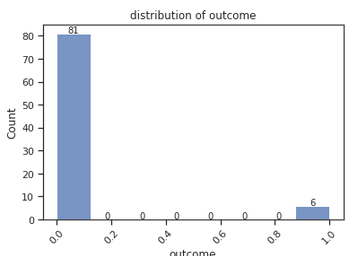

On remarque que sur 87 bidder_id, seuls 6 correspondent à des robots.
Ainsi, il s'agit d'un problème de classification binaire déséquilibré.

#### **Sélection des variables**

Les variables qui prennent plusieurs valeurs pour un même joueur pourraient être utilisés afin d'étudier la variété des outils utilisés par le joueur. C'est le cas des variables (country, device, auction, url, ip). La variable bid_id est un identifiant unique de transaction (nunique=100%) et ne sera pas considéré.

Les variables catégorielles, si pertinentes seront intégrées. C'est le cas de la variable (merchandise)

Les variables avec un « nunique_per_bid » prenant la valeur nulle, n'apportent pas d'informations et seront rejetées s'il n'y a pas d'extraction d'informations possibles. C'est le cas pour les variables (payment_account et address)

| Variable         | Pertinence                            | Descriptions                                | À Rejeter  |
|------------------|---------------------------------------|---------------------------------------------|------------|
| Outcome (status du joueur)  | - Il s'agit de la variable à prédire | Variable catégorielle (0 ou 1). Chaque joueur a un seul status. Cette information est vérifiée sur toute la table.      | **NON**    |
| Merchandise (type de produit achetés)| - Les robots ou les humains pourraient avoir des tendances vers des produits particuliers.           | Variable catégorielle (6 catégories)       | **NON**    |
| bidder_id (identifiant du joueur)  |  - Il s'agit de l'object de la prédiction.                         | Identifiant. Mais il n'apporte pas d'informations supplémentaires.           |     **NON**       |
| PAYMENT_ACCOUNT ET ADRESSE  | - Ces variables n'apportent pas d'informations supplémentaires (unique_per_bid = 0).         | Identifiants sans possibilité d'extraction d'informations. | **OUI**    |
| COUNTRY          | - Les joueurs de certains pays pourraient avoir plus tendance à utiliser ou non des robots.        | Variable texte (identifiant du pays).      | **NON**    |
| device (Appareil utilisé), AUCTION, URL, IP           | - Les robots ou humains pourraient avoir tendance à utiliser certains appareils (pc vs mobile vs web ...)   | Variable texte (nom du device).            | **NON**    |
| BID_ID           | - Le bid_id est unique sur les lignes et ne contient pas de features à extraire.| Identifiant ne contenant pas de features à extraire.    | **OUI**    |

### **Valeurs nulles**

On affiche le nombre de lignes vides par colonne

!!! output "`>>> df.isnull().sum()`"

    ```plaintext
    bidder_id            0
    bid_id               0
    auction              0
    merchandise          0
    device               0
    time                 0
    country            184
    ip                   0
    url                  0
    payment_account      0
    address              0
    outcome              0
    dtype: int64
    ```

Il n'y a de cellules vides que dans country

### Valeurs dupliquées ?

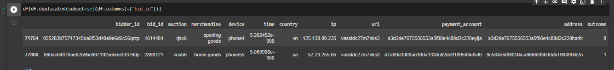

Il n'y a pas de lignes dupliquées dans la table. Mais si on enlève le champs bid_id, il y a deux lignes dupliquées. On supprime ces deux lignes puisque ce sont des transactions qui se répètent.

## Feature Engineering, Visualisation et/ou Test des Hypothèses

Afin d'en savoir plus sur le pouvoir de séparabilité des variables par rapport à la variable « outcome », nous allons effectuer une série d'analyses et de visualisations.

Par ailleurs, nous ferons une agrégation des données selon le « bidder_id » qui identifie la nature (robot ou humain) des joueurs.

### Librairies utiles

``` python

import numpy as np
import pandas as pd
import matplotlib.pyplot as plt
import seaborn as sns

import scipy.stats as stats
from statsmodels.api import Logit

from sklearn.model_selection import train_test_split
from sklearn.pipeline import make_pipeline
from sklearn.preprocessing import StandardScaler
```

### **Null values (country)**

Seule la variable country contient des valeurs nulles. Nous allons remplacer toutes les valeurs nulles par une constante nommée « NO_COUNTRY »

```python
## proportion des valeurs nulles
df.country.isnull().sum()/len(df)
```

0.00184

### **Transformation (ip)**

??? info "`>>> df.ip`"

    ```plaintext
    0        139.226.147.115
    1           21.67.17.162
    2         103.165.41.136
    3        239.250.228.152
    4        255.108.248.101
                  ...       
    99995      186.94.48.203
    99996      119.27.26.126
    99997       243.25.54.63
    99998      17.66.120.232
    99999       64.30.57.156
    Name: ip, Length: 100000, dtype: object
    ```

```python
## identify network instead of device
df["ip"] = df.ip.apply(lambda x: '.'.join(x.split('.')[:2]))
```

??? info "`>>> df.ip`"

    ```plaintext
    0        139.226
    1          21.67
    2        103.165
    3        239.250
    4        255.108
              ...   
    99995     186.94
    99996     119.27
    99997     243.25
    99998      17.66
    99999      64.30
    Name: ip, Length: 100000, dtype: object
    ```

??? info "`>>> df.groupby("ip").agg({"country": lambda x: x.nunique()}).country.value_counts()`"

    ```plaintext
    1     25426
    2      7918
    3      1469
    4       205
    5        44
    6         9
    8         4
    7         3
    10        2
    9         2
    13        1
    Name: country, dtype: int64
    ```

### **Normalisation (time)**

La variable « time » prends des valeurs très petites (de l'ordre de 10\*\*(-308)). On appliquera une normalisation linéaire et qui donc ne réduit pas l'information de cette variable.

??? info "`>>> df["time"].describe()`"

    ```plaintext
    count     1.000000e+05
    mean     5.143168e-308
    std       0.000000e+00
    min      5.067452e-308
    25%      5.079343e-308
    50%      5.139090e-308
    75%      5.197759e-308
    max      5.206746e-308
    Name: time, dtype: float64
    ```

```python
## normalize time
df["time"] = (df.time - df.time.min())/(df.time.max() - df.time.min())
```

??? info "`>>> df["time"].describe()`"

    ```plaintext
    count    100000.000000
    mean          0.543571
    std           0.362483
    min           0.000000
    25%           0.085364
    50%           0.514295
    75%           0.935483
    max           1.000000
    Name: time, dtype: float64
    ```

### **Visualisation (Merchandise)**

```python
## histogrammes des produits
ax = sns.histplot(x="merchandise", data=df, color='b')
add_labels_to_histplot(ax, title="Distribution of merchandises")
```

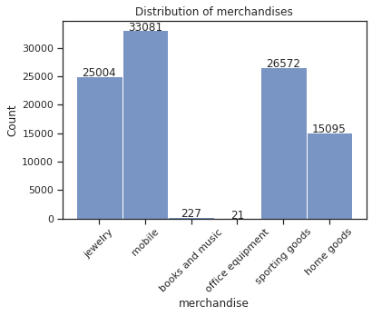

```python
## histogramme des produits par outcome
ax = sns.histplot(x="merchandise", data=df, hue="outcome", palette=["b","orange"])
add_labels_to_histplot(ax, title="Distribution of merchandises by outcome")
```

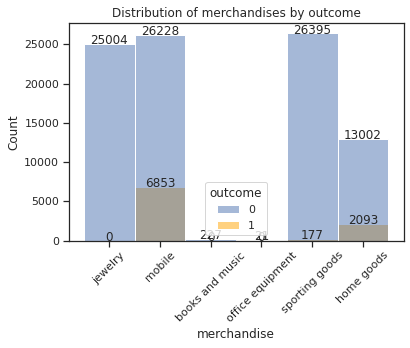

```python
## liste des outcome par produit
def human(x): return (x==0).sum()
def bot(x): return (x==1).sum()
df.groupby("merchandise").agg({"outcome": [human, bot] })
```

| Category          | Human | Bot  |
|-------------------|-------|------|
| Merchandise       |       |      |
| Books and Music   | 227   | 0    |
| Home Goods        | 13002 | 2093 |
| Jewelry           | 25004 | 0    |
| Mobile            | 26228 | 6853 |
| Office Equipment  | 21    | 0    |
| Sporting Goods    | 26395 | 177  |

### **Encoding (Merchandise)**

!!! info "`>>> df.merchandise.unique()`"

    array(['jewelry', 'mobile', 'books and music', 'office equipment',
           'sporting goods', 'home goods'], dtype=object)

??? code "`def one_hot_encoder`"

    ```python
    REMOVE_EVIDENT_MERCHANDISE = False

    if REMOVE_EVIDENT_MERCHANDISE : df = df[df.merchandise.apply(lambda x: x in ["mobile", "sporting goods", "home goods"])]
    else: df["non_robot_merchandise"] = df.merchandise.apply(lambda x: int(x in ['jewelry', 'books and music', 'office equipment']))

    def one_hot_encoder_v2(data, col_name):
      data = data.copy()
      new_cols = []
      for i, elt in enumerate(data[col_name].unique()):
        new_cols.append(f"{col_name}_{i+1}")
        data[new_cols[-1]] = data[col_name].apply(lambda x: int(x==elt))
      del data[col_name]
      return data, new_cols

    df2, new_cols = one_hot_encoder_v2(df, "merchandise")
    df2
    ```

???+ output "`>>> df2`"

    |     | bidder_id                                 | auction | device     | time    | country | ip     | url           | outcome | non_robot_merchandise | merchandise_1 | merchandise_2 | merchandise_3 | merchandise_4 | merchandise_5 | merchandise_6 |
    |-----|------------------------------------------|---------|------------|---------|---------|--------|---------------|---------|-----------------------|---------------|---------------|---------------|---------------|---------------|---------------|
    | 0   | 001068c415025a009fee375a12cff4fcnht8y    | 4ifac   | phone561   | 0.527973| bn      | 139.226| vasstdc27m7nks3| 0       | 1                     | 1             | 0             | 0             | 0             | 0             | 0             |
    | 1   | 0030a2dd87ad2733e0873062e4f83954mkj86   | obbny   | phone313   | 0.515267| ir      | 21.67  | vnw40k8zzokijsv| 0       | 0                     | 0             | 1             | 0             | 0             | 0             | 0             |
    | 2   | 00a0517965f18610417ee784a05f494d4dw6e   | l3o6q   | phone451   | 0.002705| bh      | 103.165| kk7rxe25ehseyci| 0       | 1                     | 0             | 0             | 1             | 0             | 0             | 0             |
    | 3   | 00a0517965f18610417ee784a05f494d4dw6e   | du967   | phone117   | 0.008986| tr      | 239.250| iu2iu3k137vakme| 0       | 1                     | 0             | 0             | 1             | 0             | 0             | 0             |
    | 4   | 00a0517965f18610417ee784a05f494d4dw6e   | wx3kf   | phone16    | 0.009710| in      | 255.108| u85yj2e7owkz6xp| 0       | 1                     | 0             | 0             | 1             | 0             | 0             | 0             |
    | ... | ...                                      | ...     | ...        | ...     | ...     | ...    | ...           | ...     | ...                   | ...           | ...           | ...           | ...           | ...           | ...           |
    | 99995| 0ad17aa9111f657d71cd3005599afc24fd44y  | toxfq   | phone1036  | 0.962363| in      | 186.94 | vasstdc27m7nks3| 1       | 0                     | 1             | 0             | 0             | 0             | 0             | 0             |
    | 99996| 0ad17aa9111f657d71cd3005599afc24fd44y  | ucb4u   | phone127   | 0.962380| in      | 119.27 | vasstdc27m7nks3| 1       | 0                     | 1             | 0             | 0             | 0             | 0             | 0             |
    | 99997| 0ad17aa9111f657d71cd3005599afc24fd44y  | sg8yd   | phone383   | 0.962386| in      | 243.25 | yweo7wfejrgbi2d| 1       | 0                     | 1             | 0             | 0             | 0             | 0             | 0             |
    | 99998| 0ad17aa9111f657d71cd3005599afc24fd44y  | toaj7   | phone26    | 0.962393| in      | 17.66  | 4dd8ei0o5oqsua3| 1       | 0                     | 1             | 0             | 0             | 0             | 0             | 0             |
    | 99999| 0ad17aa9111f657d71cd3005599afc24fd44y  | 07axb   | phone25    | 0.962401| in      | 64.30  | 8zdkeqk4yby6lz2| 1       | 0                     | 1             | 0             | 0             | 0             | 0             | 0             |

### country

```python
#sns.barplot(x="country", y="outcome", data=df)
```

no unique on merchandise because of unicite/bidder_id

### **Groupage par bidder_id**

Les variables actuelles

!!! info "`>>> df.columns`"

    Index(['bidder_id', 'auction', 'device', 'time', 'country', 'ip', 'url',
           'outcome', 'non_robot_merchandise', 'merchandise_1', 'merchandise_2',
           'merchandise_3', 'merchandise_4', 'merchandise_5', 'merchandise_6'],
          dtype='object')

Les nouvelles variables :

| Champs                  | Descriptif                                                                   |
|-------------------------|------------------------------------------------------------------------------|
| nb_device               | Nombre d'appareils uniques utilisés par bidder_id                           |
| nb_auction              | Nombre d'enchères auxquelles bidder_id a participé                           |
| nb_ip                   | Nombre d'adresses IP (identifiant de réseau) uniques utilisées par bidder_id |
| nb_url                  | Nombre d'URLs utilisées par le bidder_id                                     |
| nb_country              | Nombre de pays uniques identifiés par bidder_id                              |
| outcome                 | 1 si robot, 0 si homme                                                       |
| non_robot_merchandise   | Catégories non choisies par les robots                                       |
| time                    | Moyenne des écarts de temps pour chaque bidder_id                            |
| nb_bid                  | Nombre de bids effectuées par bidder_id                                      |
| nb_merchandise_1        | Nombre de "jewelry" uniques utilisés par bidder_id                           |
| nb_merchandise_2        | Nombre de "mobile" uniques utilisés par bidder_id                            |
| nb_merchandise_3        | Nombre de "books and music" uniques utilisés par bidder_id                   |
| nb_merchandise_4        | Nombre de "office equipment" uniques utilisés par bidder_id                  |
| nb_merchandise_5        | Nombre de "sporting goods" uniques utilisés par bidder_id                    |
| nb_merchandise_6        | Nombre de "home goods" uniques utilisés par bidder_id                        |

### **Groupage par bidder_id and time**

Pour chaque bidder_id, à chaque instant donné, on identifie le nombre de fois que l'utilisateur a utilisé simultanément certaines ressources

- adresse ip : on identifie le nombre d'adresses ip utilisées à cet instant par cette personne

- auction : le nombre d'enchères où il était connecté simultanément

- device : le nombre d'appareils différents qu'il a utilisé
simultanément

- url : le nombre d'urls différents qui ont été utilisés simultanément par l'enrichisseur

- country : le nombre de pays depuis lesquels l'enrichisseur a fait simultanément la transaction .

Ensuite, pour chaque bidder_id et chaque temps, on somme ces 5
quantités.

Ainsi, pour chaque bidder_id, on a une série de valeurs sur laquelle on calcule des statistiques simples telles que la moyenne
(my_agg_mean), la somme(my_agg_sum), l'écart-type(my_agg_std) et le max(my_agg_max)

??? code "`def compute_groupby`"

    ```python
    def compute_groupby(filename):
      dd = df.groupby(["bidder_id", "time"]).agg({
                  "auction":lambda x: x.nunique() - 1,
                  "device":lambda x: x.nunique() - 1,
                  "country":lambda x: x.nunique() - 1,
                  "ip":lambda x: x.nunique() - 1,
                  "url":lambda x: x.nunique() - 1,
                  "outcome":lambda x: x.unique()[0]
                  })
      cls_ =list(set(dd.columns)-{'outcome','bidder_id','time'})
      dd["my_agg"] = dd[cls_].sum(axis=1)
      dd2 = dd.reset_index()
      dd_min_per_bidder_id = {bidder_id: dd2[dd2.bidder_id==bidder_id].time.min() for bidder_id in dd2.bidder_id.unique()}

      def modif_time(x):
        x["time"] = x["time"] - dd_min_per_bidder_id[x["bidder_id"]]
        return x

      dd2 = dd2.apply(modif_time, axis=1)
      dd2.to_csv(filename)
      return dd2

    ```

### **Normalisation (tous les features)**

Chaque variable est normalisée entre 0 et 1 à l'aide d'un min-max-scaler

??? info "Preview"

    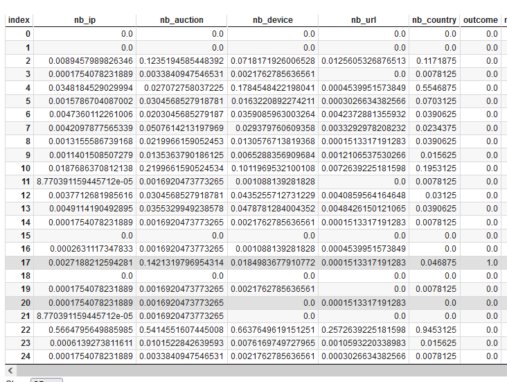

    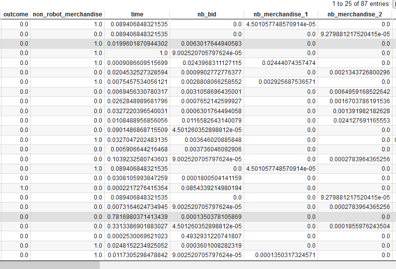

    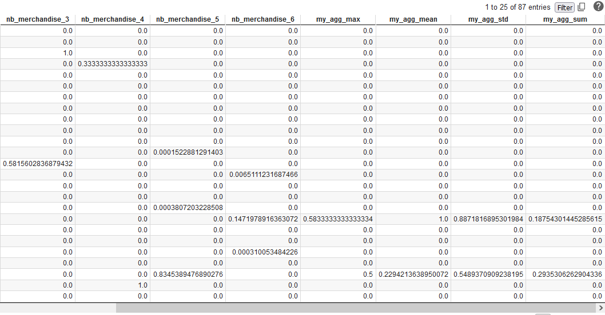

### Visualisation - Histogramme

Pour chaque variable, nous faisons un histogramme afin de comprendre l'explicabilité de nos variables explicatives par rapport à notre variable expliqué « outcome ». Nous ajoutons à ces diagrammes une estimation de la densité de chacune de ses variables.

Comme nos données sont déséquilibrées par rapport à la variable expliqué, nous effectuons une augmentation de données par duplication pour ces visualisations.

#### Les agrégations sur bidder_id

=== ":octicons-file-code-16: `Nb_ip`"

    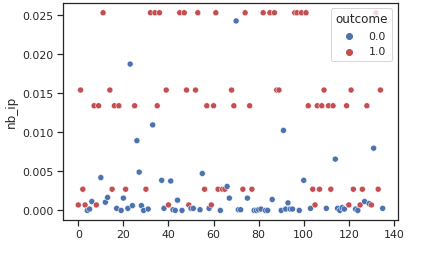
    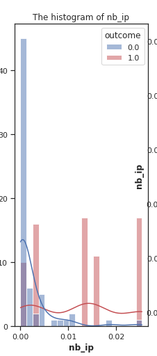

=== ":octicons-file-code-16: `Nb_auction`"

    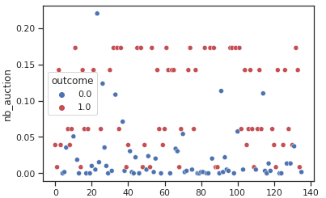
    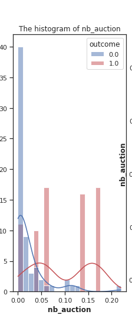

=== ":octicons-file-code-16: `Nb_device`"

    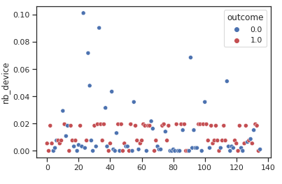
    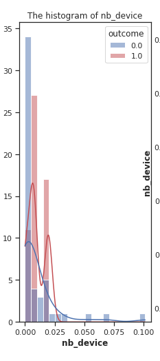

=== ":octicons-file-code-16: `Nb_url`"

    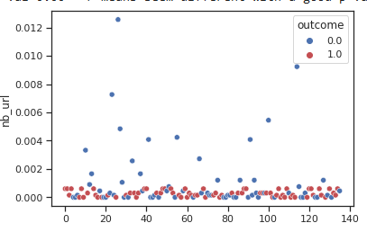
    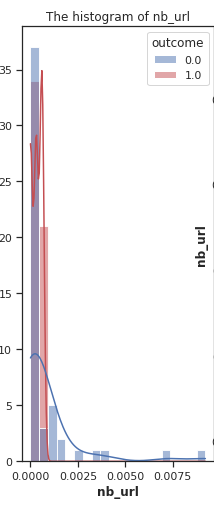

=== ":octicons-file-code-16: `Nb_country`"

    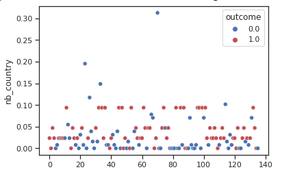
    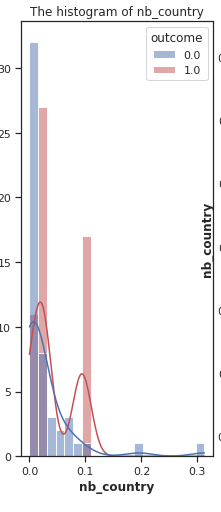

=== ":octicons-file-code-16: `Nb_bid`"

    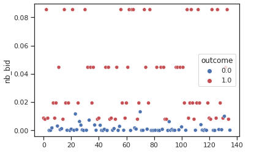
    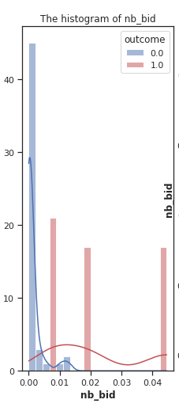

On s'attends à ce que les robots effectuent plus d'opérations que les humains, ce qui se vérifie facilement dans ces diagrammes. En effet,
on représente les histogrammes des variables (nb_ip, nb_auction,
nb_device, nb_url, nb_country, nb_bid) (bleu pour les humains et rouge pour les robots).

D'abord, on remarque qu'il y a beaucoup de valeurs nulles, ce qui signifie que pour chaque ressource (ip, url, ...), l'usage multiple de ces ressources n'est pas courant. En plus, parmi ceux qui font un usage multiple de ces ressources, on note des robots mais aussi des humains pour certaines ressources comme l'url ou l'appareil. Ce qui est contre intuitif, c'est que les humains dépassent parfois les robots sur ces métriques.

#### produits achetés

Avec les variables suivantes, nous introduiront les produits achetés ainsi que le temps qui est très important.

=== ":octicons-file-code-16: `Nb_merchandise_1 & 2`"

    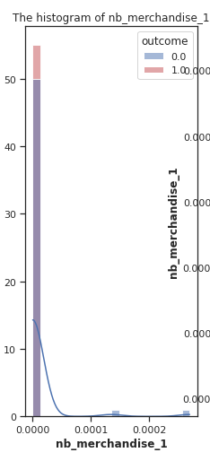
    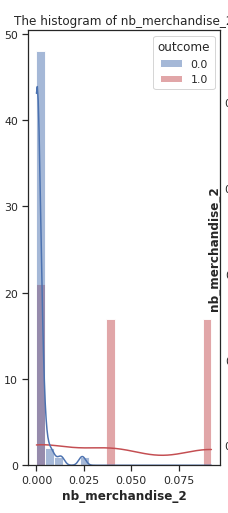

=== ":octicons-file-code-16: `Nb_merchandise_4 & 6`"

    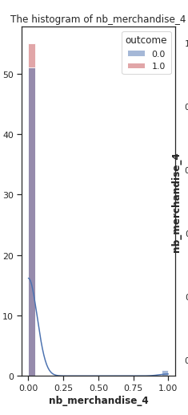
    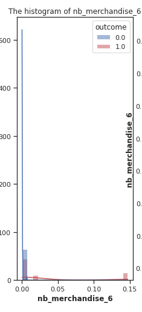

=== ":octicons-file-code-16: `Nb_merchandise_3`"

    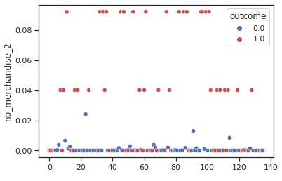
    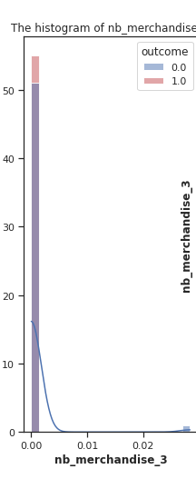

=== ":octicons-file-code-16: `Nb_merchandise_5`"

    
    

Ces visualisations montrent bien que les robots se séparent des hommes quand l'utilisation des ressources augmente

#### temps

- time

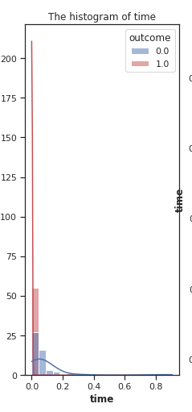

Cette variable est pertinante car la visualisation confirme l'évidence : le temps entre les connections des robots sont beaucoup plus court que ceux des hommes

- my_agg (aggrégation sur le bidder_id et le temps)

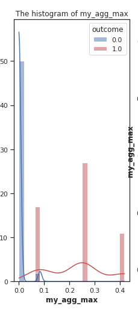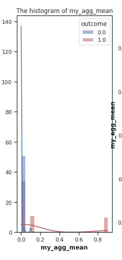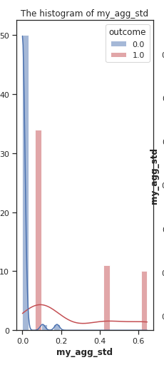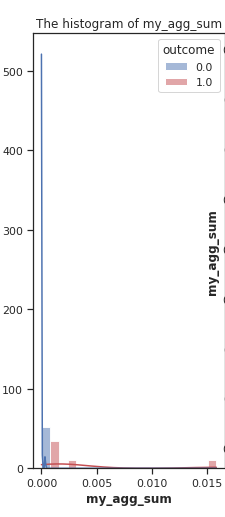

Les agrégations effectuées sur le temps et le bidder_id, sont pertinentes car les robots ont plus tendance à se connecter plusieurs fois de façon simultanée

Nous avons fait des tests statistiques en plus de ces visualisations mais ils ne seront présentés que brièvement dans ce rapport.

### **Binarization (on continuous features)**

L'objectif est d'exploiter le pouvoir séparatif de nos variables afin de rendre les algorithmes de classification plus efficaces.

Chaque feature est projetée sur l'espace {0,1} en définissant un seuil (threshold). Les valeurs supérieures au seuil correspondent à  
1, tandis que les valeurs inférieures ou égales au seuil correspondent à 0.

Ce seuil est déterminé pour chaque feature. Pour cela, on choisit un nombre limité de valeurs possibles entre 0 et1 (range (0, 1, 0.05)).
Pour chaque valeur,

On transforme la série en variable catégorielle

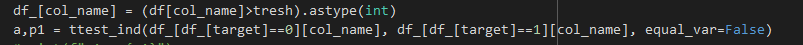

On sépare la série en deux échantillons (outcome=0 vs outcome=1).
Puis, on réalise un [test de student](https://docs.scipy.org/doc/scipy/reference/generated/scipy.stats.ttest_ind.html)
pour les moyennes de deux échantillons pour voir s'ils sont significativement différents


On sépare la série en deux échantillons selon les deux catégories.
Puis, on calcule la proportion de robots dans chaque échantillon.
Ensuite, on compare ces proportions à l'aide d'un z-test pour voir s'ils sont significativement différents

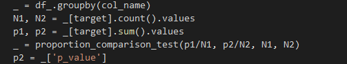

Si ces deux tests donnent des résultats conclusifs (p-value\<0.05),  
on les retients

On choisit le seuil qui passe les deux tests avec des p-valeurs minimales. Ce seuil est utilisé pour transformer la variable continue en variable binaire (0 et 1)

### **Resampling Techniques**


On remarque que sur 87 bidder_id, seuls 6 correspondent à des robots.
Nous appliquons alors une méthode de oversampling nommée SMOTE. Cette méthode, ne duplique pas des lignes mais créé de nouveaux points à partir des anciens en trouvant des points au milieu des points existants.

## Stratégie d'entrainement

### **Split train test**

Nous séparons d'abord notre base de données en deux parties. Une partie pour l'entrainement et une autre pour le test (50% du dataset).

### **Models**

Nous utilisons principalement des modèles de classification disponibles sous la librairie sklearn. Il s'agit notamment

- Modèles linéaires (Régression logistique (sous sklearn ou statsmodels), Support vecteur Machine (SVC), Descente de gradient stochastique (SDG))

- Tree based (Arbre de décision, Random Forest)

- D'autres modèles (KNN, LDA)

- Des modèles ensemblistes (AdaBoost, Gradient Boosting)

Nous présenterons d'abord les résultats obtenus sur les algorithmes :
**Régression logistique, Support vecteur machine et random Forest**.

### **Choix des hyperparamètres**

Pour certains modèles, nous utilisons une méthode nommée Grid Search.
Nous choisissions certains paramètres importants ainsi que des valeurs possibles. Cette méthode améliore optimise le loss du modèle sur le training set en fonction des valeurs des hyperparamètres données.

|      Algorithm        |      Parameters           |     Objectives                                                        |
|-----------------------|---------------------------|-----------------------------------------------------------------------|
| Regression Logistic   | - max_iter: [5, 100, 1000, 2000] <br> - penalty: ["l1", "l2", "elasticnet", "none"] <br> - C: [0.01, 0.1, 0.5, 1] <br> - solver: ["lbfgs", "liblinear"] |  - Varying the number of iterations <br> - Testing different regularizations with different weights <br> - Testing the "liblinear" solver suitable for small datasets |
| SVM                   | - gamma='scale' <br> - probability=True <br> - C=1 <br> - kernel="linear" <br> - class_weight="balanced" |  - Utilizing a linear model |
| Random Forest         | - max_depth: [1, 3, 5, 15, 25] <br> - max_leaf_nodes: [1, 3, 5, 15] <br> - n_estimators: [10, 50, 100] <br> - max_features: ["sqrt", "log2", None] <br> - criterion: ["gini", "entropy", "log_loss"] | - Varying tree sizes but maintaining a maximum limit <br> - Testing different metrics, particularly the log-loss |

### **Selection de feature?**

Nous avons fait nos modèles sur 19 variables et nous souhaitons tiliser 5 variables. Afin de sélectionner les variables les plus pertinentes pour chaque modèle, nous utilisons une méthode qui élimine les variables les moins importantes de façon itérative. Une implémentation est disponible sous sklearn à travers la fonction [RFE (recursive feature elimination)](https://scikit-learn.org/stable/modules/generated/sklearn.feature_selection.RFE.html)

## Métriques de validation

Afin de valider nos modèles, nous utilisons des métriques adaptées à
la classification. Il s'agit de

- Matrice de confusion : Elle montre le nombre de prédictions (bien classé vs mal classé) en fonction des catégories

- Précision : Mesure la capacité du modèle à identifier tous les humains même s'il classe mal des robots. Il réduit le nombre de faux positifs

- recall : Mesure la capacité du modèle à identifier tous les robots même si il classe mal des humains. Il réduit le nombre de faux négatifs


- f1 : elle combine la precision et le recall

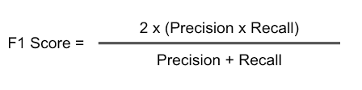

- Courbe ROC : Calculer l\'aire sous la courbe ROC à partir des scores de prédiction.

Toutes ces métriques sont disponibles sous [sklearn](https://scikit-learn.org/stable/modules/classes.html#module-sklearn.metrics)

## Prédiction

### Librairies utiles pour la prédiction

``` python
from sklearn.linear_model import LogisticRegression, SGDClassifier
from sklearn.svm import SVC
from sklearn.neighbors import KNeighborsClassifier
from sklearn.model_selection import GridSearchCV
from sklearn.tree import DecisionTreeClassifier
from sklearn.discriminant_analysis import LinearDiscriminantAnalysis
from sklearn.ensemble import RandomForestClassifier
from sklearn.ensemble import AdaBoostClassifier, GradientBoostingClassifier
from sklearn import metrics
from sklearn.metrics import confusion_matrix,r2_score,accuracy_score,roc_auc_score,f1_score,precision_score,recall_score
```

### Démarche

Les modèles sont utilisés dans une classe qui implémente la méthode suivante

??? code "`def compute_all`"

    ```python
    def compute_all(self, model_name, important_cols:list=None, oversample:bool=None, test_size:float=None, remove_cols:list=None, feature_eng:bool=None):
          print(f"model loader: {self.description}")
          list_fct = {
                "logit": self.logit_regression,
                "logistic": logistic_regression_sklearn,
                "svc": svc_classifier,
                "knn":knn_classifier,
                "sdg":sdg_classifier,
                "tree":decision_tree_classifier,
                "lda": lda_classifier,
                "forest":random_forest_classifier,
                "ada": ada_boost_classifier,
                "xgboost": gradient_boosting_classifier
                }

          # transform, split and oversample
          X_train, X_test, y_train, y_test = self.get_train_test(model_name=model_name, important_cols=important_cols, oversample=oversample, test_size=test_size, remove_cols=remove_cols, feature_eng=feature_eng)

          # get model
          my_fct = list_fct[model_name]
          print(f"{'':~^50}\n{model_name:~^50}\n{'':~^50}")

          # train
          y_test_proba, y_train_proba, y_train_pred, y_test_pred, nb_params = my_fct(X_train, y_train, X_test, y_test)

          # evaluate
          train_res, test_res = show_results(y_train, y_train_pred, y_train_proba,y_test, y_test_pred, y_test_proba)
          g = f"{model_name}: nb_params = {nb_params}"
          print(f"{g:~^50}")
    ```

Cette méthode utilise des algorithmes qui implémentent chaque une méthode de classification avec comme valeur ajoutée

- La sélection des hyperparamètres à l'aide de GridSearchCV

- Le choix éventuel d'un threshold plus optimal pour les méthodes qui générent des probabilités

- La sélection des variables avec RFE

Les résultats sont présentés avec cet algorithme

??? code "`def show_results`"

    ```python
    def return_dict_scores(y, y_pred, pred_proba):
      return {"acc":round(accuracy_score(y_pred, y),3), "f1":round(f1_score(y_pred, y),3), "pres":round(precision_score(y_pred, y),3), "rec":round(recall_score(y_pred, y),3), "roc":round(roc_auc_score(y_pred, pred_proba),3)}

    def bestThressholdForF1(y_true,y_pred_proba):
        best_thresh = None
        best_score = 0
        for thresh in np.arange(0.1, 0.501, 0.01):
            y_pred = np.array(y_pred_proba)>thresh
            score = f1_score(y_true, y_pred)
            if score > best_score:
                best_thresh = thresh
                best_score = score
        return best_score , best_thresh, return_dict_scores(y_true, y_pred, y_pred_proba)

    def print_metrics(y, y_pred,pred_proba):
      print("- confusion_matrix\n",confusion_matrix(y, y_pred))
      print(f"- accuracy = {100*accuracy_score(y, y_pred):.2f}%") #better ->1 ##accuracy = nb_sucess/nb_sample
      print(f"- f1 = {100*f1_score(y, y_pred):.2f}%") #better ->1 ##f1 = 2 * (precision * recall) / (precision + recall)
      print(f"- roc(area under the curve) = {100*roc_auc_score(y, pred_proba):.2f}%") #better ->1 ##area under ROC and AUC
      print(f"- precision = {100*precision_score(y, y_pred):.2f}%") #better->1 ##precision = tp / (tp + fp) where (tp=true_positive; fp:false_positive)
      print(f"- recall = {100*recall_score(y, y_pred):.2f}%") #better->1 ##precision = tp / (tp + fn) where (tp=true_positive; fn:false_negative)
      print(f"- bestThressholdForF1 = {bestThressholdForF1(y,pred_proba)}")
      return return_dict_scores(y, y_pred, pred_proba)

    def show_results(y_train, y_train_pred, y_train_proba,y_test, y_test_pred, y_test_proba ):
      print("\n>>>> metriques sur la base de données d'entrainement")
      train_res = print_metrics(y_train,y_train_pred,y_train_proba)
      print("\n>>>> metriques sur la base de données de test")
      test_res = print_metrics(y_test, y_test_pred,y_test_proba)
      return train_res, test_res
    ```

### Quelques exemples

??? code ">>> Régression logistique"

    ```python
    def logistic_regression_sklearn(X_train, y_train, X_test, y_test):
      parameters = {"max_iter":[5,100,1000,2000], "penalty":["l1", "l2", "elasticnet", "none"], "C":[0.01, 0.1, 0.5, 1], "solver":["lbfgs", "liblinear"]}
      clf = GridSearchCV(LogisticRegression(random_state=0, class_weight="balanced"), parameters).fit(X_train, y_train)
      print(clf.best_params_)

      #clf = LogisticRegression(random_state=0, max_iter=1000, class_weight="balanced").fit(X_train, y_train)
      y_train_pred = clf.predict(X_train)
      y_test_pred = clf.predict(X_test)
      y_train_proba = clf.predict_proba(X_train)[:, 1] #[proba({label=1}/row_data) for row_data in X_train]
      y_test_proba = clf.predict_proba(X_test)[:, 1]
      return y_test_proba, y_train_proba, y_train_pred, y_test_pred, len(clf.feature_names_in_)
    ```

??? code ">>> Knn"

    ```python
    def knn_classifier(X_train, y_train, X_test, y_test):
      parameters = {"n_neighbors":[1,2,5,10,15,20]}
      clf = GridSearchCV(KNeighborsClassifier(), parameters).fit(X_train, y_train)
      print(clf.best_params_)
      #clf = KNeighborsClassifier(n_neighbors=10).fit(X_train, y_train)
      y_train_pred = clf.predict(X_train)
      y_test_pred = clf.predict(X_test)
      y_train_proba = clf.predict_proba(X_train)[:, 1] #[proba({label=1}/row_data) for row_data in X_train]
      y_test_proba = clf.predict_proba(X_test)[:, 1]
      return y_test_proba, y_train_proba, y_train_pred, y_test_pred, len(clf.feature_names_in_)
    ```

### Algorithmes

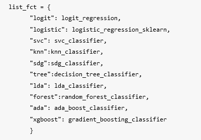

### Configurations

- Base de données utilisée : Par défaut, c'est une base de données de 87 lignes qui contient tous les features qu'on a cauculé
auparavant

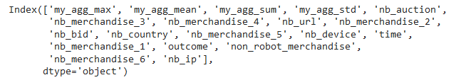

- Oversampling : par défaut True. Dans ce cas, on utilise la méthode SMOTE

- Test_size : par défaut 50%

- Feature_eng : si on applique le binarizer aux données avant l'entrainement. Oui par défaut

- Important_cols : la liste des colonnes à sélectionner : par défaut, toutes les colonnes sont utilisées même si on fera un filtre pendant le fine tuning du modèle (RFE)

### Résultats

- **Algorithmique**

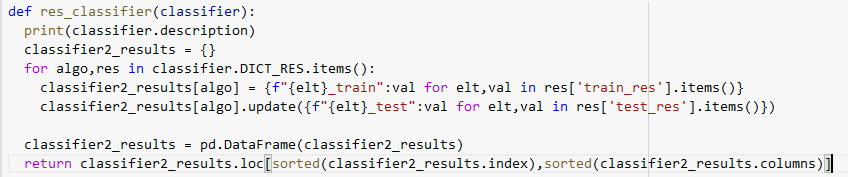

- **Dataset avec oversampling (SMOTE) appliqué juste au training set**

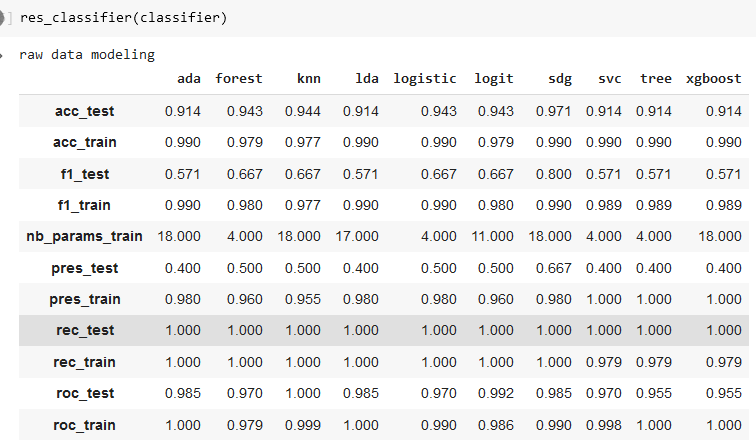

- **Dataset avec oversampling (Duplication) appliqué à tout le dataset**

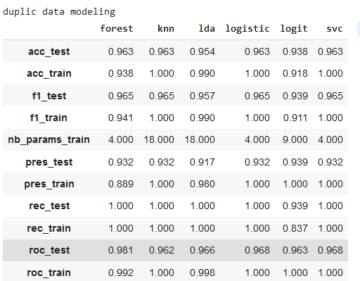

- **Dataset avec oversampling (SMOTE) appliqué à tout le dataset**

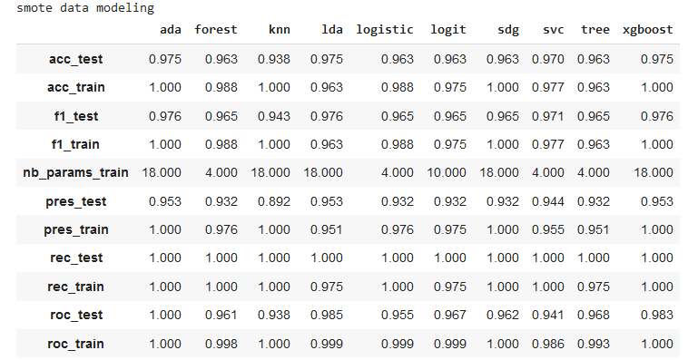

??? info "Légende"

    - acc : accuracy score

    - f1 : f1 score

    - pres : precision score

    - rec : recall score

    - roc : area under the curve

    - Ada: AdaBoost

    - Forest: Random Forest

    - Knn: K nearest neighbors

    - Lda: Linear Discriminant analysis

    - logistic: Logistic regression (sklearn)

    - Logit: Logistic regression Analysis (statsmodels)

    - Sgd: Descente de gradient stochastique

    - Svc : Support vecteur Machine

    - Tree : Arbre de decision

    - Xgboost : Gradient Bossting

### **Comparaison des modèles**

Nous remarquons en général, que nos modèles sur des features limités ou non, donnent les résultats intéressants

- Des accuracy \> 0.9 sur tous nos datasets, ce qui n'est pas
étonnant vu qu'un tuning est fait sur les hyperparamètres pendant et après l'entrainement.

- Presque tous les recall des modèles donnent un résultat de 100%  

- Pour les modèles (random Forest, regression logistique, SVM et decision tree), nous avons sélectionné 4 paramètres et les résultats sont toujours aussi bons. Ces modèles sont donc meilleurs que les autres car plus explicables notamment la regression logistique. Concernat les modèles basés sur les arbres
(random Forest et decision tree), les visualisations (qui seront montrés en bas) montrent que les rabres sont très lisibles
(profondeur de 3 et largeur faible car limité dans le hyperparameter tuning)

- Concernant le choix de la méthode de oversampling, nous pouvons,
en comparer les 3 tables,

- remarquer que malgré de bon recall, la première table montre des précisions de moins de 50% sur le test alors que les précisions sont supérieures à 90% sur le train, ce qui montre du overfitting. Cette première table représente le dataset où
on a appliqué le oversampling juste sur le training set.

- Remarquer que la table 3 présente en général de meilleurs résultats que la table 2, ce qui montre que la méthode SMOTE
est plus explicative qu'une simple duplication des données non représentatives.

En conclusion, il est préférable d'utiliser des modèles à peu de variables car ils sont relativement aussi bons que les autres. Il est
également préférable d'utiliser SMOTE comme méthode d'oversampling et de l'appliquer à tout le dataset avant l'entrainement

## Review

### **Overfitting**

Il n'y a pas eu quelques phénomènes d'overfitting pendant l'implémentation.

Comme un tuning important a été fait sur les hyperparamètres et qu'on a un nombre assez limité de données, l'overfitting est évité en utilisant 50% de la base de données pour le test. Pour compenser le nombre limité de données en train et l'impact du déséquilibre des classes, nous appliquons la méthode SMOTE sur notre base de données.
Néanmoins, même quand on applique la méthode SMOTE uniquement sur la base de données d'entrainement, on a également de bons résultats

### **Choix techniques**

- Dans la construction des features, nous avons calculé pour chaque bidder_id, des aggrégations. Ce sont des sommes. On améliore le pouvoir de séparabilité en normalisant ces données par rapport au nombre de bid auquels le bidder_id a participé.

- Faire un oversampling sur toute le dataset ou juste sur le training set : le choix est fait en fonction du modèle

### **Explicabilité des résultats**

#### Régression Logistique

#### Random Forest

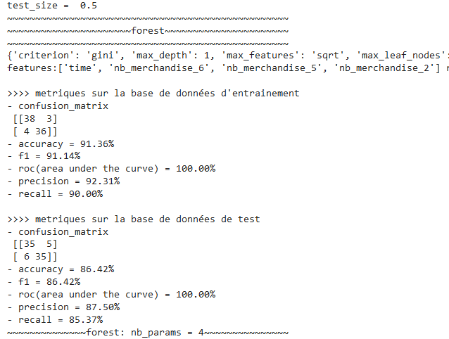
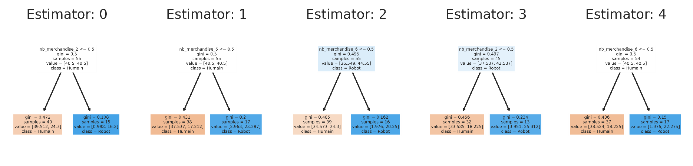

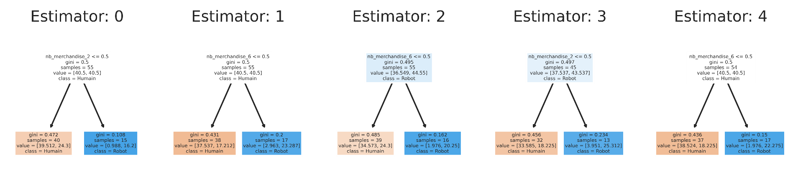

Ce modèle utilise 5 arbres de décisions et 4 variables et obtient une precision de 87% et un recall de 85%. Les processus de décision est assez simple et intuitif. Par ailleurs, on peut avoir de meilleurs résultats en moyennant les calculs (par groupe de bidder_id) par le nombre de bid. On a une amélioration des métriques

#### Random Forest (avec moyenne par groupe)

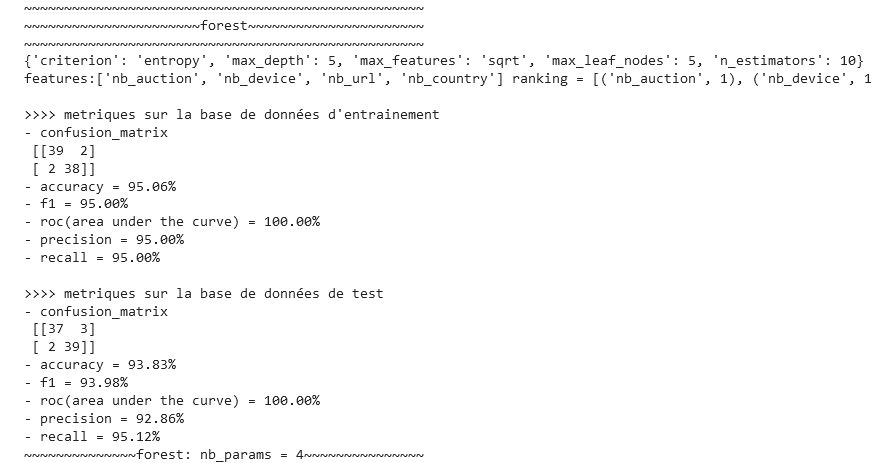

  

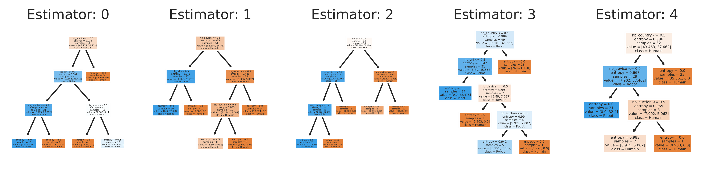

Ce modèle utilise 5 arbres de décisions et 4 variables

- Nb_auction

- Nb_device

- Nb_country

- Nb_url

Ces variables ont été moyennées par rapport au nombre de bid auxquels ils ont participé. Ainsi, on remarque que conformément aux résultats obtenus dans l'étape de feature engineering, les nombre d'appareils petits correspondent à des humains ; les url et les enchères et pays de petites valeurs correspondent à des robots

#### Support vecteur Machine

Avec 4 variables, on ne peut pas voir les séparations linéaires mais on n'a pas voulu appliquer des méthodes supplémentaires de réduction de dimension telles que PCA ou SVD. Néanmoins, le nombre limité de features et les bons résultats obtenus sur ce modèle montre qu'on pourrait avec plus d'analyses expliquer les résultats.

#### Decision Tree

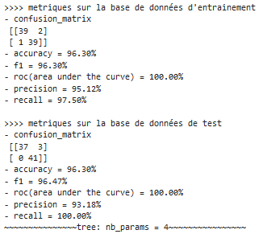

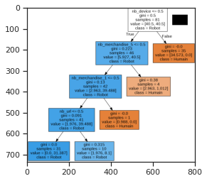

Les résultats sont très bons avec un processus de décision assez simple et explicable.

### **Discussion**

- Les modèles donnent en général de bons résultats avec la normalisation

- Nous avons utilisé une table avec des unique bidder_id pour aggréger en évitant les données dupliquées, ce qui a réduit le nombre de points de données. Mais, ensuite, nous avons fait du oversampling. Néanmoins, nous avons utilisé SMOTE, une méthode de oversampling qui ne duplique pas simplement les données. Mais unee base de données de validation aurait pu être utilisée afin de séparer totalement les méthodes de feature engineering de l'évaluation des modèles

- Comme il y a peu de points de données, nous avons mis l'accent sur le feature engineering afin d'avoir des variables pertinentes, ce qui nous as permis d'avoir des résultats satisfaisants (precision, recall\>96%) sur un modèle linéaire tel que la régression logistique

- Des corrélations entre les variables explicatives n'impactent pas les résultats grâce à la sélection de variables qui entre en compte pendant l'entrainement du modèle.

- Architecture de déploiement : A partir de notre modèle, on prend le maximum d'informations sur un bidder puis, on fait du feature engineering avant d'utiliser les modèles. Ainsi,

- Pendant l'exploration, on a remaqué que certains produits étaient achetés que par des humains (dans les limites de ce datset).
Ainsi, nous aurions pu enlever les lignes correspondantes car la prédiction est évidente. D'un autre point de vue, les garder peut apporter des informations de correlations sur les autres features.

## Conclusion

Ce projet de classification présente des spécificités intéressantes.
D'une part, on a pu valider à priori qu'on a sur les robots à l'aide des données qu'on avait même s\'il y a eu des paradoxes quelques fois qui peuvent être liés au nombre limité de données ou à des facteurs extérieurs.
D'autre part, la base de données brute contient beaucoup de champs texte. Ainsi, la transformation des données est l'étape cruciale de ce projet. En plus, la base de données, déséquilibrée, nécessite d'utiliser des techniques particulières pour l'entrainement. Nous avons également adapté les métriques de validation au problème de classification et avons obtenu des résultats satisfaisants (recall, précision \> 90%) avec jusque 4 à 5 features maximum, ce qui montre le potentiel que le feature engineering peut apporter à la modélisation et à l'explicabilité des modèles.
Enfin, avec des modèles simples qui proposent des recall parfaits, nous pouvons être sûr de déterminer les robots même si certains (très peu) d'humains sont mals prédits
