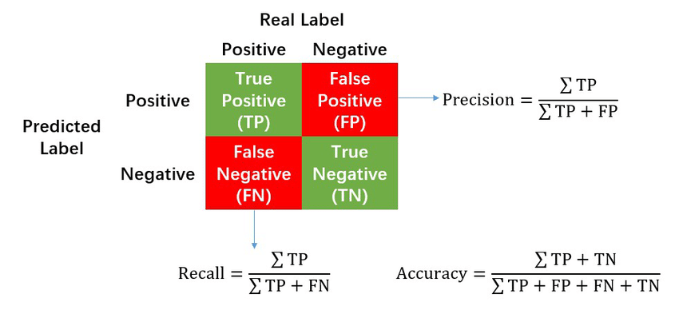

# Bot Detection in Auctions

{width=50%}

## General Objective

Our general objective is to study a dataset from an advertising auction platform to predict whether the agent placing bids is a human or a robot. Through a thorough analysis of various transaction data, including digital tools used, transaction times, and other features, we will develop a classification model capable of predicting the binary variable "outcome" where 0 designates `human` and 1 `robot`. Furthermore, we aim to minimize the false negative rate (predicting a human when it is a robot) and thus increase the "recall" metric to prevent fraud. Finally, we will select at most 5 variables for our modeling.

## Data Understanding

The provided database contains information about auction bidders and the auction itself. The given features are explained below:

| **Feature**         | **Explanation**                                                |
|---------------------|---------------------------------------------------------------|
| Bidder_id           | Unique identifier for the bidder                  |
| Bid_id              | Unique identifier for the bid made by the bidder   |
| Auction             | Unique identifier for the auction (public offer)          |
| Merchandise         | Category of the product/offer                                  |
| Device              | Visitor's phone model                              |
| Time                | Time when the transaction was made for the auction      |
| Country             | Country to which the IP belongs                                 |
| IP                  | IP address of the bidder                                   |
| Url                 | Site from which the bidder was referred            |
| Payment_account     | Account from which the bidder paid                |
| Address             | Address of the bidder                                    |
| Outcome             | 1 if robot, 0 if human                                         |

## Descriptive Analysis and Variable Selection

### **some constants**

```python
TARGET_COL = "outcome"
REMOVE_EVIDENT_MERCHANDISE = False
FILE_VERSION = "v7"
PROD_INSTEAD_OF_SUM =  True
ADD_LEN_TO_GROUPBY = True
#prod+nolen < prod+len
```

### **Load data**

```python
df = pd.read_csv("Projet_ML.csv")
df.bidder_id.nunique() # 87
```

### **Preview**

Here is an overview of the dataset:

??? output ">>> df"

    | bidder_id                              | bid_id  | auction | merchandise       | device    | time          | country | ip              | url            | payment_account                      | address                             | outcome |
    |----------------------------------------|---------|---------|-------------------|-----------|---------------|---------|-----------------|----------------|--------------------------------------|-------------------------------------|---------|
    | 001068c415025a009fee375a12cff4fcnht8y | 7179832 | 4ifac   | jewelry           | phone561  | 5.140996e-308 | bn      | 139.226.147.115 | vasstdc27m7nks3 | a3d2de7675556553a5f08e4c88d2c228iiasc | a3d2de7675556553a5f08e4c88d2c2282aj35 | 0       |
    | 0030a2dd87ad2733e0873062e4f83954mkj86 | 6805028 | obbny   | mobile            | phone313  | 5.139226e-308 | ir      | 21.67.17.162    | vnw40k8zzokijsv | a3d2de7675556553a5f08e4c88d2c228jem8t | f3bc67b04b43c3cebd1db5ed4941874c9br67 | 0       |
    | 00a0517965f18610417ee784a05f494d4dw6e | 2501797 | l3o6q   | books and music   | phone451  | 5.067829e-308 | bh      | 103.165.41.136  | kk7rxe25ehseyci | 52743ba515e9c1279ac76e19f00c0b001p3pm | 7578f951008bd0b64528bf81b8578d5djy0uy | 0       |
    | 00a0517965f18610417ee784a05f494d4dw6e | 2724778 | du967   | books and music   | phone117  | 5.068704e-308 | tr      | 239.250.228.152 | iu2iu3k137vakme | 52743ba515e9c1279ac76e19f00c0b001p3pm | 7578f951008bd0b64528bf81b8578d5djy0uy | 0       |
    | 00a0517965f18610417ee784a05f494d4dw6e | 2742648 | wx3kf   | books and music   | phone16   | 5.068805e-308 | in      | 255.108.248.101 | u85yj2e7owkz6xp | 52743ba515e9c1279ac76e19f00c0b001p3pm | 7578f951008bd0b64528bf81b8578d5djy0uy | 0       |
    | ...                                    | ...     | ...     | ...               | ...       | ...           | ...     | ...             | ...            | ...                                  | ...                                 | ...     |
    | 0ad17aa9111f657d71cd3005599afc24fd44y | 1411172 | toxfq   | mobile            | phone1036 | 5.201503e-308 | in      | 186.94.48.203   | vasstdc27m7nks3 | 22cdb26663f071c00de61cc2dcde7b556rido | db147bf6056d00428b1bbf250c6e97594ewjy | 1       |
    | 0ad17aa9111f657d71cd3005599afc24fd44y | 1411587 | ucb4u   | mobile            | phone127  | 5.201506e-308 | in      | 119.27.26.126   | vasstdc27m7nks3 | 22cdb26663f071c00de61cc2dcde7b556rido | db147bf6056d00428b1bbf250c6e97594ewjy | 1       |
    | 0ad17aa9111f657d71cd3005599afc24fd44y | 1411727 | sg8yd   | mobile            | phone383  | 5.201507e-308 | in      | 243.25.54.63    | yweo7wfejrgbi2d | 22cdb26663f071c00de61cc2dcde7b556rido | db147bf6056d00428b1bbf250c6e97594ewjy | 1       |
    | 0ad17aa9111f657d71cd3005599afc24fd44y | 1411877 | toaj7   | mobile            | phone26   | 5.201508e-308 | in      | 17.66.120.232   | 4dd8ei0o5oqsua3 | 22cdb26663f071c00de61cc2dcde7b556rido | db147bf6056d00428b1bbf250c6e97594ewjy | 1       |
    | 0ad17aa9111f657d71cd3005599afc24fd44y | 1412085 | 07axb   | mobile            | phone25   | 5.201509e-308 | in      | 64.30.57.156    | 8zdkeqk4yby6lz2 | 22cdb26663f071c00de61cc2dcde7b556rido | db147bf6056d00428b1bbf250c6e97594ewjy | 1       |

### Target Variable

!!! output "`>>> df[TARGET_COL].value_counts()`"

    ```plaintext
    0    90877
    1     9123
    Name: outcome, dtype: int64
    ```

It is a binary classification

### **Description of Numeric Fields**

!!! output "`>>> df.info()`"

    ```markdown
    <class 'pandas.core.frame.DataFrame'>
    RangeIndex: 100000 entries, 0 to 99999
    Data columns (total 12 columns):

    ## Column           Non-Null Count   Dtype  

    ---  ------           --------------   -----  
    0   bidder_id        100000 non-null  object
    1   bid_id           100000 non-null  int64  
    2   auction          100000 non-null  object
    3   merchandise      100000 non-null  object
    4   device           100000 non-null  object
    5   time             100000 non-null  float64
    6   country          99816 non-null   object
    7   ip               100000 non-null  object
    8   url              100000 non-null  object
    9   payment_account  100000 non-null  object
    10  address          100000 non-null  object
    11  outcome          100000 non-null  int64  
    dtypes: float64(1), int64(2), object(9)
    memory usage: 9.2+ MB
    ```

We have nearly 200 empty cells in country. We will deal with this later.

### **Types and Other Information**

The dataset contains 12 columns and 100,000 rows.

#### **Description**

The image below presents several characteristics of each field in the table

- dtype: variable type (int64 for integers, float64 for numbers, object for text or unidentified fields)

- nunique: number of unique values this variable takes

- nunique(%): proportion of unique values this variable takes relative to the number of rows in the table

- nunique_per_bid\>1(%): number of "bidder_id" that present multiple different values for this variable.

- is_cat: 1 if the variable can be considered categorical (here, less than 10 unique values) 0 otherwise

??? code "`def get_cols_info`"

    ```python
    from math import ceil

    def get_cols_info(df, index_col=None):
      print(">>> df.shape= ", df.shape)
      print("\n>>> df.info= ")
      df.info()
      dd = {"col":[],"dtype":[],"nunique":[],"nunique(%)":[],"nunique_per_bid>1(%)":[],"is_cat":[]}
      for elt in df.columns:
      dd["col"].append(elt)
      dd["nunique"].append(df[elt].nunique())
      dd["nunique(%)"].append(0.1*ceil(10*100*df[elt].nunique()/len(df)))
      dd["dtype"].append(df[elt].dtype)
      dd["is_cat"].append(int(df[elt].nunique()<10))
      if index_col: dd["nunique_per_bid>1(%)"].append(0.1*ceil(10*100*(df.groupby(index_col)[elt].nunique()>1).sum()/df[index_col].nunique()))
      else: dd["nunique_per_bid>1(%)"].append('')
      list_indx = dd["col"]
      del dd["col"]
      print("\n>>> df.more_info= ")
      print(pd.DataFrame(dd, index=list_indx).sort_values(by=['nunique']))
      print("\n>>> df.describe= ")
      print(df.describe())

    get_cols_info(df, "bidder_id")
    ```

???+ output "`>>> get_cols_info(df, "bidder_id")`"

    ```markdown
      >>> df.shape=  (100000, 12)

      >>> df.info= 
      <class 'pandas.core.frame.DataFrame'>
      RangeIndex: 100000 entries, 0 to 99999
      Data columns (total 12 columns):
      ##   Column           Non-Null Count   Dtype  
      ---  ------           --------------   -----  
      0   bidder_id        100000 non-null  object 
      1   bid_id           100000 non-null  int64  
      2   auction          100000 non-null  object 
      3   merchandise      100000 non-null  object 
      4   device           100000 non-null  object 
      5   time             100000 non-null  float64
      6   country          100000 non-null  object 
      7   ip               100000 non-null  object 
      8   url              100000 non-null  object 
      9   payment_account  100000 non-null  object 
      10  address          100000 non-null  object 
      11  outcome          100000 non-null  int64  
      dtypes: float64(1), int64(2), object(9)
      memory usage: 9.2+ MB

      >>> df.more_info= 
      dtype  nunique  nunique(%)  nunique_per_bid>1(%)  is_cat
      outcome            int64        2         0.1                   0.0       1
      merchandise       object        6         0.1                   0.0       1
      bidder_id         object       87         0.1                   0.0       0
      payment_account   object       87         0.1                   0.0       0
      address           object       87         0.1                   0.0       0
      country           object      175         0.2                  70.2       0
      device            object     1871         1.9                  80.5       0
      auction           object     3438         3.5                  79.4       0
      url               object    21951        22.0                  72.5       0
      ip                object    35083        35.1                  84.0       0
      time             float64    92385        92.4                  85.1       0
      bid_id             int64   100000       100.0                  85.1       0

      >>> df.describe= 
      bid_id           time        outcome
      count  1.000000e+05  100000.000000  100000.000000
      mean   3.697622e+06       0.543571       0.091230
      std    2.380217e+06       0.362483       0.287937
      min    8.900000e+01       0.000000       0.000000
      25%    1.463762e+06       0.085364       0.000000
      50%    3.660968e+06       0.514295       0.000000
      75%    5.881387e+06       0.935483       0.000000
      max    7.656326e+06       1.000000       1.000000
    ```

!!! info "we notice bid_id is a unique identifier for each bidder_id representing the bidding action taken by each bidder"

!!! info "we observe that time is not 100% unique so we can have two auction actions performed at the same instant"

#### **Study of the Predictive Variable**

```python
tg = "outcome" #("outcome", "<lambda>")
sss[tg] = sss[tg].values.astype(int)
ax = sns.histplot(x=tg, data=sss)
add_labels_to_histplot(ax, title="distribution of outcome")
```


We notice that out of 87 bidder_ids, only 6 correspond to robots.
Thus, it is an imbalanced binary classification problem.

#### **Variable Selection**

Variables that take multiple values for the same player could be used to study the variety of tools used by the player. This is the case for variables (country, device, auction, url, ip). The variable bid_id is a unique transaction identifier (nunique=100%) and will not be considered.

Categorical variables, if relevant, will be integrated. This is the case for the variable (merchandise).

Variables with a "nunique_per_bid" taking a null value do not provide information and will be rejected if no information extraction is possible. This is the case for variables (payment_account and address).

| Variable         | Relevance                            | Descriptions                                | To Reject  |
|------------------|---------------------------------------|---------------------------------------------|------------|
| Outcome (player status)  | - This is the variable to predict | Categorical variable (0 or 1). Each player has a single status. This information is verified across the entire table.      | **NO**    |
| Merchandise (type of purchased products)| - Robots or humans might have tendencies towards specific products.           | Categorical variable (6 categories)       | **NO**    |
| bidder_id (player identifier)  |  - This is the object of prediction.                         | Identifier. But it does not provide additional information.           |     **NO**       |
| PAYMENT_ACCOUNT AND ADDRESS  | - These variables do not provide additional information (unique_per_bid = 0).         | Identifiers with no possibility of information extraction. | **YES**    |
| COUNTRY          | - Players from certain countries might have more tendency to use robots or not.        | Text variable (country identifier).      | **NO**    |
| device (Device used), AUCTION, URL, IP           | - Robots or humans might tend to use certain devices (pc vs mobile vs web ...)   | Text variable (device name).            | **NO**    |
| BID_ID           | - bid_id is unique across rows and contains no features to extract.| Identifier containing no features to extract.    | **YES**    |

### **Null Values**

We display the number of empty rows per column

!!! output "`>>> df.isnull().sum()`"

    ```plaintext
    bidder_id            0
    bid_id               0
    auction              0
    merchandise          0
    device               0
    time                 0
    country            184
    ip                   0
    url                  0
    payment_account      0
    address              0
    outcome              0
    dtype: int64
    ```

There are empty cells only in country

### Duplicated Values?


There are no duplicated rows in the table. But if we remove the bid_id field, there are two duplicated rows. We remove these two rows as they are repeating transactions.

## Feature Engineering, Visualization and/or Hypothesis Testing

To learn more about the separability power of variables relative to the "outcome" variable, we will perform a series of analyses and visualizations.

Furthermore, we will aggregate data according to "bidder_id" which identifies the nature (robot or human) of the players.

### Useful Libraries

``` python

import numpy as np
import pandas as pd
import matplotlib.pyplot as plt
import seaborn as sns

import scipy.stats as stats
from statsmodels.api import Logit

from sklearn.model_selection import train_test_split
from sklearn.pipeline import make_pipeline
from sklearn.preprocessing import StandardScaler
```

### **Null values (country)**

Only the country variable contains null values. We will replace all null values with a constant named "NO_COUNTRY".

```python
## proportion of null values
df.country.isnull().sum()/len(df)
```

0.00184

### **Transformation (ip)**

??? info "`>>> df.ip`"

    ```plaintext
    0        139.226.147.115
    1           21.67.17.162
    2         103.165.41.136
    3        239.250.228.152
    4        255.108.248.101
                  ...       
    99995      186.94.48.203
    99996      119.27.26.126
    99997       243.25.54.63
    99998      17.66.120.232
    99999       64.30.57.156
    Name: ip, Length: 100000, dtype: object
    ```

```python
## identify network instead of device
df["ip"] = df.ip.apply(lambda x: '.'.join(x.split('.')[:2]))
```

??? info "`>>> df.ip`"

    ```plaintext
    0        139.226
    1          21.67
    2        103.165
    3        239.250
    4        255.108
              ...   
    99995     186.94
    99996     119.27
    99997     243.25
    99998      17.66
    99999      64.30
    Name: ip, Length: 100000, dtype: object
    ```

??? info "`>>> df.groupby("ip").agg({"country": lambda x: x.nunique()}).country.value_counts()`"

    ```plaintext
    1     25426
    2      7918
    3      1469
    4       205
    5        44
    6         9
    8         4
    7         3
    10        2
    9         2
    13        1
    Name: country, dtype: int64
    ```

### **Normalization (time)**

The "time" variable takes very small values (of the order of 10\*\*(-308)). We will apply a linear normalization which therefore does not reduce the information of this variable.

??? info "`>>> df["time"].describe()`"

    ```plaintext
    count     1.000000e+05
    mean     5.143168e-308
    std       0.000000e+00
    min      5.067452e-308
    25%      5.079343e-308
    50%      5.139090e-308
    75%      5.197759e-308
    max      5.206746e-308
    Name: time, dtype: float64
    ```

```python
## normalize time
df["time"] = (df.time - df.time.min())/(df.time.max() - df.time.min())
```

??? info "`>>> df["time"].describe()`"

    ```plaintext
    count    100000.000000
    mean          0.543571
    std           0.362483
    min           0.000000
    25%           0.085364
    50%           0.514295
    75%           0.935483
    max           1.000000
    Name: time, dtype: float64
    ```

### **Visualization (Merchandise)**

```python
## product histograms
ax = sns.histplot(x="merchandise", data=df, color='b')
add_labels_to_histplot(ax, title="Distribution of merchandises")
```


```python
## product histogram by outcome
ax = sns.histplot(x="merchandise", data=df, hue="outcome", palette=["b","orange"])
add_labels_to_histplot(ax, title="Distribution of merchandises by outcome")
```


```python
## list of outcomes by product
def human(x): return (x==0).sum()
def bot(x): return (x==1).sum()
df.groupby("merchandise").agg({"outcome": [human, bot] })
```

| Category          | Human | Bot  |
|-------------------|-------|------|
| Merchandise       |       |      |
| Books and Music   | 227   | 0    |
| Home Goods        | 13002 | 2093 |
| Jewelry           | 25004 | 0    |
| Mobile            | 26228 | 6853 |
| Office Equipment  | 21    | 0    |
| Sporting Goods    | 26395 | 177  |

### **Encoding (Merchandise)**

!!! info "`>>> df.merchandise.unique()`"

    array(['jewelry', 'mobile', 'books and music', 'office equipment',
           'sporting goods', 'home goods'], dtype=object)

??? code "`def one_hot_encoder`"

    ```python
    REMOVE_EVIDENT_MERCHANDISE = False

    if REMOVE_EVIDENT_MERCHANDISE : df = df[df.merchandise.apply(lambda x: x in ["mobile", "sporting goods", "home goods"])]
    else: df["non_robot_merchandise"] = df.merchandise.apply(lambda x: int(x in ['jewelry', 'books and music', 'office equipment']))

    def one_hot_encoder_v2(data, col_name):
      data = data.copy()
      new_cols = []
      for i, elt in enumerate(data[col_name].unique()):
        new_cols.append(f"{col_name}_{i+1}")
        data[new_cols[-1]] = data[col_name].apply(lambda x: int(x==elt))
      del data[col_name]
      return data, new_cols

    df2, new_cols = one_hot_encoder_v2(df, "merchandise")
    df2
    ```

???+ output "`>>> df2`"

    |     | bidder_id                                 | auction | device     | time    | country | ip     | url           | outcome | non_robot_merchandise | merchandise_1 | merchandise_2 | merchandise_3 | merchandise_4 | merchandise_5 | merchandise_6 |
    |-----|------------------------------------------|---------|------------|---------|---------|--------|---------------|---------|-----------------------|---------------|---------------|---------------|---------------|---------------|---------------|
    | 0   | 001068c415025a009fee375a12cff4fcnht8y    | 4ifac   | phone561   | 0.527973| bn      | 139.226| vasstdc27m7nks3| 0       | 1                     | 1             | 0             | 0             | 0             | 0             | 0             |
    | 1   | 0030a2dd87ad2733e0873062e4f83954mkj86   | obbny   | phone313   | 0.515267| ir      | 21.67  | vnw40k8zzokijsv| 0       | 0                     | 0             | 1             | 0             | 0             | 0             | 0             |
    | 2   | 00a0517965f18610417ee784a05f494d4dw6e   | l3o6q   | phone451   | 0.002705| bh      | 103.165| kk7rxe25ehseyci| 0       | 1                     | 0             | 0             | 1             | 0             | 0             | 0             |
    | 3   | 00a0517965f18610417ee784a05f494d4dw6e   | du967   | phone117   | 0.008986| tr      | 239.250| iu2iu3k137vakme| 0       | 1                     | 0             | 0             | 1             | 0             | 0             | 0             |
    | 4   | 00a0517965f18610417ee784a05f494d4dw6e   | wx3kf   | phone16    | 0.009710| in      | 255.108| u85yj2e7owkz6xp| 0       | 1                     | 0             | 0             | 1             | 0             | 0             | 0             |
    | ... | ...                                      | ...     | ...        | ...     | ...     | ...    | ...           | ...     | ...                   | ...           | ...           | ...           | ...           | ...           | ...           |
    | 99995| 0ad17aa9111f657d71cd3005599afc24fd44y  | toxfq   | phone1036  | 0.962363| in      | 186.94 | vasstdc27m7nks3| 1       | 0                     | 1             | 0             | 0             | 0             | 0             | 0             |
    | 99996| 0ad17aa9111f657d71cd3005599afc24fd44y  | ucb4u   | phone127   | 0.962380| in      | 119.27 | vasstdc27m7nks3| 1       | 0                     | 1             | 0             | 0             | 0             | 0             | 0             |
    | 99997| 0ad17aa9111f657d71cd3005599afc24fd44y  | sg8yd   | phone383   | 0.962386| in      | 243.25 | yweo7wfejrgbi2d| 1       | 0                     | 1             | 0             | 0             | 0             | 0             | 0             |
    | 99998| 0ad17aa9111f657d71cd3005599afc24fd44y  | toaj7   | phone26    | 0.962393| in      | 17.66  | 4dd8ei0o5oqsua3| 1       | 0                     | 1             | 0             | 0             | 0             | 0             | 0             |
    | 99999| 0ad17aa9111f657d71cd3005599afc24fd44y  | 07axb   | phone25    | 0.962401| in      | 64.30  | 8zdkeqk4yby6lz2| 1       | 0                     | 1             | 0             | 0             | 0             | 0             | 0             |

### country

```python
#sns.barplot(x="country", y="outcome", data=df)
```

no unique on merchandise because of unicite/bidder_id

### **Grouping by bidder_id**

Current variables

!!! info "`>>> df.columns`"

    Index(['bidder_id', 'auction', 'device', 'time', 'country', 'ip', 'url',
           'outcome', 'non_robot_merchandise', 'merchandise_1', 'merchandise_2',
           'merchandise_3', 'merchandise_4', 'merchandise_5', 'merchandise_6'],
          dtype='object')

New variables:

| Fields                  | Description                                                                   |
|-------------------------|------------------------------------------------------------------------------|
| nb_device               | Number of unique devices used by bidder_id                           |
| nb_auction              | Number of auctions bidder_id participated in                           |
| nb_ip                   | Number of unique IP addresses (network identifier) used by bidder_id |
| nb_url                  | Number of URLs used by bidder_id                                     |
| nb_country              | Number of unique countries identified by bidder_id                              |
| outcome                 | 1 if robot, 0 if human                                                       |
| non_robot_merchandise   | Categories not chosen by robots                                       |
| time                    | Mean time differences for each bidder_id                            |
| nb_bid                  | Number of bids made by bidder_id                                      |
| nb_merchandise_1        | Number of unique "jewelry" used by bidder_id                           |
| nb_merchandise_2        | Number of unique "mobile" used by bidder_id                            |
| nb_merchandise_3        | Number of unique "books and music" used by bidder_id                   |
| nb_merchandise_4        | Number of unique "office equipment" used by bidder_id                  |
| nb_merchandise_5        | Number of unique "sporting goods" used by bidder_id                    |
| nb_merchandise_6        | Number of unique "home goods" used by bidder_id                        |

### **Grouping by bidder_id and time**

For each bidder_id, at each given instant, we identify the number of times the user simultaneously used certain resources

- ip address: we identify the number of ip addresses used at this instant by this person

- auction: the number of auctions where they were connected simultaneously

- device: the number of different devices they used simultaneously

- url: the number of different urls used simultaneously by the bidder

- country: the number of countries from which the bidder made the transaction simultaneously.

Then, for each bidder_id and each time, we sum these 5 quantities.

Thus, for each bidder_id, we have a series of values on which we calculate simple statistics such as mean (my_agg_mean), sum (my_agg_sum), standard deviation (my_agg_std), and max (my_agg_max).

??? code "`def compute_groupby`"

    ```python
    def compute_groupby(filename):
      dd = df.groupby(["bidder_id", "time"]).agg({
                  "auction":lambda x: x.nunique() - 1,
                  "device":lambda x: x.nunique() - 1,
                  "country":lambda x: x.nunique() - 1,
                  "ip":lambda x: x.nunique() - 1,
                  "url":lambda x: x.nunique() - 1,
                  "outcome":lambda x: x.unique()[0]
                  })
      cls_ =list(set(dd.columns)-{'outcome','bidder_id','time'})
      dd["my_agg"] = dd[cls_].sum(axis=1)
      dd2 = dd.reset_index()
      dd_min_per_bidder_id = {bidder_id: dd2[dd2.bidder_id==bidder_id].time.min() for bidder_id in dd2.bidder_id.unique()}

      def modif_time(x):
        x["time"] = x["time"] - dd_min_per_bidder_id[x["bidder_id"]]
        return x

      dd2 = dd2.apply(modif_time, axis=1)
      dd2.to_csv(filename)
      return dd2

    ```

### **Normalization (all features)**

Each variable is normalized between 0 and 1 using a min-max-scaler

??? info "Preview"

    

    

    

### Visualization - Histogram

For each variable, we create a histogram to understand the explainability of our explanatory variables relative to our explained variable "outcome". We add to these diagrams a density estimation for each of these variables.

As our data is imbalanced regarding the explained variable, we perform data augmentation by duplication for these visualizations.

#### Aggregations on bidder_id

=== ":octicons-file-code-16: `Nb_ip`"

    
    

=== ":octicons-file-code-16: `Nb_auction`"

    
    

=== ":octicons-file-code-16: `Nb_device`"

    
    

=== ":octicons-file-code-16: `Nb_url`"

    
    

=== ":octicons-file-code-16: `Nb_country`"

    
    

=== ":octicons-file-code-16: `Nb_bid`"

    
    

We expect robots to perform more operations than humans, which is easily verified in these diagrams. Indeed, we represent histograms of variables (nb_ip, nb_auction, nb_device, nb_url, nb_country, nb_bid) (blue for humans and red for robots).

First, we notice there are many null values, which means that for each resource (ip, url, ...), multiple usage of these resources is not common. Furthermore, among those who make multiple usage of these resources, we note robots but also humans for certain resources like url or device. What is counter-intuitive is that humans sometimes surpass robots on these metrics.

#### purchased products

With the following variables, we will introduce purchased products as well as time which is very important.

=== ":octicons-file-code-16: `Nb_merchandise_1 & 2`"

    
    

=== ":octicons-file-code-16: `Nb_merchandise_4 & 6`"

    
    

=== ":octicons-file-code-16: `Nb_merchandise_3`"

    
    

=== ":octicons-file-code-16: `Nb_merchandise_5`"

    
    

These visualizations clearly show that robots separate from humans when resource usage increases

#### time

- time


This variable is relevant because the visualization confirms the obvious: the time between robot connections is much shorter than that of humans

- my_agg (aggregation on bidder_id and time)


Aggregations performed on time and bidder_id are relevant because robots tend to connect multiple times simultaneously.

We performed statistical tests in addition to these visualizations but they will only be presented briefly in this report.

### **Binarization (on continuous features)**

The objective is to exploit the separability power of our variables to make classification algorithms more effective.

Each feature is projected onto the space {0,1} by defining a threshold. Values greater than the threshold correspond to 1, while values less than or equal to the threshold correspond to 0.

This threshold is determined for each feature. To do this, we choose a limited number of possible values between 0 and 1 (range (0, 1, 0.05)).
For each value,

We transform the series into a categorical variable.


We separate the series into two samples (outcome=0 vs outcome=1).
Then, we perform a [Student's t-test](https://docs.scipy.org/doc/scipy/reference/generated/scipy.stats.ttest_ind.html) for the means of two samples to see if they are significantly different.


We separate the series into two samples according to the two categories.
Then, we calculate the proportion of robots in each sample.
Next, we compare these proportions using a z-test to see if they are significantly different.


If these two tests yield conclusive results (p-value < 0.05), we retain them.

We choose the threshold that passes both tests with minimal p-values. This threshold is used to transform the continuous variable into a binary variable (0 and 1).

### **Resampling Techniques**


We notice that out of 87 bidder_ids, only 6 correspond to robots.
We then apply an oversampling method named SMOTE. This method does not duplicate rows but creates new points from old ones by finding points in between existing points.

## Training Strategy

### **Split train test**

We first separate our database into two parts. One part for training and another for testing (50% of the dataset).

### **Models**

We mainly use classification models available under the sklearn library. These include:

- Linear models (Logistic Regression (under sklearn or statsmodels), Support Vector Machine (SVC), Stochastic Gradient Descent (SGD))

- Tree based (Decision Tree, Random Forest)

- Other models (KNN, LDA)

- Ensemble models (AdaBoost, Gradient Boosting)

We will first present the results obtained on the algorithms:
**Logistic Regression, Support Vector Machine, and Random Forest**.

### **Hyperparameter Choice**

For some models, we use a method named Grid Search.
We choose certain important parameters as well as possible values. This method optimizes the model loss on the training set according to the given hyperparameter values.

|      Algorithm        |      Parameters           |     Objectives                                                        |
|-----------------------|---------------------------|-----------------------------------------------------------------------|
| Regression Logistic   | - max_iter: [5, 100, 1000, 2000] <br> - penalty: ["l1", "l2", "elasticnet", "none"] <br> - C: [0.01, 0.1, 0.5, 1] <br> - solver: ["lbfgs", "liblinear"] |  - Varying the number of iterations <br> - Testing different regularizations with different weights <br> - Testing the "liblinear" solver suitable for small datasets |
| SVM                   | - gamma='scale' <br> - probability=True <br> - C=1 <br> - kernel="linear" <br> - class_weight="balanced" |  - Utilizing a linear model |
| Random Forest         | - max_depth: [1, 3, 5, 15, 25] <br> - max_leaf_nodes: [1, 3, 5, 15] <br> - n_estimators: [10, 50, 100] <br> - max_features: ["sqrt", "log2", None] <br> - criterion: ["gini", "entropy", "log_loss"] | - Varying tree sizes but maintaining a maximum limit <br> - Testing different metrics, particularly the log-loss |

### **Feature Selection?**

We built our models on 19 variables and we wish to use 5 variables. To select the most relevant variables for each model, we use a method that iteratively eliminates the least important variables. An implementation is available under sklearn through the RFE (recursive feature elimination) function.

## Validation Metrics

To validate our models, we use metrics adapted to classification. These are:

- Confusion Matrix: Shows the number of predictions (correctly classified vs misclassified) according to categories.

- Precision: Measures the model's ability to identify all humans even if it misclassifies robots. It reduces the number of false positives.

- Recall: Measures the model's ability to identify all robots even if it misclassifies humans. It reduces the number of false negatives.



- F1: Combines precision and recall.


- ROC Curve: Calculate the area under the ROC curve from prediction scores.

All these metrics are available under [sklearn](https://scikit-learn.org/stable/modules/classes.html#module-sklearn.metrics)

## Prediction

### Useful Libraries for Prediction

``` python
from sklearn.linear_model import LogisticRegression, SGDClassifier
from sklearn.svm import SVC
from sklearn.neighbors import KNeighborsClassifier
from sklearn.model_selection import GridSearchCV
from sklearn.tree import DecisionTreeClassifier
from sklearn.discriminant_analysis import LinearDiscriminantAnalysis
from sklearn.ensemble import RandomForestClassifier
from sklearn.ensemble import AdaBoostClassifier, GradientBoostingClassifier
from sklearn import metrics
from sklearn.metrics import confusion_matrix,r2_score,accuracy_score,roc_auc_score,f1_score,precision_score,recall_score
```

### Approach

Models are used in a class that implements the following method

??? code "`def compute_all`"

    ```python
    def compute_all(self, model_name, important_cols:list=None, oversample:bool=None, test_size:float=None, remove_cols:list=None, feature_eng:bool=None):
          print(f"model loader: {self.description}")
          list_fct = {
                "logit": self.logit_regression,
                "logistic": logistic_regression_sklearn,
                "svc": svc_classifier,
                "knn":knn_classifier,
                "sdg":sdg_classifier,
                "tree":decision_tree_classifier,
                "lda": lda_classifier,
                "forest":random_forest_classifier,
                "ada": ada_boost_classifier,
                "xgboost": gradient_boosting_classifier
                }

          # transform, split and oversample
          X_train, X_test, y_train, y_test = self.get_train_test(model_name=model_name, important_cols=important_cols, oversample=oversample, test_size=test_size, remove_cols=remove_cols, feature_eng=feature_eng)

          # get model
          my_fct = list_fct[model_name]
          print(f"{'':~^50}\n{model_name:~^50}\n{'':~^50}")

          # train
          y_test_proba, y_train_proba, y_train_pred, y_test_pred, nb_params = my_fct(X_train, y_train, X_test, y_test)

          # evaluate
          train_res, test_res = show_results(y_train, y_train_pred, y_train_proba,y_test, y_test_pred, y_test_proba)
          g = f"{model_name}: nb_params = {nb_params}"
          print(f"{g:~^50}")
    ```

Cette méthode utilise des algorithmes qui implémentent chaque une méthode de classification avec comme valeur ajoutée

- La sélection des hyperparamètres à l'aide de GridSearchCV

- Le choix éventuel d'un threshold plus optimal pour les méthodes qui générent des probabilités

- La sélection des variables avec RFE

Les résultats sont présentés avec cet algorithme

??? code "`def show_results`"

    ```python
    def return_dict_scores(y, y_pred, pred_proba):
      return {"acc":round(accuracy_score(y_pred, y),3), "f1":round(f1_score(y_pred, y),3), "pres":round(precision_score(y_pred, y),3), "rec":round(recall_score(y_pred, y),3), "roc":round(roc_auc_score(y_pred, pred_proba),3)}

    def bestThressholdForF1(y_true,y_pred_proba):
        best_thresh = None
        best_score = 0
        for thresh in np.arange(0.1, 0.501, 0.01):
            y_pred = np.array(y_pred_proba)>thresh
            score = f1_score(y_true, y_pred)
            if score > best_score:
                best_thresh = thresh
                best_score = score
        return best_score , best_thresh, return_dict_scores(y_true, y_pred, y_pred_proba)

    def print_metrics(y, y_pred,pred_proba):
      print("- confusion_matrix\n",confusion_matrix(y, y_pred))
      print(f"- accuracy = {100*accuracy_score(y, y_pred):.2f}%") #better ->1 ##accuracy = nb_sucess/nb_sample
      print(f"- f1 = {100*f1_score(y, y_pred):.2f}%") #better ->1 ##f1 = 2 * (precision * recall) / (precision + recall)
      print(f"- roc(area under the curve) = {100*roc_auc_score(y, pred_proba):.2f}%") #better ->1 ##area under ROC and AUC
      print(f"- precision = {100*precision_score(y, y_pred):.2f}%") #better->1 ##precision = tp / (tp + fp) where (tp=true_positive; fp:false_positive)
      print(f"- recall = {100*recall_score(y, y_pred):.2f}%") #better->1 ##precision = tp / (tp + fn) where (tp=true_positive; fn:false_negative)
      print(f"- bestThressholdForF1 = {bestThressholdForF1(y,pred_proba)}")
      return return_dict_scores(y, y_pred, pred_proba)

    def show_results(y_train, y_train_pred, y_train_proba,y_test, y_test_pred, y_test_proba ):
      print("\n>>>> metriques sur la base de données d'entrainement")
      train_res = print_metrics(y_train,y_train_pred,y_train_proba)
      print("\n>>>> metriques sur la base de données de test")
      test_res = print_metrics(y_test, y_test_pred,y_test_proba)
      return train_res, test_res
    ```

### Quelques exemples

??? code ">>> Régression logistique"

    ```python
    def logistic_regression_sklearn(X_train, y_train, X_test, y_test):
      parameters = {"max_iter":[5,100,1000,2000], "penalty":["l1", "l2", "elasticnet", "none"], "C":[0.01, 0.1, 0.5, 1], "solver":["lbfgs", "liblinear"]}
      clf = GridSearchCV(LogisticRegression(random_state=0, class_weight="balanced"), parameters).fit(X_train, y_train)
      print(clf.best_params_)

      #clf = LogisticRegression(random_state=0, max_iter=1000, class_weight="balanced").fit(X_train, y_train)
      y_train_pred = clf.predict(X_train)
      y_test_pred = clf.predict(X_test)
      y_train_proba = clf.predict_proba(X_train)[:, 1] #[proba({label=1}/row_data) for row_data in X_train]
      y_test_proba = clf.predict_proba(X_test)[:, 1]
      return y_test_proba, y_train_proba, y_train_pred, y_test_pred, len(clf.feature_names_in_)
    ```

??? code ">>> Knn"

    ```python
    def knn_classifier(X_train, y_train, X_test, y_test):
      parameters = {"n_neighbors":[1,2,5,10,15,20]}
      clf = GridSearchCV(KNeighborsClassifier(), parameters).fit(X_train, y_train)
      print(clf.best_params_)
      #clf = KNeighborsClassifier(n_neighbors=10).fit(X_train, y_train)
      y_train_pred = clf.predict(X_train)
      y_test_pred = clf.predict(X_test)
      y_train_proba = clf.predict_proba(X_train)[:, 1] #[proba({label=1}/row_data) for row_data in X_train]
      y_test_proba = clf.predict_proba(X_test)[:, 1]
      return y_test_proba, y_train_proba, y_train_pred, y_test_pred, len(clf.feature_names_in_)
    ```

### Algorithmes


### Configurations

- Base de données utilisée : Par défaut, c'est une base de données de 87 lignes qui contient tous les features qu'on a cauculé
auparavant


- Oversampling : par défaut True. Dans ce cas, on utilise la méthode SMOTE

- Test_size : par défaut 50%

- Feature_eng : si on applique le binarizer aux données avant l'entrainement. Oui par défaut

- Important_cols : la liste des colonnes à sélectionner : par défaut, toutes les colonnes sont utilisées même si on fera un filtre pendant le fine tuning du modèle (RFE)

### Résultats

- **Algorithmique**


- **Dataset avec oversampling (SMOTE) appliqué juste au training set**


- **Dataset avec oversampling (Duplication) appliqué à tout le dataset**


- **Dataset avec oversampling (SMOTE) appliqué à tout le dataset**


??? info "Légende"

    - acc : accuracy score

    - f1 : f1 score

    - pres : precision score

    - rec : recall score

    - roc : area under the curve

    - Ada: AdaBoost

    - Forest: Random Forest

    - Knn: K nearest neighbors

    - Lda: Linear Discriminant analysis

    - logistic: Logistic regression (sklearn)

    - Logit: Logistic regression Analysis (statsmodels)

    - Sgd: Descente de gradient stochastique

    - Svc : Support vecteur Machine

    - Tree : Arbre de decision

    - Xgboost : Gradient Bossting

### **Comparaison des modèles**

Nous remarquons en général, que nos modèles sur des features limités ou non, donnent les résultats intéressants

- Des accuracy \> 0.9 sur tous nos datasets, ce qui n'est pas
étonnant vu qu'un tuning est fait sur les hyperparamètres pendant et après l'entrainement.

- Presque tous les recall des modèles donnent un résultat de 100%  

- Pour les modèles (random Forest, regression logistique, SVM et decision tree), nous avons sélectionné 4 paramètres et les résultats sont toujours aussi bons. Ces modèles sont donc meilleurs que les autres car plus explicables notamment la regression logistique. Concernat les modèles basés sur les arbres
(random Forest et decision tree), les visualisations (qui seront montrés en bas) montrent que les rabres sont très lisibles
(profondeur de 3 et largeur faible car limité dans le hyperparameter tuning)

- Concernant le choix de la méthode de oversampling, nous pouvons,
en comparer les 3 tables,

- remarquer que malgré de bon recall, la première table montre des précisions de moins de 50% sur le test alors que les précisions sont supérieures à 90% sur le train, ce qui montre du overfitting. Cette première table représente le dataset où
on a appliqué le oversampling juste sur le training set.

- Remarquer que la table 3 présente en général de meilleurs résultats que la table 2, ce qui montre que la méthode SMOTE
est plus explicative qu'une simple duplication des données non représentatives.

En conclusion, il est préférable d'utiliser des modèles à peu de variables car ils sont relativement aussi bons que les autres. Il est
également préférable d'utiliser SMOTE comme méthode d'oversampling et de l'appliquer à tout le dataset avant l'entrainement

## Review

### **Overfitting**

Il n'y a pas eu quelques phénomènes d'overfitting pendant l'implémentation.

Comme un tuning important a été fait sur les hyperparamètres et qu'on a un nombre assez limité de données, l'overfitting est évité en utilisant 50% de la base de données pour le test. Pour compenser le nombre limité de données en train et l'impact du déséquilibre des classes, nous appliquons la méthode SMOTE sur notre base de données.
Néanmoins, même quand on applique la méthode SMOTE uniquement sur la base de données d'entrainement, on a également de bons résultats

### **Choix techniques**

- Dans la construction des features, nous avons calculé pour chaque bidder_id, des aggrégations. Ce sont des sommes. On améliore le pouvoir de séparabilité en normalisant ces données par rapport au nombre de bid auquels le bidder_id a participé.

- Faire un oversampling sur toute le dataset ou juste sur le training set : le choix est fait en fonction du modèle

### **Explicabilité des résultats**

#### Régression Logistique

#### Random Forest


Ce modèle utilise 5 arbres de décisions et 4 variables et obtient une precision de 87% et un recall de 85%. Les processus de décision est assez simple et intuitif. Par ailleurs, on peut avoir de meilleurs résultats en moyennant les calculs (par groupe de bidder_id) par le nombre de bid. On a une amélioration des métriques

#### Random Forest (avec moyenne par groupe)


  


Ce modèle utilise 5 arbres de décisions et 4 variables

- Nb_auction

- Nb_device

- Nb_country

- Nb_url

Ces variables ont été moyennées par rapport au nombre de bid auxquels ils ont participé. Ainsi, on remarque que conformément aux résultats obtenus dans l'étape de feature engineering, les nombre d'appareils petits correspondent à des humains ; les url et les enchères et pays de petites valeurs correspondent à des robots

#### Support vecteur Machine

Avec 4 variables, on ne peut pas voir les séparations linéaires mais on n'a pas voulu appliquer des méthodes supplémentaires de réduction de dimension telles que PCA ou SVD. Néanmoins, le nombre limité de features et les bons résultats obtenus sur ce modèle montre qu'on pourrait avec plus d'analyses expliquer les résultats.

#### Decision Tree


Les résultats sont très bons avec un processus de décision assez simple et explicable.

### **Discussion**

- Les modèles donnent en général de bons résultats avec la normalisation

- Nous avons utilisé une table avec des unique bidder_id pour aggréger en évitant les données dupliquées, ce qui a réduit le nombre de points de données. Mais, ensuite, nous avons fait du oversampling. Néanmoins, nous avons utilisé SMOTE, une méthode de oversampling qui ne duplique pas simplement les données. Mais unee base de données de validation aurait pu être utilisée afin de séparer totalement les méthodes de feature engineering de l'évaluation des modèles

- Comme il y a peu de points de données, nous avons mis l'accent sur le feature engineering afin d'avoir des variables pertinentes, ce qui nous as permis d'avoir des résultats satisfaisants (precision, recall\>96%) sur un modèle linéaire tel que la régression logistique

- Des corrélations entre les variables explicatives n'impactent pas les résultats grâce à la sélection de variables qui entre en compte pendant l'entrainement du modèle.

- Architecture de déploiement : A partir de notre modèle, on prend le maximum d'informations sur un bidder puis, on fait du feature engineering avant d'utiliser les modèles. Ainsi,

- Pendant l'exploration, on a remaqué que certains produits étaient achetés que par des humains (dans les limites de ce datset).
Ainsi, nous aurions pu enlever les lignes correspondantes car la prédiction est évidente. D'un autre point de vue, les garder peut apporter des informations de correlations sur les autres features.

## Conclusion

Ce projet de classification présente des spécificités intéressantes.
D'une part, on a pu valider à priori qu'on a sur les robots à l'aide des données qu'on avait même s\'il y a eu des paradoxes quelques fois qui peuvent être liés au nombre limité de données ou à des facteurs extérieurs.
D'autre part, la base de données brute contient beaucoup de champs texte. Ainsi, la transformation des données est l'étape cruciale de ce projet. En plus, la base de données, déséquilibrée, nécessite d'utiliser des techniques particulières pour l'entrainement. Nous avons également adapté les métriques de validation au problème de classification et avons obtenu des résultats satisfaisants (recall, précision \> 90%) avec jusque 4 à 5 features maximum, ce qui montre le potentiel que le feature engineering peut apporter à la modélisation et à l'explicabilité des modèles.
Enfin, avec des modèles simples qui proposent des recall parfaits, nous pouvons être sûr de déterminer les robots même si certains (très peu) d'humains sont mals prédits

## Project Members

- Salma KHMASSI
- Hermann Agossou
- Noura Jamal
