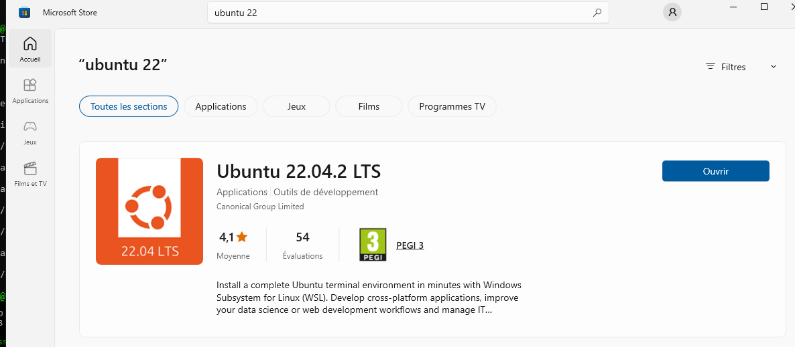
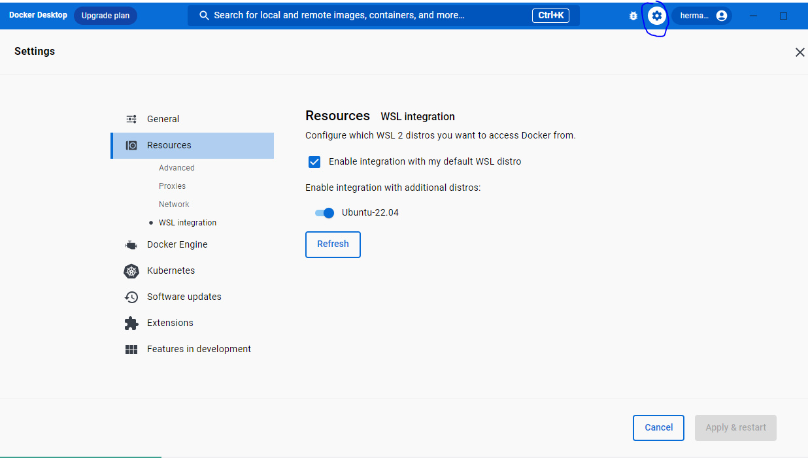

## Introduction
For a heavy linux user like me, using windows also mean find a door to work with a linux distro. There are several options to gauge from the situation. I usually need both docker and wsl2 on the computer. And i've installed this many times. 

<div class="float-img-container float-img-right">
  <a title="Credit: docker.com" href="https://www.docker.com/company/newsroom/media-resources/"></a>
</div>

So, this is a very straight forward tutorial on docker and wsl2 installation and configuration on windows10 or 11.

## Prerequisites
- Windows 10 Pro, Enterprise, or Education edition.
- WSL 2 enabled on your Windows machine.
- Docker Desktop for Windows installed.

## Step-by-Step Guide
<!-- - install docker [^3]: He recommend to install [docker desktop](https://docs.docker.com/desktop/install/windows-install/) -->

1. **Install Docker Desktop for Windows:**
   - Download Docker Desktop for Windows from the official Docker website: https://www.docker.com/products/docker-desktop
   - Run the installer and follow the instructions to complete the installation.

??? output "wsl installer"
    

2. **Enable WSL 2:**
   - Open PowerShell as an administrator and run the following command:
     ```powershell
     wsl --set-default-version 2
     ```

<!-- more -->

3. **Install a Linux Distribution:**
   - Open the Microsoft Store app on your Windows machine.
   - Search for a Linux distribution (e.g., Ubuntu, Debian, or Alpine) and install it.

??? output "Enable docker for wsl2"
    

6. **Configure WSL 2 as the Default WSL Version:**
   - see the list of distro you have 
     ```powershell
     wsl.exe -l -v
     ```
   - Open PowerShell as an administrator and run the following command:
     ```powershell
     wsl --set-version <distribution_name> 2
     ```
     Replace `<distribution_name>` with the name of the Linux distribution you installed.

7. **Start the Linux Distribution:**
   - Launch the Linux distribution you installed from the Start menu or by running its executable.
   - Follow the initial setup instructions to create a user account and set a password.

8. **Add the Docker host configuration:**
   - Scroll to the end of the file using the arrow keys.
   - Add the following line:
     ```bash
     echo "export DOCKER_HOST=unix:///var/run/docker.sock" >> ~/.bashrc
     ```
   - I didn't need this one but who knows:
     ```bash
     # open the bashrc
     nano ~/.bashrc
     # add this line in the file
     export DOCKER_HOST=tcp://localhost:2375
     ```

9. **Reload the updated `.bashrc` file:**
   - Run the following command to apply the changes:
     ```bash
     source ~/.bashrc
     ```

10. **Verify Docker connectivity:**
    - Run the following command to check if the Docker client in WSL can connect to Docker Desktop:
      ```bash
      docker version
      ```

11. **Enable WSL Integration in Docker Desktop:**
    - Open Docker Desktop on your Windows machine.
    - Right-click on the Docker Desktop icon in the system tray (notification area) and select "Settings".
    - In the "Settings" window, navigate to the "Resources" section.
    - Click on "WSL Integration" in the left sidebar.
    - Toggle the switch next to your WSL distribution (e.g., Ubuntu) to enable integration.
    - Click "Apply & Restart" to save the changes and restart Docker Desktop.

12. **Verify Docker Connectivity in WSL:**
    - Open the WSL terminal (Ubuntu).
    - Run the following command to check Docker connectivity:
      ```bash
      docker version
      ```

That's it! You should now have Docker successfully configured and running on Windows 10 with WSL 2. You can now use Docker commands within your Ubuntu WSL terminal to manage containers, images, and other Docker resources.

If you encounter any issues or have further questions, feel free to ask. Happy Dockerizing!

### basic commands for working with wsl [^2]
- install wsl: ```wsl --install```
- check list of distro (name and version): ```wsl.exe -l -v```
- change from v1 to v2: ```wsl.exe --set-version Ubuntu 2``` [^1]
- unsinstall the wsl: ```wsl.exe --unregister Ubuntu-22.04``` where `Ubuntu-22.04` is my distro name i got
- see images 
```docker images```


[^1]: [Running Docker on WSL2 without Docker Desktop (the right way), Felipe Santos, 11 oct. 2022](https://dev.to/felipecrs/simply-run-docker-on-wsl2-3o8)
[^3]: [2nd tuto for installing docker on windows](https://dev.to/bowmanjd/install-docker-on-windows-wsl-without-docker-desktop-34m9)
[^2]: [basic commands for working with wsl](https://learn.microsoft.com/en-us/windows/wsl/install#install-wsl-command)