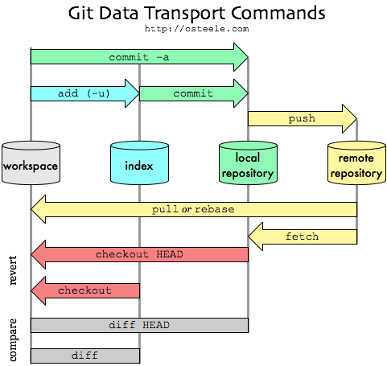

## Introduction

Git is, without discussion, a powerful version control system that enables collaborative development. 

__Ever found yourself in a twist trying to mix changes you made with updates from others in Git?__

It's like trying to blend your cooking style with someone else's recipe without making a mess. Git's awesome for team coding, but when your tweaks clash with online updates, how do you sort it out ?

Indeed, when local modifications clash with remote changes, navigating these conflicts efficiently becomes crucial. Let's explore different strategies to handle this situation effectively.

<!-- <figure>
  
  <figcaption>Git Data Transport Diagram</figcaption>
</figure> -->



<!-- more -->

*by Johnson Huang &lt;https://github.com/jshuang0520/git>*

<!-- 
<a title="Johnson Huang &lt;https://github.com/jshuang0520/git" href="https://www.jeffirwin.xyz/posts/resources/git-transport-cmds.svg"></a> -->

<!-- <a title="Johnson Huang &lt;https://github.com/jshuang0520/git" href="https://www.jeffirwin.xyz/posts/resources/git-transport-cmds.svg"></a> -->


## Options for Handling Local and Remote Changes in Git

When you encounter local modifications and remote changes in your Git workflow, several options are available:

### 1. Incorporating Local Changes with Remote Changes

If no conflicts exist between your local changes and the remote changes, use:

```bash
git pull --rebase
``` 

- This command integrates your commits after the remote commits, making it seem as if your changes were made after the remote changes.
- Manual resolution is required if conflicts arise during the rebase process.

To apply rebase whenever you do a `git pull`, run this command to modify git default behavior

```bash
git config pull.rebase true
```

**Example Scenario:**
Consider a scenario where ...

**Pros:**

- Keeps a linear, clean commit history.
- Integrates local changes after remote ones, maintaining chronological order.

**Cons:**

- Requires manual resolution of conflicts that may arise during rebase.

### 2. Preserving Local Changes without Rebasing

In this scenario:

- Git will consider the point where you started modifying without pulling as the base.
- There's no predetermined order or priority between your local commits and the remote commits.
- Git combines changes from your local repository and the remote commits into a single commit.

You set the default pulling as no-rebase with 
```bash
git config pull.rebase false
```

You pull with the no-rebase option with 
```bash
git pull --no-rebase
```

**Example Scenario:**
Suppose you've made substantial local changes and need to pull remote updates without modifying your commit history:

```bash
git pull --no-rebase origin main
```

**Pros:**

- Creates a single combined commit representing both local and remote changes.
- Retains the original commit structure without altering history.

**Cons:**

- Might lose individual context from multiple local commits.

### 3. Pulling with Strict Fast-Forward Mode (`git config pull.ff only`)

In this scenario:

- Git checks for any absence of remote commits.
- If no remote commits exist, it adds your commits seamlessly.
- However, conflicts prompt resolution when remote commits are present.

You set the default pulling as no-rebase with 
```bash
git config pull.ff only
```

You pull with the fast-forward option with 
```bash
git pull --ff-only
```

**Example Scenario:**
When ensuring a linear history is a priority and avoiding merge commits:

```bash
git pull --ff-only origin main
```

**Pros:**

- Enforces a strictly linear history if possible, avoiding merge commits.
- Facilitates a cleaner commit timeline for easier tracking.

**Cons:**

- Requires conflict resolution if the remote branch diverges.

### 4. Default Behavior: Fast-Forward Merge (`git config pull.ff merge`)

In this scenario (default behavior):

- Proceeds as usual when no remote commits are present.
- Performs a rebase based on the `git config pull.rebase` setting if remote commits exist.

**Example Scenario:**
Pulling changes with flexibility based on configured rebase settings:

```bash
git pull --ff-merge origin main
```

**Pros:**

- Offers flexibility based on configured rebase settings (`pull.rebase true/false`).
- Can accommodate both linear and non-linear commit histories.

**Cons:**

- May result in a non-linear history with merge commits in certain scenarios.

### 5. `git push --force`

- Enables forceful pushing, overriding any changes made by others.
- Caution is advised as it can lead to the loss of other developers' work.
- Coordination with the team is crucial for a smooth collaboration process.

**Example Scenario:**
When pushing changes forcefully becomes necessary:

```bash
git push --force origin feature-branch
```

**Pros:**

- Allows correcting mistakes or overriding changes when needed.
- Provides a quick resolution to divergent branch issues.

**Cons:**

- Risks losing or overwriting others' work, disrupting collaboration.
- Requires careful coordination within the team.


## Conclusion
Choosing the right Git approach involves understanding the implications and trade-offs associated with each method. Experimenting with these options within the context of your team's workflow helps determine the most suitable approach for a smoother collaborative Git environment.

!!! note "Play it safe !"

    In this guide, remember to play it safe: make backups as you work on different branches, decide if you're merging or rebasing changes like picking different tools for different jobs, and keep feature branches separate from the main code like organizing toys into different boxes. These simple tips will keep your code kitchen running smoothly!

## Related pages

- [Mastering Git Merge Strategies: A Developer's Guide](./sync-branches-with-conflicts.md)
- [Understanding Git Pull vs Merge in Git Workflow](./git-pull-vs-git-merge-equivalence.md)
- [Nesting Repositories with Git Submodules: A Newbie's Guide](./git-submodules.md)
- [Mastering Git Branch Handling: Strategies for Deletion and Recovery](./handling-branch-deletion.md)
