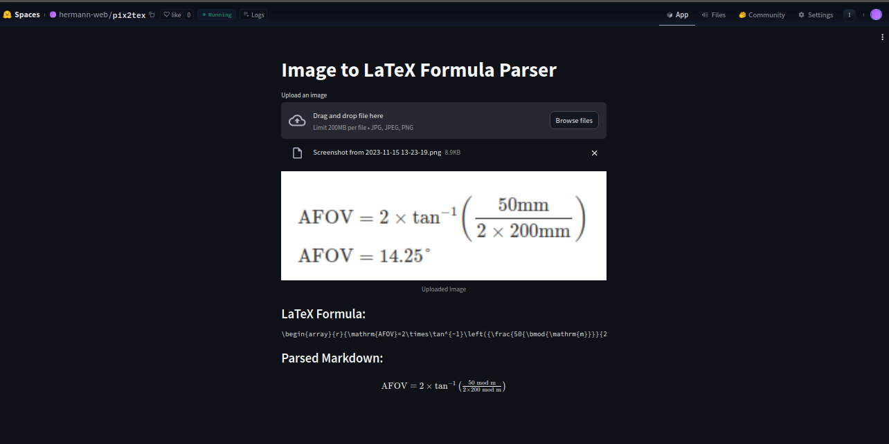

# Streamlit App for Formula OCR using pix2tex

## Introduction
I've implemented and deployed a [Streamlit application](https://github.com/Hermann-web/pix2tex) designed for writing a LaTeX formula from an image containing that formula. The application is hosted on [Hugging Face Spaces](https://pix2tex.streamlit.app/y) and [github](https://pix2tex.streamlit.app/) so users can upload images freely and copy LaTeX formulas.

For the frontend, I use Streamlit, a framework that makes frontend for data projects easy. For the backend converter, I use a Python module named [pix2tex](https://github.com/lukas-blecher/LaTeX-OCR) that uses computer vision to generate the LaTeX formula.

```python
from PIL import Image
from pix2tex.cli import LatexOCR

img = Image.open('path/to/image.png')
model = LatexOCR()
print(model(img))
```

You can access the application online at [https://pix2tex.streamlit.app/](https://pix2tex.streamlit.app/) or [https://huggingface.co/spaces/hermann-web/pix2tex](https://huggingface.co/spaces/hermann-web/pix2tex).



You can read the following if you want to know the implementation details or clone the project.

## Prerequisites

- Python >=3.9
- torch >=2.0.0
- Streamlit
- Pillow
- pix2tex

## Installation

1. Clone the repository:

    ```bash
    git clone https://huggingface.co/spaces/hermann-web/pix2tex
    cd pix2tex
    ```

2. Create a virtual environment and activate it:

=== ":octicons-file-code-16: `For Linux & Mac`"

    ```bash
    python3 -m venv myenv
    source myenv/bin/activate
    ```

=== ":octicons-file-code-16: `For Windows`"

    ```bash
    python -m venv myenv
    ./myenv/Scripts/activate
    ```

3. Install the required dependencies:

    ```bash
    pip install -r requirements.txt
    ```

4. Start the Streamlit server:

    ```bash
    streamlit run app.py
    ```

5. Access the application by visiting [http://localhost:8501](http://localhost:8501) in your web browser.

## Development Details

During the development of the Streamlit-based formula OCR app, several key components and decisions were made to ensure a smooth and efficient workflow.

### Backend with pix2tex

The core functionality of converting images into LaTeX formulas is powered by the `pix2tex` Python module. This module leverages computer vision techniques to perform LaTeX OCR on images. The following snippet illustrates how the image processing is handled:

```python
from PIL import Image
from pix2tex.cli import LatexOCR

def process_image(image):
    # Perform LaTeX OCR on the image
    img = Image.open(image)
    model = LatexOCR()
    latex_formula = model(img)
    return latex_formula
```

The `LatexOCR` class from `pix2tex` is responsible for extracting LaTeX formulas from images, making the app suitable for mathematical content extraction.


### Streamlit for Frontend

The frontend of the application is built using [Streamlit](https://streamlit.io/), a powerful Python library for creating web applications with minimal effort. Streamlit allowed for rapid prototyping and easy integration with the backend.

The image is rendered with a streamlit function `st.latex`:
```python
import streamlit as st
st.latex(f"\n{latex_formula}\n")
```

## Usage

Add information about how users can use the application, including any specific instructions or features.

## Deployment Guide

### With streamlit.io 

Deployment on streamlit.io is pretty fastforward [^streamlit-create-an-app].
You can put the application on a public repository. Then, Go to the website [https://share.streamlit.io/deploy](https://share.streamlit.io/deploy), signup with you github account for example, then choose the repository and your pyhton script.

## On streamlit

To deploy the app on Hugging Face, follow these steps:

1. **Create a Hugging Face Account:**
    - If you don't have a Hugging Face account, create one on [Hugging Face](https://huggingface.co/signup).

2. **Create a New Space:**
    - Log in to your Hugging Face account.
    - Navigate to the [Spaces](https://huggingface.co/spaces) page.
    - Click on "New Space" and give it a name, e.g., "FileHostingApp."

3. **Upload Your Code:**
    - Inside your local `pix2tex` directory, create a `.zip` archive of your code.
    - Upload the `.zip` archive to your newly created Space.

4. **Set Up Environment Variables:**
    - In your Hugging Face Space, go to "Settings."
    - Under the "Environment Variables" section, add the necessary variables, such as any API keys or configuration parameters.

5. **Deploy the App:**
    - Go back to the "Overview" tab in your Space.
    - Click on "Deploy Model" and follow the instructions to deploy your Streamlit app.

6. **Access Your Deployed App:**
    - Once deployed, you can access your app through the provided link.

## License

This project is licensed under the [MIT License](LICENSE).

[^streamlit-create-an-app]: [Streamlit documentation: Create an app](https://docs.streamlit.io/get-started/tutorials/create-an-app)
